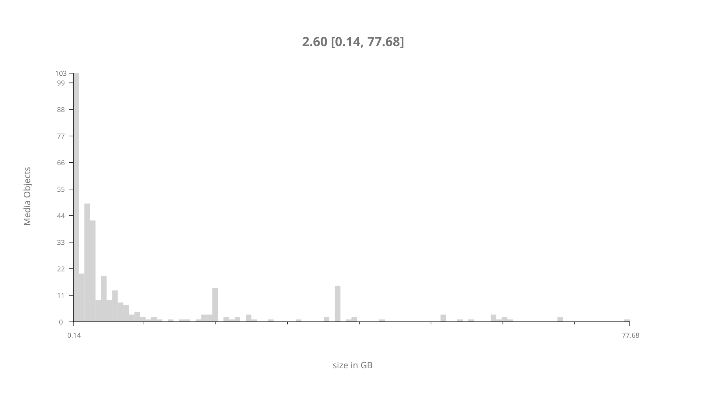
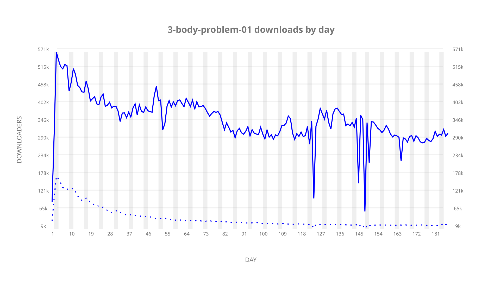
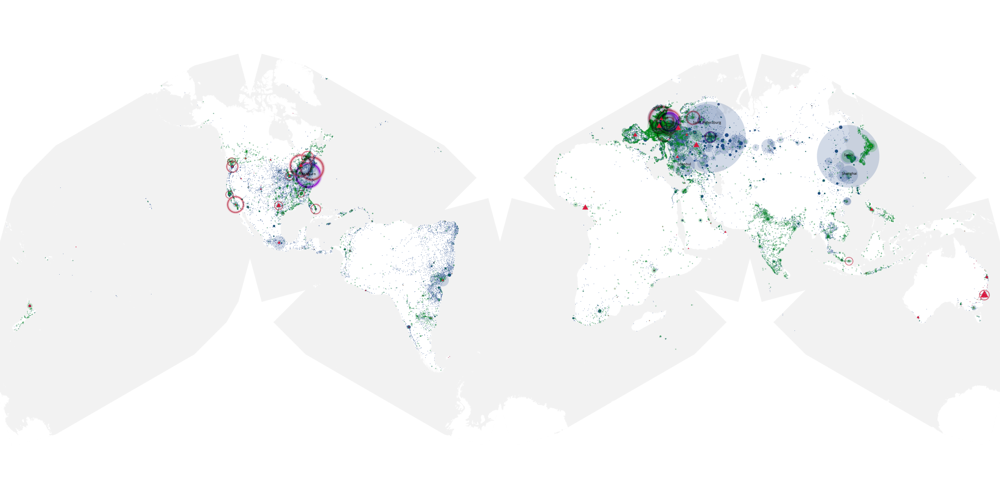
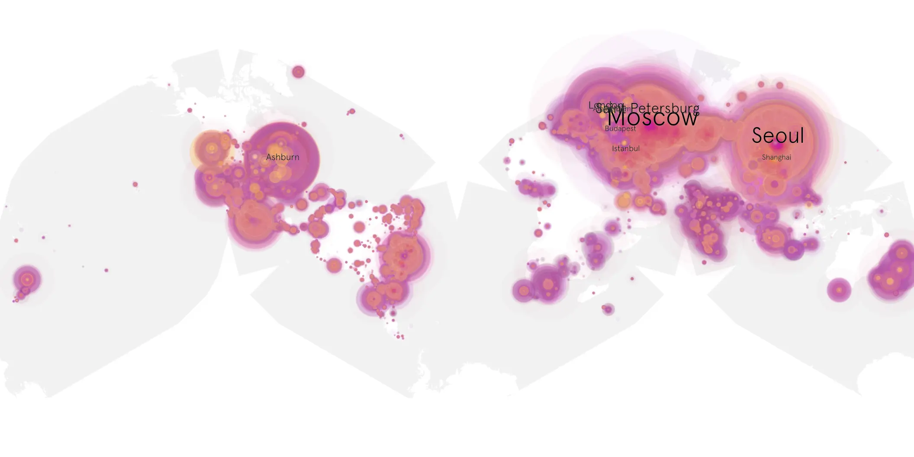
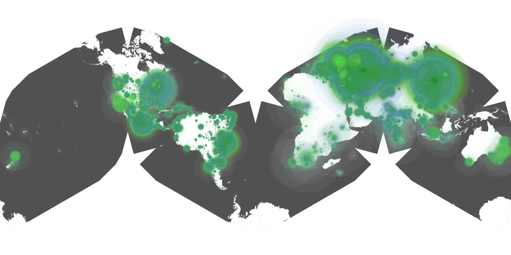

# 3-body-problem-01 sample cache audit

## 1. Media object

| Field | Value |
| --- | --- |
| Media object | 3 Body Problem |
| Collection key | `3-body-problem-01` |
| imdb_id | [tt13016388](https://www.imdb.com/title/tt13016388/) |
| wikipedia_url | [3 Body Problem (TV series)](https://en.wikipedia.org/wiki/3_Body_Problem_(TV_series)) |
| Sample dates | 2024-03-21-to-2024-09-24 |
| Sample days | 188 |
| BTIH count | 419 |
| Unique BTIH count | 363 |
| Downloaders total | 48,319,019 |
| Uploaders total | 3,579,613 |
| Data version | `2026-08-05` |
| IP geolocation version | `6:1777968300` |

## 2. Sample coverage report

- Generated: 2026-08-29T14:40:59Z
- Sample archive directory: `/run/media/bkoz/gold/src/alpha60-samples-raw.gold/3-body-problem-01.xz`
- Hour directories: 4399
- Zero-length sample files: 0
- Other unparsable sample files: 0
- Hourly discontinuities: 7 (93 missing hours)
- Missing days: 1

### Sample archive discontinuities

- hourly gap: last `2024-03-31 01:00`, resumed `2024-03-31 03:00` — missing 1 hour(s)
- hourly gap: last `2024-07-21 22:00`, resumed `2024-07-22 19:00` — missing 20 hour(s)
- hourly gap: last `2024-08-11 22:00`, resumed `2024-08-12 14:20` — missing 15 hour(s)
- hourly gap: last `2024-08-12 22:00`, resumed `2024-08-13 00:00` — missing 1 hour(s)
- hourly gap: last `2024-08-14 22:00`, resumed `2024-08-16 21:18` — missing 46 hour(s)
- hourly gap: last `2024-08-17 22:00`, resumed `2024-08-18 08:44` — missing 9 hour(s)
- hourly gap: last `2024-08-18 22:00`, resumed `2024-08-19 00:00` — missing 1 hour(s)
- missing day: `2024-08-15`

## 3. Media objects file size histogram

## 4. Visualization pass — graphs

### Downloads by week cumulative (normalized start)



### Downloads by day, Saturday and Sunday in gray

## 5. Visualization pass — maps

### Cumulative geographic slices

| Africa | Americas | Asia | Europe | Oceania | Unknown |
| --- | --- | --- | --- | --- | --- |
| 1.38 | 18.12 | 25.05 | 51.80 | 1.16 | 0.73 |

### Cumulative network infrastructure

{:target="_blank" rel="noopener"}

### Cumulative data maps

**Cumulative >= 1080p**

{:target="_blank" rel="noopener"}

**Cumulative < 1080p**

{:target="_blank" rel="noopener"}
