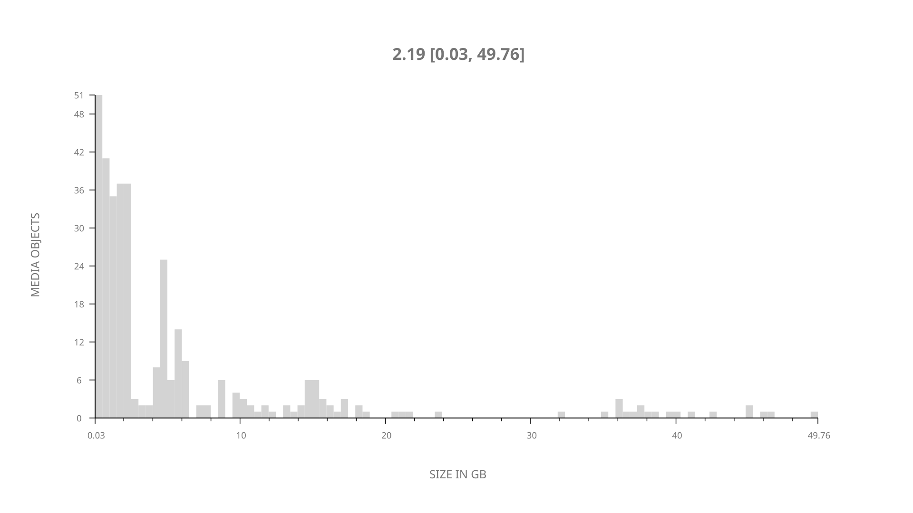
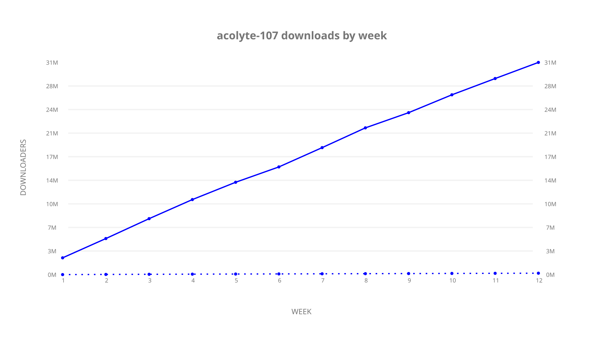
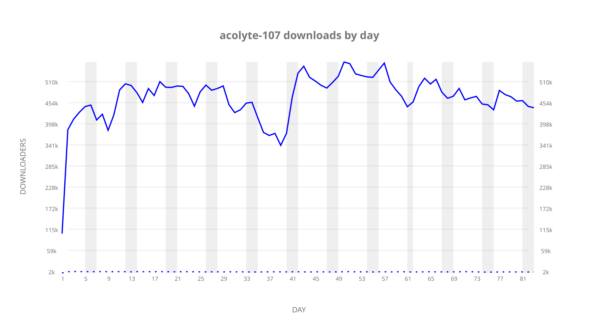

# acolyte-107 sample cache audit

## 1. Media object

| Field | Value |
| --- | --- |
| Media object | The Acolyte |
| Collection key | `acolyte-107` |
| imdb_id | [tt12262202](https://www.imdb.com/title/tt12262202/) |
| wikipedia_url | [Star Wars: The Acolyte](https://en.wikipedia.org/wiki/Star_Wars%3A_The_Acolyte) |
| Sample dates | 2026-05-04-to-2026-07-26 |
| Sample days | 84 (2026–2026) |
| BTIH count | 376 |
| Unique BTIH count | 346 |
| Downloaders total | 31,714,901 |
| Uploaders total | 243,711 |
| Data version | `2026-08-05` |
| IP geolocation version | `6:1777968300` |

## 2. Cache coverage report

UNAVAILABLE: no sample archive on this host.

## 3. Collection size histogram

## 4. Visualization pass — graphs

### Downloads by week cumulative (normalized start)

### Downloads by day, Saturday and Sunday in gray

## 5. Visualization pass — maps

### Continental downloader slices

| Africa | Americas | Asia | Europe | Oceania | Unknown |
| --- | --- | --- | --- | --- | --- |
| 1.08 | 15.37 | 37.31 | 43.28 | 1.05 | 0.81 |

### Cumulative network infrastructure

{:target="_blank" rel="noopener"}

UNAVAILABLE — no cumulative data maps were rendered.
