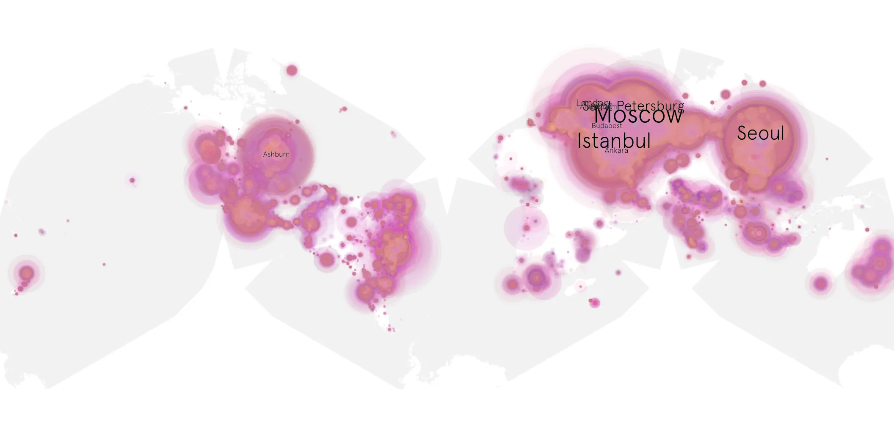
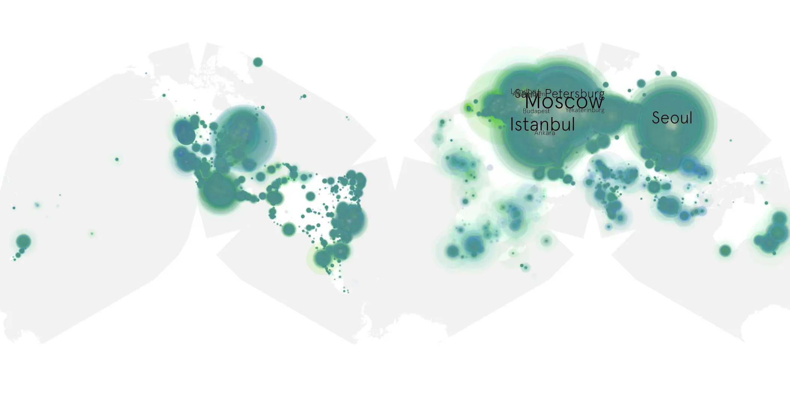

# agatha-all-along-101 sample cache audit

## 1. Media object

| Field | Value |
| --- | --- |
| Media object | Agatha All Along |
| Collection key | `agatha-all-along-101` |
| imdb_id | [tt15571732](https://www.imdb.com/title/tt15571732/) |
| wikipedia_url | [Agatha All Along](https://en.wikipedia.org/wiki/Agatha_All_Along) |
| Sample dates | 2024-09-19-to-2025-03-19 |
| Sample days | 182 |
| BTIH count | 337 |
| Unique BTIH count | 318 |
| Downloaders total | 44,242,696 |
| Uploaders total | 2,227,912 |
| Data version | `2026-08-05` |
| IP geolocation version | `6:1777968300` |

## 2. Coverage report

- Generated: 2026-08-28T16:35:04Z
- Sample archive directory: `/run/media/bkoz/gold/src/alpha60-samples-raw.gold/agatha-all-along-101.xz`
- Hour directories: 4234
- Zero-length sample files: 0
- Other unparsable sample files: 0
- Hourly discontinuities: 7 (129 missing hours)
- Missing days: 3

### Sample archive discontinuities

- hourly gap: last `2024-12-30 20:00`, resumed `2024-12-30 22:00` — missing 1 hour(s)
- hourly gap: last `2025-01-11 22:00`, resumed `2025-01-12 01:00` — missing 2 hour(s)
- hourly gap: last `2025-02-08 22:00`, resumed `2025-02-10 00:00` — missing 25 hour(s)
- hourly gap: last `2025-02-18 17:00`, resumed `2025-02-19 00:00` — missing 6 hour(s)
- hourly gap: last `2025-02-20 22:00`, resumed `2025-02-22 02:00` — missing 27 hour(s)
- hourly gap: last `2025-03-06 22:00`, resumed `2025-03-08 22:00` — missing 47 hour(s)
- hourly gap: last `2025-03-09 22:00`, resumed `2025-03-10 20:00` — missing 21 hour(s)
- missing day: `2025-02-09`
- missing day: `2025-02-21`
- missing day: `2025-03-07`

## 3. File sizes histogram *median[lowest, highest]*

## 4. Graphs

### Downloads by week cumulative (normalized start)



### Downloads by day, Saturday and Sunday in gray

## 5. Cumulative Maps

<!-- https://raw.githubusercontent.com/alpha60-devops/alpha60-results-2024/refs/heads/main/data/ -->

### <a href="https://raw.githubusercontent.com/alpha60-devops/alpha60-results-2024/refs/heads/main/data/geojson.cumulative/agatha-all-along-101-cumulative-aggregate.geojson.gz" data-map-title="Agatha All Along — agatha-all-along-101" onclick="leaflet_map_open_window(this.href, this.dataset.mapTitle); return false;" class="table-link" aria-label="Open Agatha All Along (agatha-all-along-101) cumulative data map in new window" title="Opens interactive map for Agatha All Along (agatha-all-along-101) data">Swarm Detail</a>

### Geographic Regions

| Africa | Americas | Asia | Europe | Oceania | Unknown |
| --- | --- | --- | --- | --- | --- |
| 1.37 | 15.78 | 26.63 | 53.51 | 0.82 | 0.55 |

### Network infrastructure

{:target="_blank" rel="noopener"}

### Resolution >= 1080p

{:target="_blank" rel="noopener"}

### Resolution < 1080p

{:target="_blank" rel="noopener"}
