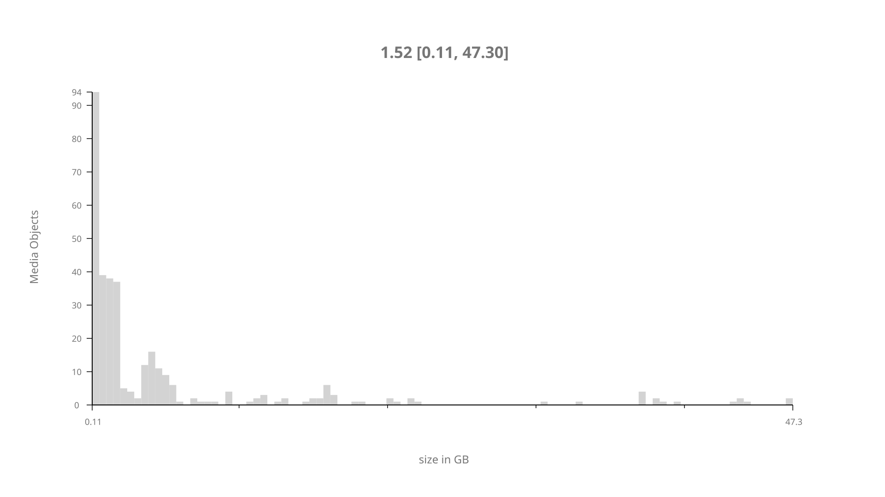
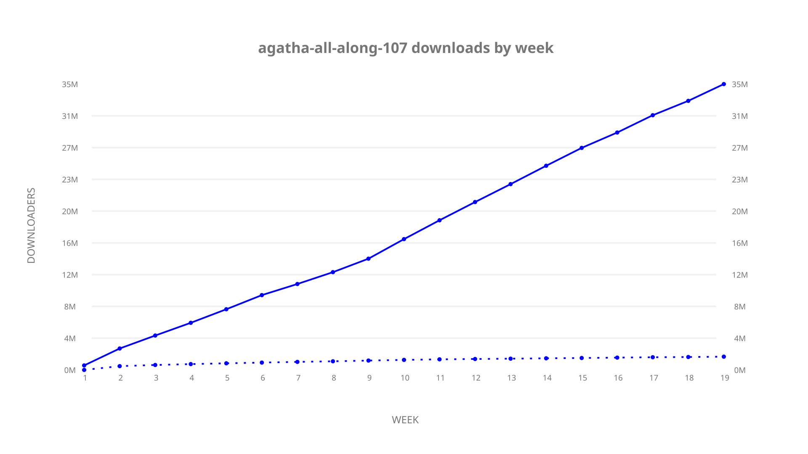
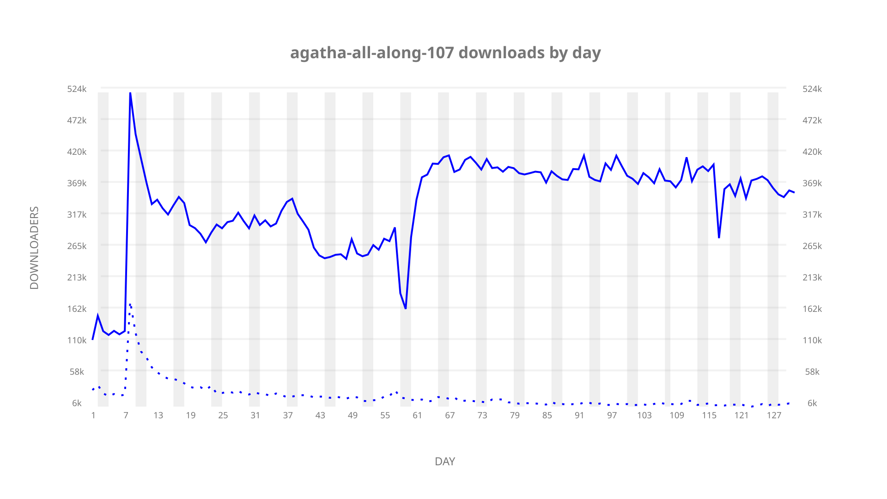
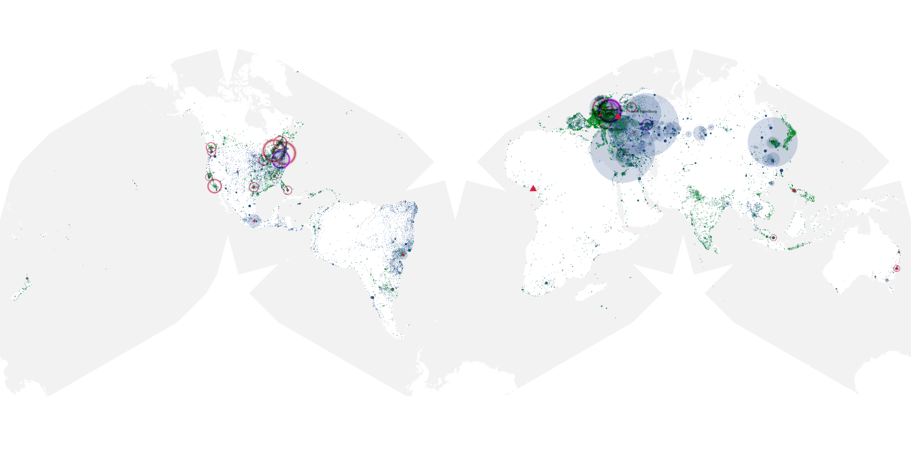
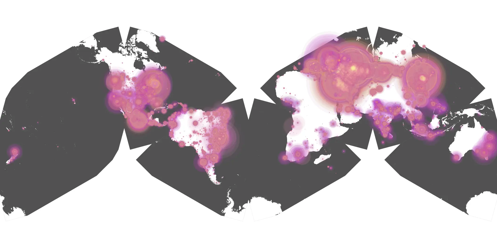
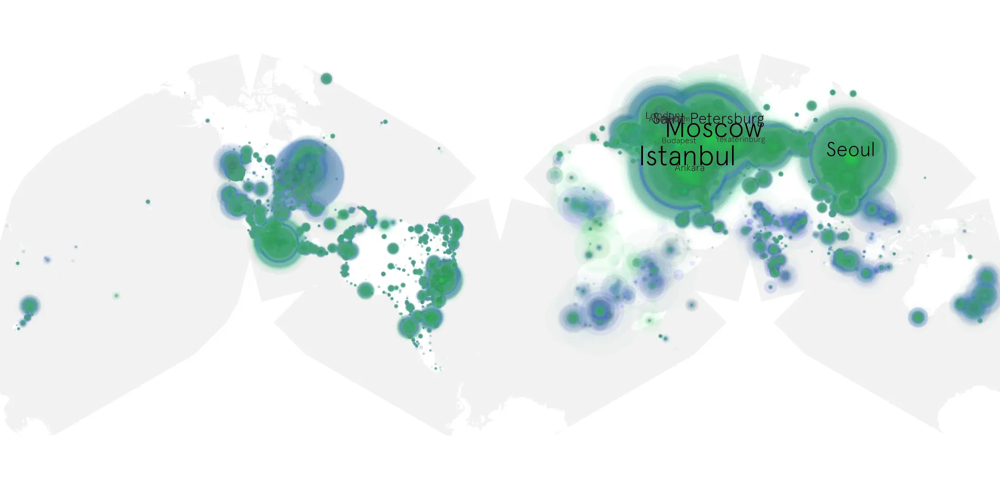

# agatha-all-along-107 sample cache audit

## 1. Media object

| Field | Value |
| --- | --- |
| Media object | Agatha All Along |
| Collection key | `agatha-all-along-107` |
| imdb_id | [tt15571732](https://www.imdb.com/title/tt15571732/) |
| wikipedia_url | UNAVAILABLE |
| Sample dates | 2024-10-24-to-2025-03-05 |
| Sample days | 133 (2024–2025) |
| BTIH count | 363 |
| Unique BTIH count | 330 |
| Downloaders total | 36,491,034 |
| Uploaders total | 1,974,531 |
| Data version | `2026-08-05` |
| IP geolocation version | `6:1777968300` |

## 2. Cache coverage report

- Generated: 2026-08-28T16:35:04Z
- Sample archive directory: `/run/media/bkoz/gold/src/alpha60-samples-raw.gold/agatha-all-along-107.xz`
- Hour directories: 4232
- Zero-length sample files: 0
- Other unparsable sample files: 0
- Hourly discontinuities: 10 (133 missing hours)
- Missing days: 3

### Sample archive discontinuities

- hourly gap: last `2024-12-30 20:06`, resumed `2024-12-30 22:06` — missing 1 hour(s)
- hourly gap: last `2025-01-11 22:06`, resumed `2025-01-12 01:06` — missing 2 hour(s)
- hourly gap: last `2025-02-08 22:06`, resumed `2025-02-10 00:06` — missing 25 hour(s)
- hourly gap: last `2025-02-18 17:06`, resumed `2025-02-19 00:06` — missing 6 hour(s)
- hourly gap: last `2025-02-20 22:06`, resumed `2025-02-22 02:06` — missing 27 hour(s)
- hourly gap: last `2025-03-06 22:06`, resumed `2025-03-08 22:06` — missing 47 hour(s)
- hourly gap: last `2025-03-09 22:06`, resumed `2025-03-10 20:06` — missing 21 hour(s)
- hourly gap: last `2025-03-23 22:06`, resumed `2025-03-24 00:06` — missing 1 hour(s)
- hourly gap: last `2025-03-25 23:06`, resumed `2025-03-26 02:43` — missing 2 hour(s)
- hourly gap: last `2025-03-30 01:00`, resumed `2025-03-30 03:00` — missing 1 hour(s)
- missing day: `2025-02-09`
- missing day: `2025-02-21`
- missing day: `2025-03-07`

## 3. Collection size histogram

## 4. Visualization pass — graphs

### Downloads by week cumulative (normalized start)

### Downloads by day, Saturday and Sunday in gray

## 5. Visualization pass — maps

### Continental downloader slices

| Africa | Americas | Asia | Europe | Oceania | Unknown |
| --- | --- | --- | --- | --- | --- |
| 1.29 | 16.21 | 27.02 | 52.94 | 0.82 | 0.53 |

### Cumulative network infrastructure

{:target="_blank" rel="noopener"}

### Cumulative data maps

**Cumulative >= 1080p**

**Cumulative < 1080p**

