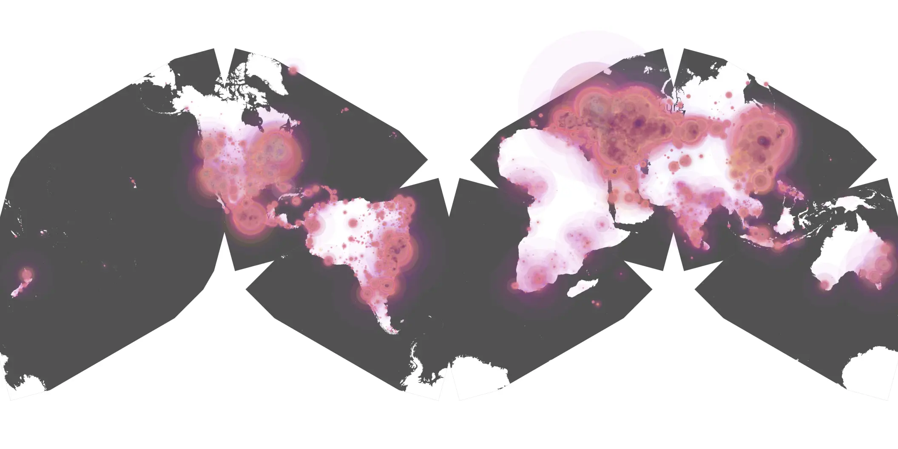
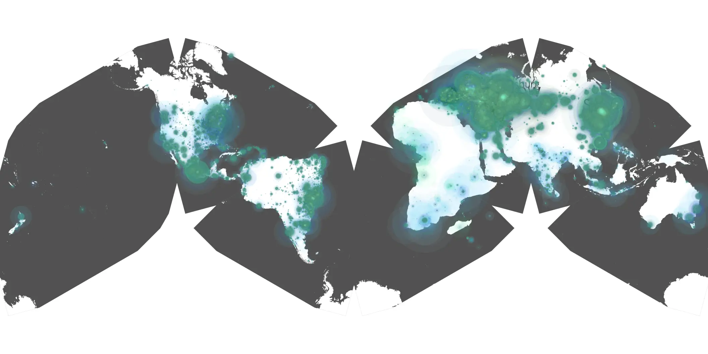

# american-fiction sample cache audit

## 1. Media object

| Field | Value |
| --- | --- |
| Media object | American Fiction |
| Collection key | `american-fiction` |
| imdb_id | [tt23561236](https://www.imdb.com/title/tt23561236/) |
| wikipedia_url | [American Fiction (film)](https://en.wikipedia.org/wiki/American_Fiction_(film)) |
| Sample dates | 2024-02-06-to-2024-05-20 |
| Sample days | 105 |
| BTIH count | 151 |
| Unique BTIH count | 129 |
| Downloaders total | 12,378,175 |
| Uploaders total | 1,562,179 |
| Data version | `2026-08-05` |
| IP geolocation version | `6:1777968300` |

## 2. Coverage report

- Generated: 2026-08-28T16:48:38Z
- Sample archive directory: `/run/media/bkoz/gold/src/alpha60-samples-raw.gold/american-fiction.xz`
- Hour directories: 2457
- Zero-length sample files: 0
- Other unparsable sample files: 0
- Hourly discontinuities: 2 (42 missing hours)
- Missing days: 1

### Sample archive discontinuities

- hourly gap: last `2024-03-31 01:00`, resumed `2024-03-31 03:00` — missing 1 hour(s)
- hourly gap: last `2024-04-20 06:00`, resumed `2024-04-22 00:00` — missing 41 hour(s)
- missing day: `2024-04-21`

## 3. File sizes histogram *median[lowest, highest]*

## 4. Graphs

### Downloads by week cumulative (normalized start)



### Downloads by day, Saturday and Sunday in gray

## 5. Cumulative Maps

<!-- https://raw.githubusercontent.com/alpha60-devops/alpha60-results-2024/refs/heads/main/data/ -->

### <a href="https://raw.githubusercontent.com/alpha60-devops/alpha60-results-2024/refs/heads/main/data/geojson.cumulative/american-fiction-cumulative-aggregate.geojson.gz" data-map-title="American Fiction — american-fiction" onclick="leaflet_map_open_window(this.href, this.dataset.mapTitle); return false;" class="table-link" aria-label="Open American Fiction (american-fiction) cumulative data map in new window" title="Opens interactive map for American Fiction (american-fiction) data">Swarm Detail</a>

### Geographic Regions

| Africa | Americas | Asia | Europe | Oceania | Unknown |
| --- | --- | --- | --- | --- | --- |
| 1.90 | 19.46 | 21.80 | 49.48 | 0.95 | 0.58 |

### Network infrastructure

{:target="_blank" rel="noopener"}

### Resolution >= 1080p

{:target="_blank" rel="noopener"}

### Resolution < 1080p

{:target="_blank" rel="noopener"}
