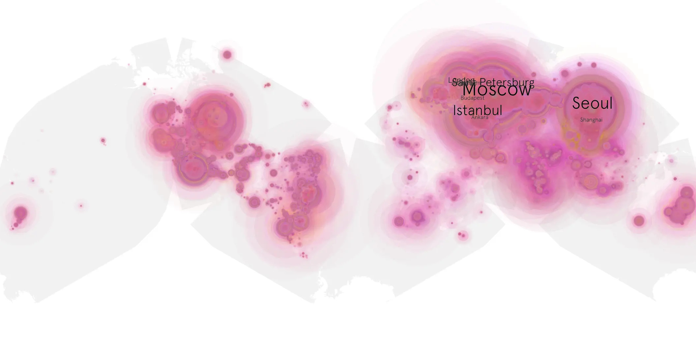
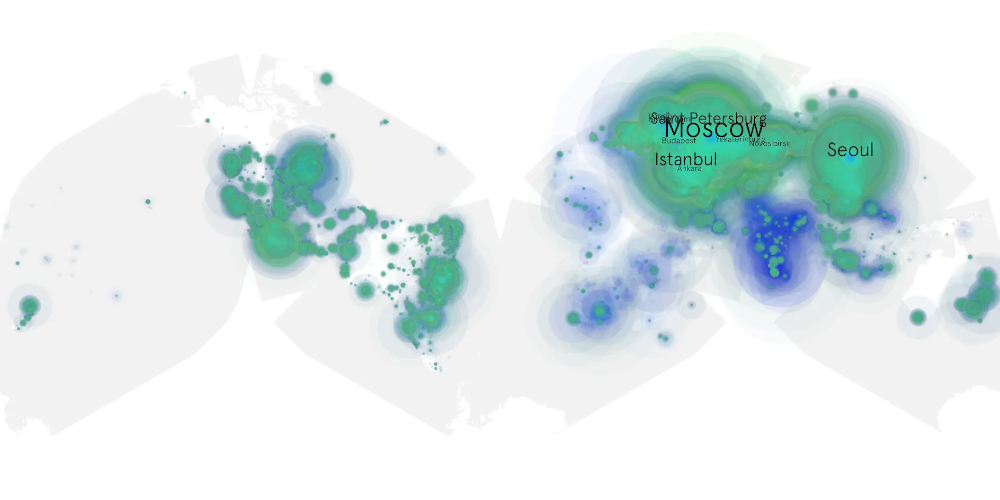

# anora sample cache audit

## 1. Media object

| Field | Value |
| --- | --- |
| Media object | Anora |
| Collection key | `anora` |
| imdb_id | [tt28607951](https://www.imdb.com/title/tt28607951/) |
| wikipedia_url | [Anora](https://en.wikipedia.org/wiki/Anora) |
| Sample dates | 2024-12-18-to-2025-06-17 |
| Sample days | 182 |
| BTIH count | 308 |
| Unique BTIH count | 274 |
| Downloaders total | 48,302,651 |
| Uploaders total | 6,049,711 |
| Data version | `2026-08-05` |
| IP geolocation version | `6:1777968300` |

## 2. Coverage report

- Generated: 2026-08-28T16:50:34Z
- Sample archive directory: `/run/media/bkoz/gold/src/alpha60-samples-raw.gold/anora.xz`
- Hour directories: 4334
- Zero-length sample files: 0
- Other unparsable sample files: 0
- Hourly discontinuities: 3 (33 missing hours)
- Missing days: 0

### Sample archive discontinuities

- hourly gap: last `2025-03-30 01:06`, resumed `2025-03-30 03:06` — missing 1 hour(s)
- hourly gap: last `2025-04-25 04:06`, resumed `2025-04-26 09:06` — missing 28 hour(s)
- hourly gap: last `2025-06-17 15:06`, resumed `2025-06-17 20:50` — missing 4 hour(s)

## 3. File sizes histogram *median[lowest, highest]*

## 4. Graphs

### Downloads by week cumulative (normalized start)



### Downloads by day, Saturday and Sunday in gray

## 5. Cumulative Maps

<!-- https://raw.githubusercontent.com/alpha60-devops/alpha60-results-2024/refs/heads/main/data/ -->

### <a href="https://raw.githubusercontent.com/alpha60-devops/alpha60-results-2024/refs/heads/main/data/geojson.cumulative/anora-cumulative-aggregate.geojson.gz" data-map-title="Anora — anora" onclick="leaflet_map_open_window(this.href, this.dataset.mapTitle); return false;" class="table-link" aria-label="Open Anora (anora) cumulative data map in new window" title="Opens interactive map for Anora (anora) data">Swarm Detail</a>

### Geographic Regions

| Africa | Americas | Asia | Europe | Oceania | Unknown |
| --- | --- | --- | --- | --- | --- |
| 1.68 | 15.18 | 27.28 | 50.45 | 0.88 | 0.55 |

### Network infrastructure

{:target="_blank" rel="noopener"}

### Resolution >= 1080p

{:target="_blank" rel="noopener"}

### Resolution < 1080p

{:target="_blank" rel="noopener"}
