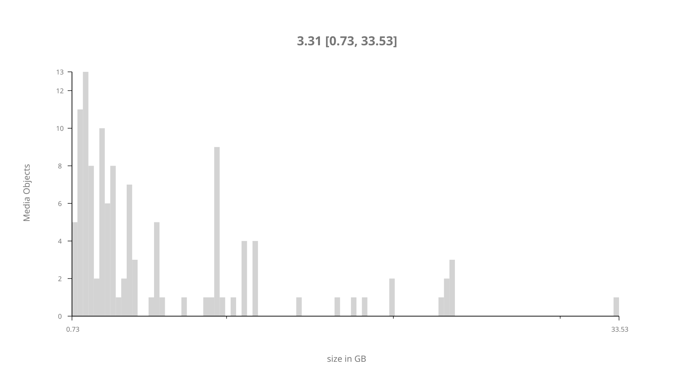
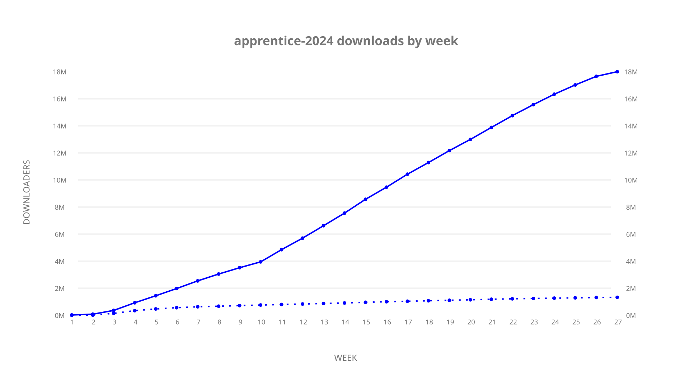
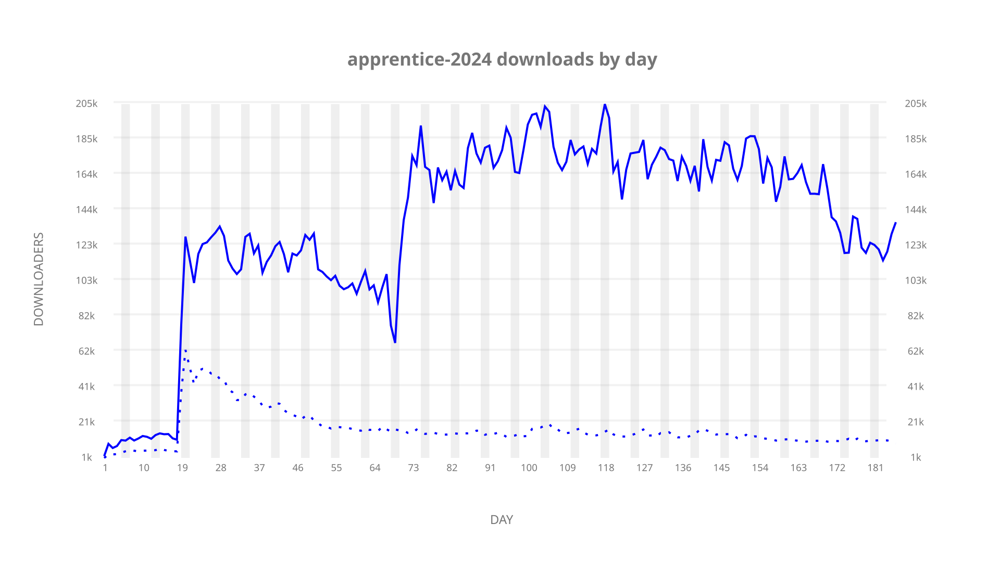
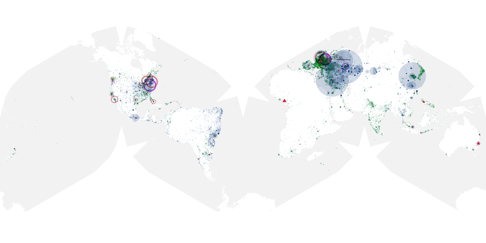
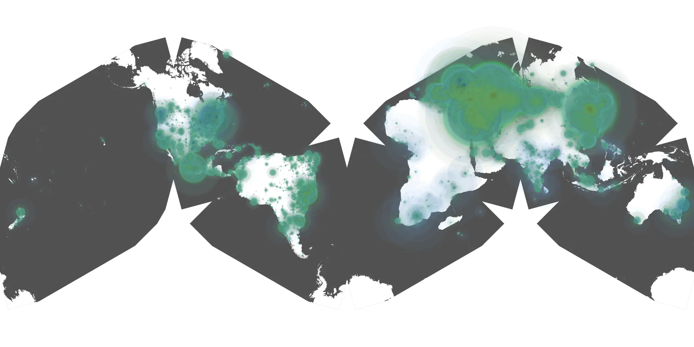

# apprentice-2024 sample cache audit

## 1. Media object

| Field | Value |
| --- | --- |
| Media object | The Apprentice |
| Collection key | `apprentice-2024` |
| imdb_id | [tt4660736](https://www.imdb.com/title/tt4660736/) |
| wikipedia_url | UNAVAILABLE |
| Sample dates | 2024-10-14-to-2025-04-17 |
| Sample days | 186 (2024–2025) |
| BTIH count | 135 |
| Unique BTIH count | 118 |
| Downloaders total | 21,380,906 |
| Uploaders total | 2,338,768 |
| Data version | `2026-08-05` |
| IP geolocation version | `6:1777968300` |

## 2. Cache coverage report

- Generated: 2026-08-28T16:51:37Z
- Sample archive directory: `/run/media/bkoz/gold/src/alpha60-samples-raw.gold/apprentice-2024.xz`
- Hour directories: 4441
- Zero-length sample files: 0
- Other unparsable sample files: 0
- Hourly discontinuities: 1 (1 missing hours)
- Missing days: 0

### Sample archive discontinuities

- hourly gap: last `2025-03-30 01:00`, resumed `2025-03-30 03:00` — missing 1 hour(s)

## 3. Collection size histogram

## 4. Visualization pass — graphs

### Downloads by week cumulative (normalized start)

### Downloads by day, Saturday and Sunday in gray

## 5. Visualization pass — maps

### Continental downloader slices

| Africa | Americas | Asia | Europe | Oceania | Unknown |
| --- | --- | --- | --- | --- | --- |
| 1.41 | 14.95 | 25.76 | 51.39 | 0.86 | 0.51 |

### Cumulative network infrastructure

{:target="_blank" rel="noopener"}

### Cumulative data maps

**Cumulative >= 1080p**

**Cumulative < 1080p**

