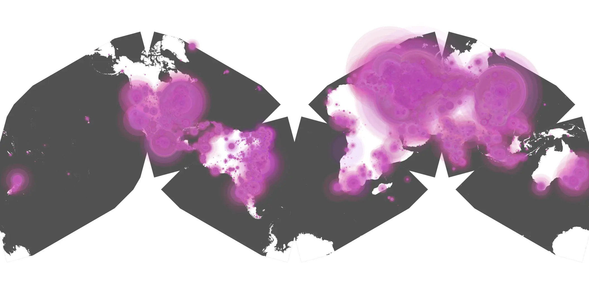
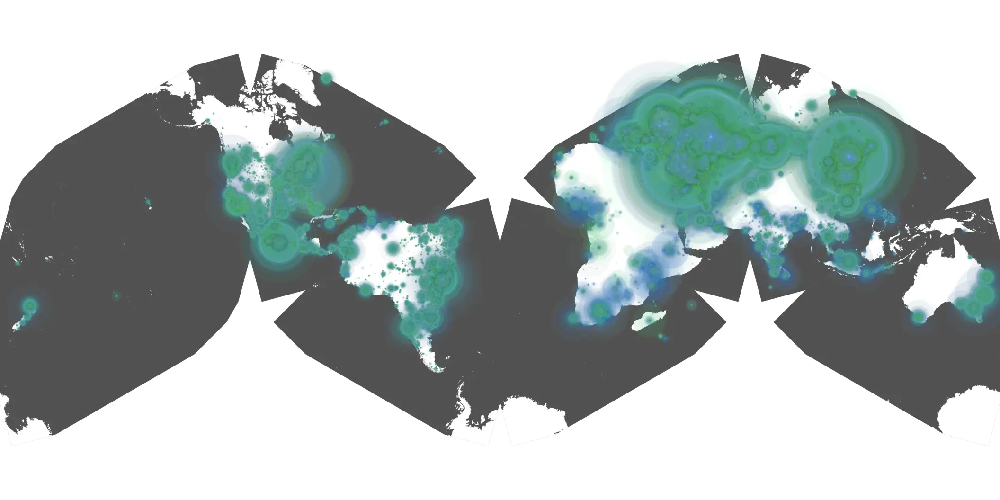

# arcane-02.1 sample cache audit

## 1. Media object

| Field | Value |
| --- | --- |
| Media object | Arcane |
| Collection key | `arcane-02.1` |
| imdb_id | [tt11126994](https://www.imdb.com/title/tt11126994/) |
| wikipedia_url | [Arcane (TV series)](https://en.wikipedia.org/wiki/Arcane_(TV_series)) |
| Sample dates | 2024-11-09-to-2025-05-09 |
| Sample days | 182 |
| BTIH count | 319 |
| Unique BTIH count | 289 |
| Downloaders total | 43,917,141 |
| Uploaders total | 3,397,232 |
| Data version | `2026-08-05` |
| IP geolocation version | `6:1777968300` |

## 2. Sample coverage report

- Generated: 2026-08-28T16:52:42Z
- Sample archive directory: `/run/media/bkoz/gold/src/alpha60-samples-raw.gold/arcane-02.1.xz`
- Hour directories: 4343
- Zero-length sample files: 0
- Other unparsable sample files: 0
- Hourly discontinuities: 2 (8 missing hours)
- Missing days: 0

### Sample archive discontinuities

- hourly gap: last `2024-12-07 22:03`, resumed `2024-12-08 06:03` — missing 7 hour(s)
- hourly gap: last `2025-03-30 01:03`, resumed `2025-03-30 03:03` — missing 1 hour(s)

## 3. Media objects file size histogram

## 4. Visualization pass — graphs

### Downloads by week cumulative (normalized start)



### Downloads by day, Saturday and Sunday in gray

## 5. Visualization pass — maps

### Cumulative geographic slices

| Africa | Americas | Asia | Europe | Oceania | Unknown |
| --- | --- | --- | --- | --- | --- |
| 1.88 | 16.03 | 26.79 | 51.86 | 0.91 | 0.52 |

### Cumulative network infrastructure

{:target="_blank" rel="noopener"}

### Cumulative data maps

**Cumulative >= 1080p**

{:target="_blank" rel="noopener"}

**Cumulative < 1080p**

{:target="_blank" rel="noopener"}
