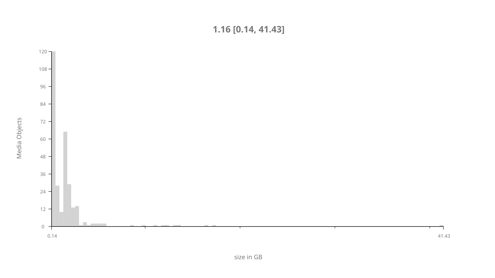
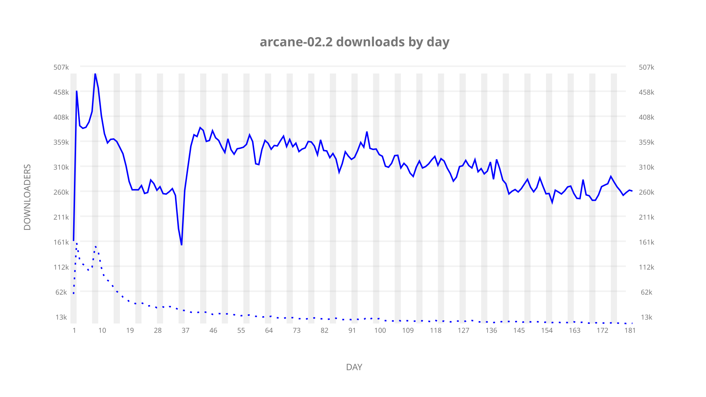
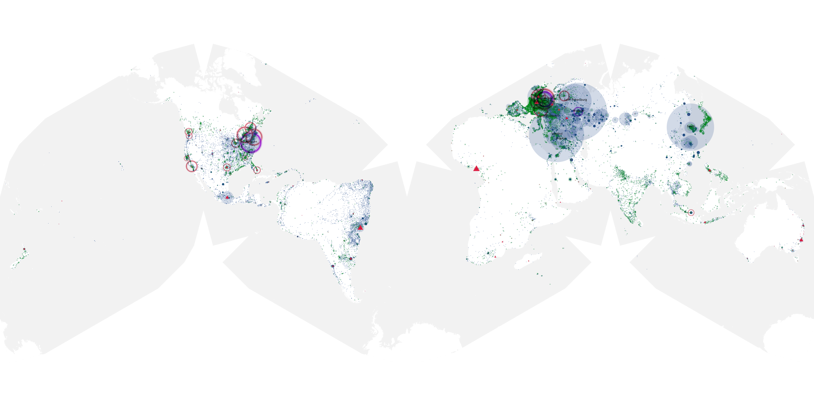
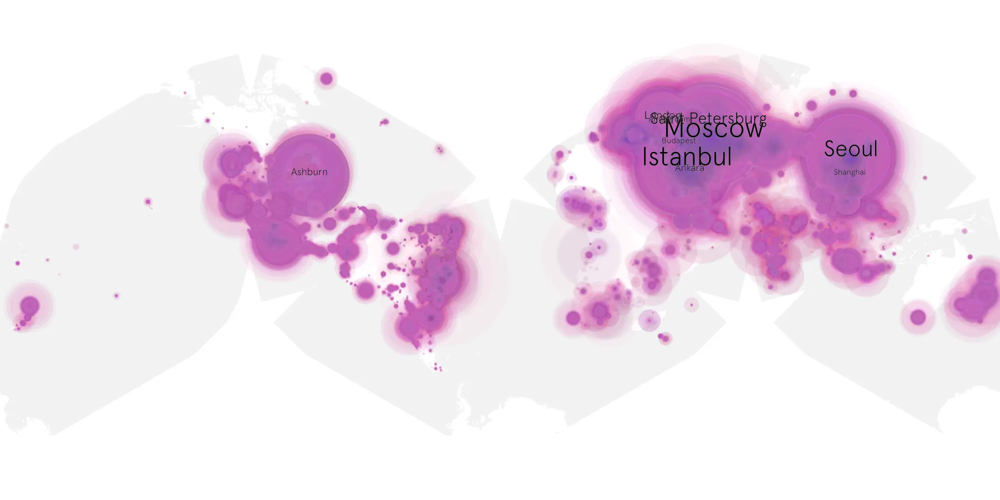
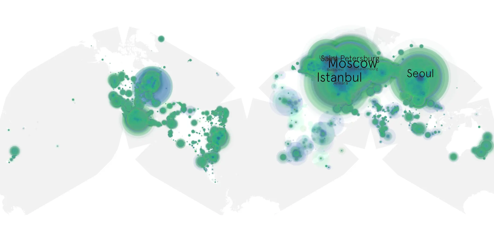

# arcane-02.2 sample cache audit

## 1. Media object

| Field | Value |
| --- | --- |
| Media object | Arcane |
| Collection key | `arcane-02.2` |
| imdb_id | [tt11126994](https://www.imdb.com/title/tt11126994/) |
| wikipedia_url | [Arcane (TV series)](https://en.wikipedia.org/wiki/Arcane_(TV_series)) |
| Sample dates | 2024-11-16-to-2025-05-16 |
| Sample days | 182 |
| BTIH count | 325 |
| Unique BTIH count | 302 |
| Downloaders total | 45,609,458 |
| Uploaders total | 2,612,466 |
| Data version | `2026-08-05` |
| IP geolocation version | `6:1777968300` |

## 2. Coverage report

- Generated: 2026-08-28T16:56:36Z
- Sample archive directory: `/run/media/bkoz/gold/src/alpha60-samples-raw.gold/arcane-02.2.xz`
- Hour directories: 4350
- Zero-length sample files: 0
- Other unparsable sample files: 0
- Hourly discontinuities: 1 (1 missing hours)
- Missing days: 0

### Sample archive discontinuities

- hourly gap: last `2025-03-30 01:03`, resumed `2025-03-30 03:03` — missing 1 hour(s)

## 3. File sizes histogram *median[lowest, highest]*

## 4. Graphs

### Downloads by week cumulative (normalized start)



### Downloads by day, Saturday and Sunday in gray

## 5. Cumulative Maps

<!-- https://raw.githubusercontent.com/alpha60-devops/alpha60-results-2024/refs/heads/main/data/ -->

### <a href="https://raw.githubusercontent.com/alpha60-devops/alpha60-results-2024/refs/heads/main/data/geojson.cumulative/arcane-02.2-cumulative-aggregate.geojson.gz" data-map-title="Arcane — arcane-02.2" onclick="leaflet_map_open_window(this.href, this.dataset.mapTitle); return false;" class="table-link" aria-label="Open Arcane (arcane-02.2) cumulative data map in new window" title="Opens interactive map for Arcane (arcane-02.2) data">Swarm Detail</a>

### Geographic Regions

| Africa | Americas | Asia | Europe | Oceania | Unknown |
| --- | --- | --- | --- | --- | --- |
| 1.49 | 15.74 | 27.29 | 52.86 | 0.78 | 0.53 |

### Network infrastructure

{:target="_blank" rel="noopener"}

### Resolution >= 1080p

{:target="_blank" rel="noopener"}

### Resolution < 1080p

{:target="_blank" rel="noopener"}
