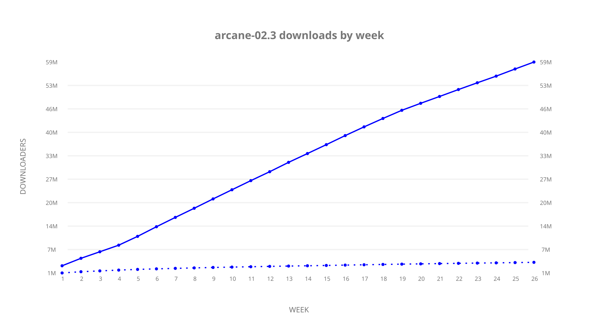
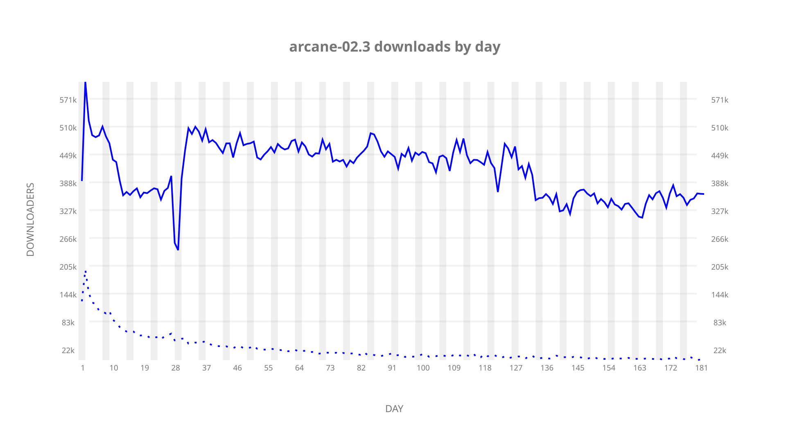
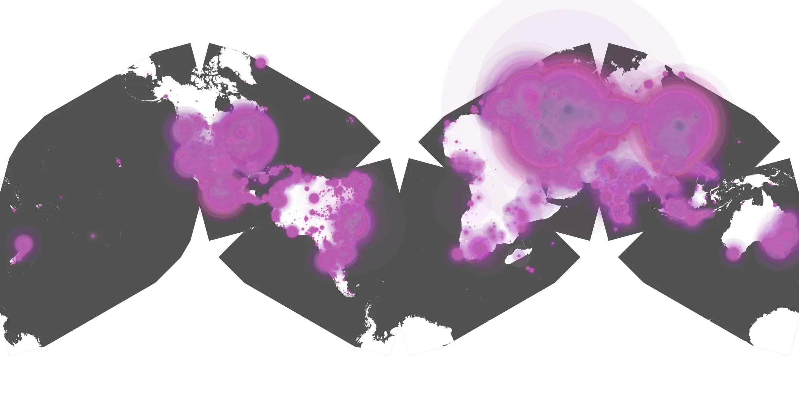
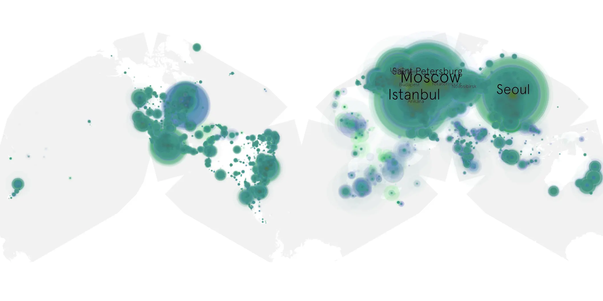

# arcane-02.3 sample cache audit

## 1. Media object

| Field | Value |
| --- | --- |
| Media object | Arcane |
| Collection key | `arcane-02.3` |
| imdb_id | [tt11126994](https://www.imdb.com/title/tt11126994/) |
| wikipedia_url | UNAVAILABLE |
| Sample dates | 2024-11-23-to-2025-05-23 |
| Sample days | 182 (2024–2025) |
| BTIH count | 412 |
| Unique BTIH count | 380 |
| Downloaders total | 61,839,090 |
| Uploaders total | 4,373,359 |
| Data version | `2026-08-05` |
| IP geolocation version | `6:1777968300` |

## 2. Cache coverage report

- Generated: 2026-08-28T17:00:51Z
- Sample archive directory: `/run/media/bkoz/gold/src/alpha60-samples-raw.gold/arcane-02.3.xz`
- Hour directories: 4350
- Zero-length sample files: 0
- Other unparsable sample files: 0
- Hourly discontinuities: 2 (2 missing hours)
- Missing days: 0

### Sample archive discontinuities

- hourly gap: last `2025-03-30 01:06`, resumed `2025-03-30 03:06` — missing 1 hour(s)
- hourly gap: last `2025-04-18 22:06`, resumed `2025-04-19 00:06` — missing 1 hour(s)

## 3. Collection size histogram

UNAVAILABLE — no collection size histogram was rendered.

## 4. Visualization pass — graphs

### Downloads by week cumulative (normalized start)

### Downloads by day, Saturday and Sunday in gray

## 5. Visualization pass — maps

### Continental downloader slices

| Africa | Americas | Asia | Europe | Oceania | Unknown |
| --- | --- | --- | --- | --- | --- |
| 1.49 | 15.33 | 27.47 | 52.61 | 0.82 | 0.54 |

### Cumulative network infrastructure

{:target="_blank" rel="noopener"}

### Cumulative data maps

**Cumulative >= 1080p**

**Cumulative < 1080p**

