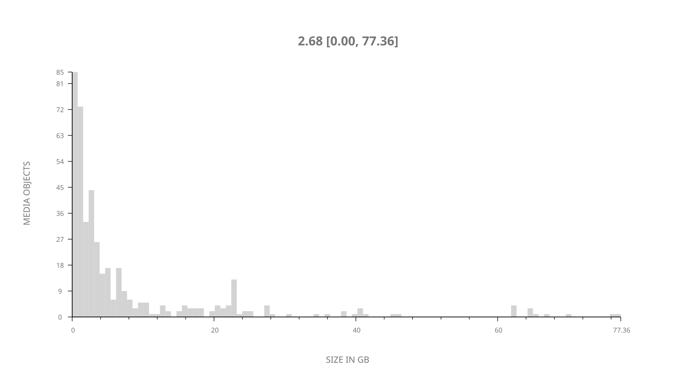
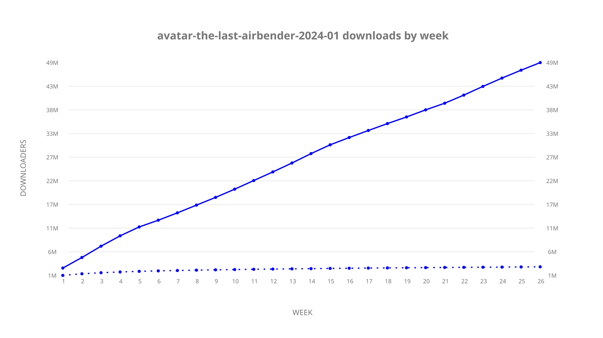
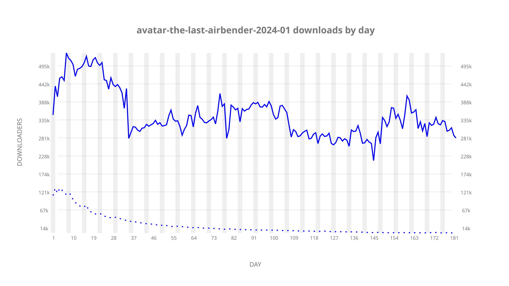

# avatar-the-last-airbender-2024-01 sample cache audit

## 1. Media object

| Field | Value |
| --- | --- |
| Media object | Avatar: The Last Airbender |
| Collection key | `avatar-the-last-airbender-2024-01` |
| imdb_id | [tt9018736](https://www.imdb.com/title/tt9018736/) |
| wikipedia_url | [Avatar: The Last Airbender (2024 TV series)](https://en.wikipedia.org/wiki/Avatar:_The_Last_Airbender_(2024_TV_series)) |
| Sample dates | 2024-02-24-to-2024-08-23 |
| Sample days | 182 (2024–2024) |
| BTIH count | 480 |
| Unique BTIH count | 427 |
| Downloaders total | 52,149,524 |
| Uploaders total | 3,278,199 |
| Data version | `2026-08-05` |
| IP geolocation version | `6:1777968300` |

## 2. Cache coverage report

UNAVAILABLE: no sample archive on this host.

## 3. Collection size histogram

## 4. Visualization pass — graphs

### Downloads by week cumulative (normalized start)

### Downloads by day, Saturday and Sunday in gray

## 5. Visualization pass — maps

### Continental downloader slices

| Africa | Americas | Asia | Europe | Oceania | Unknown |
| --- | --- | --- | --- | --- | --- |
| 1.83 | 18.79 | 24.74 | 51.20 | 0.89 | 0.65 |

### Cumulative network infrastructure

{:target="_blank" rel="noopener"}

UNAVAILABLE — no cumulative data maps were rendered.
