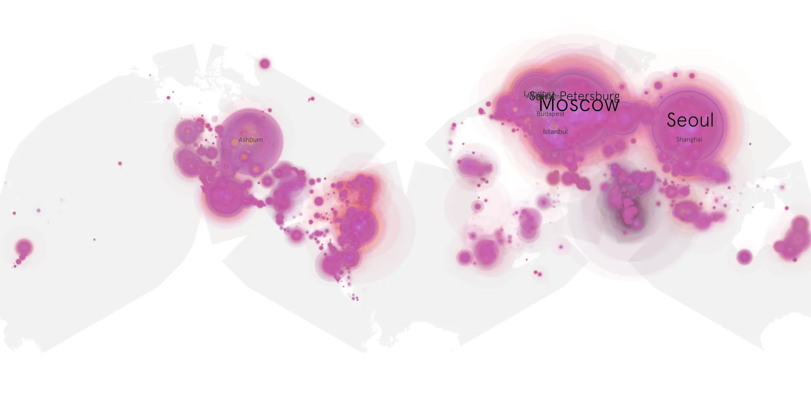
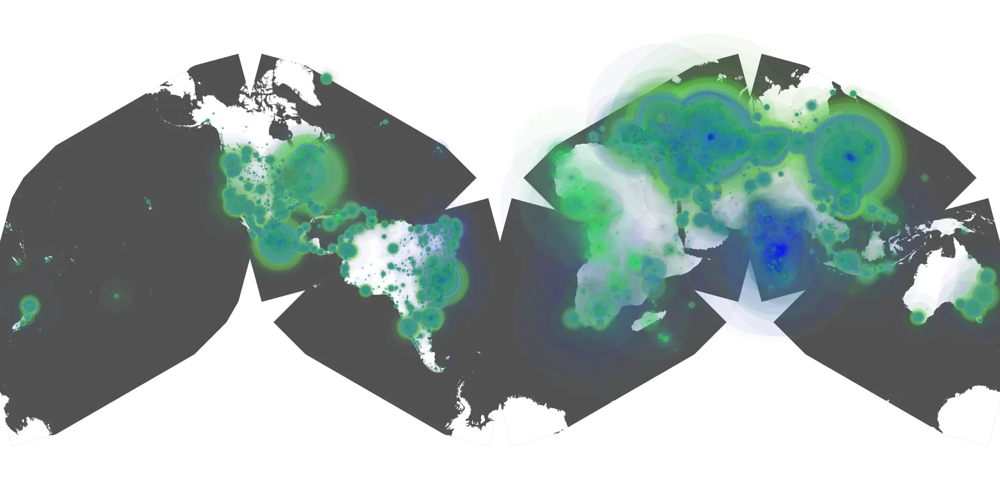

# avatar-the-last-airbender-2024-01 sample cache audit

## 1. Media object

| Field | Value |
| --- | --- |
| Media object | Avatar: The Last Airbender |
| Collection key | `avatar-the-last-airbender-2024-01` |
| imdb_id | [tt9018736](https://www.imdb.com/title/tt9018736/) |
| wikipedia_url | [Avatar: The Last Airbender (2024 TV series)](https://en.wikipedia.org/wiki/Avatar:_The_Last_Airbender_(2024_TV_series)) |
| Sample dates | 2024-02-24-to-2024-08-23 |
| Sample days | 182 |
| BTIH count | 480 |
| Unique BTIH count | 427 |
| Downloaders total | 52,149,524 |
| Uploaders total | 3,278,199 |
| Data version | `2026-08-05` |
| IP geolocation version | `6:1777968300` |

## 2. Coverage report

- Generated: 2026-08-28T17:04:04Z
- Sample archive directory: `/run/media/bkoz/gold/src/alpha60-samples-raw.gold/avatar-the-last-airbender-2024-01.xz`
- Hour directories: 4357
- Zero-length sample files: 0
- Other unparsable sample files: 0
- Hourly discontinuities: 3 (7 missing hours)
- Missing days: 0

### Sample archive discontinuities

- hourly gap: last `2024-03-31 01:00`, resumed `2024-03-31 03:00` — missing 1 hour(s)
- hourly gap: last `2024-07-06 19:00`, resumed `2024-07-06 21:00` — missing 1 hour(s)
- hourly gap: last `2024-07-16 23:00`, resumed `2024-07-17 05:00` — missing 5 hour(s)

## 3. File sizes histogram *median[lowest, highest]*

## 4. Graphs

### Downloads by week cumulative (normalized start)



### Downloads by day, Saturday and Sunday in gray

## 5. Cumulative Maps

<!-- https://raw.githubusercontent.com/alpha60-devops/alpha60-results-2024/refs/heads/main/data/ -->

### <a href="https://raw.githubusercontent.com/alpha60-devops/alpha60-results-2024/refs/heads/main/data/geojson.cumulative/avatar-the-last-airbender-2024-01-cumulative-aggregate.geojson.gz" data-map-title="Avatar: The Last Airbender — avatar-the-last-airbender-2024-01" onclick="leaflet_map_open_window(this.href, this.dataset.mapTitle); return false;" class="table-link" aria-label="Open Avatar: The Last Airbender (avatar-the-last-airbender-2024-01) cumulative data map in new window" title="Opens interactive map for Avatar: The Last Airbender (avatar-the-last-airbender-2024-01) data">Swarm Detail</a>

### Geographic Regions

| Africa | Americas | Asia | Europe | Oceania | Unknown |
| --- | --- | --- | --- | --- | --- |
| 1.83 | 18.79 | 24.74 | 51.20 | 0.89 | 0.65 |

### Network infrastructure

{:target="_blank" rel="noopener"}

### Resolution >= 1080p

{:target="_blank" rel="noopener"}

### Resolution < 1080p

{:target="_blank" rel="noopener"}
