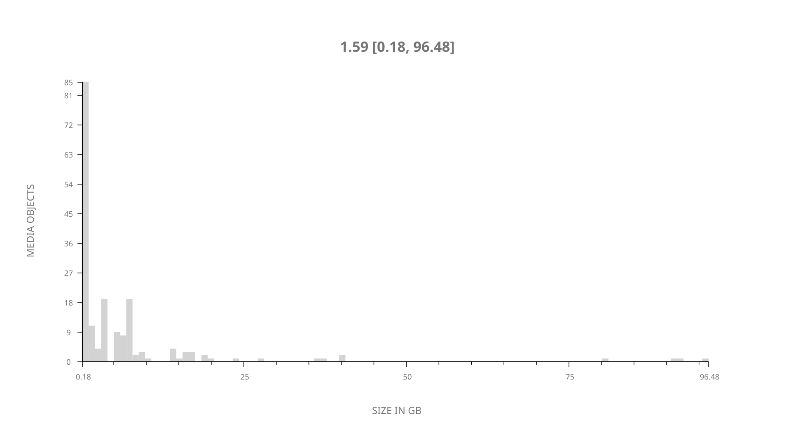
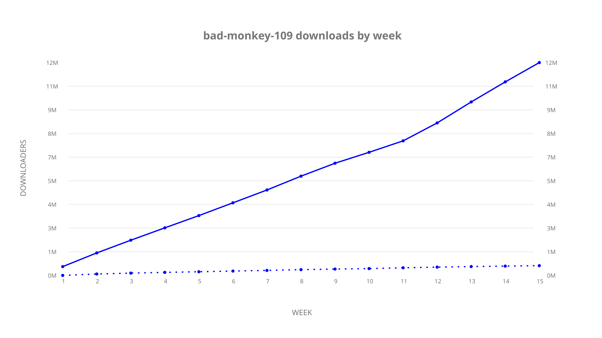
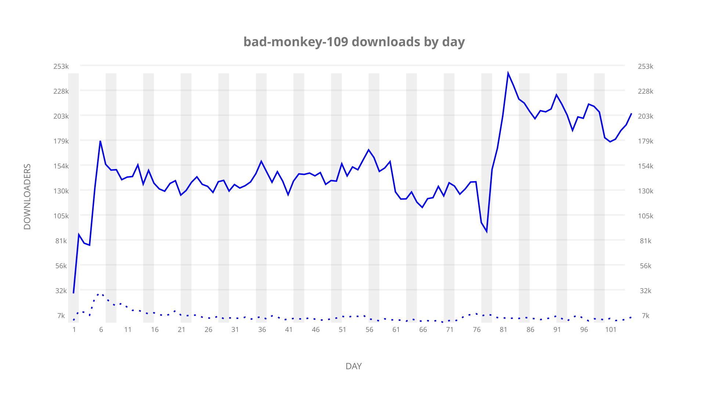
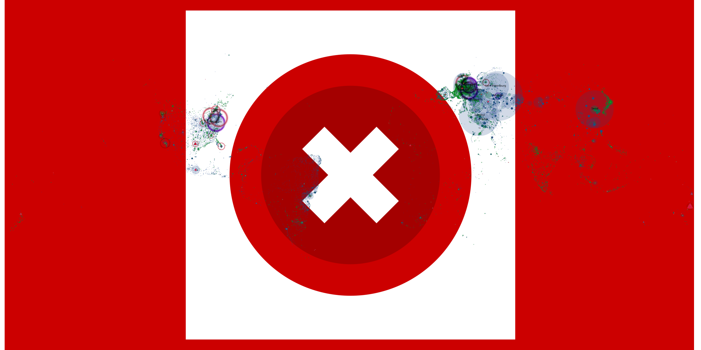

# bad-monkey-109 sample cache audit

## 1. Media object

| Field | Value |
| --- | --- |
| Media object | Bad Monkey 109 |
| Collection key | `bad-monkey-109` |
| imdb_id | [tt15203646](https://www.imdb.com/title/tt15203646/) |
| wikipedia_url | UNAVAILABLE |
| Sample dates | 2024-10-05-to-2025-01-17 |
| Sample days | 105 (2024–2025) |
| BTIH count | 205 |
| Unique BTIH count | 185 |
| Downloaders total | 12,433,783 |
| Uploaders total | 711,776 |
| Data version | `2026-08-05` |
| IP geolocation version | `6:1777968300` |

## 2. Cache coverage report

UNAVAILABLE: no sample archive on this host.

## 3. Collection size histogram

## 4. Visualization pass — graphs

### Downloads by week cumulative (normalized start)

### Downloads by day, Saturday and Sunday in gray

## 5. Visualization pass — maps

### Continental downloader slices

| Africa | Americas | Asia | Europe | Oceania | Unknown |
| --- | --- | --- | --- | --- | --- |
| 1.05 | 16.55 | 25.07 | 53.90 | 0.98 | 0.52 |

### Cumulative network infrastructure

{:target="_blank" rel="noopener"}

UNAVAILABLE — no cumulative data maps were rendered.
