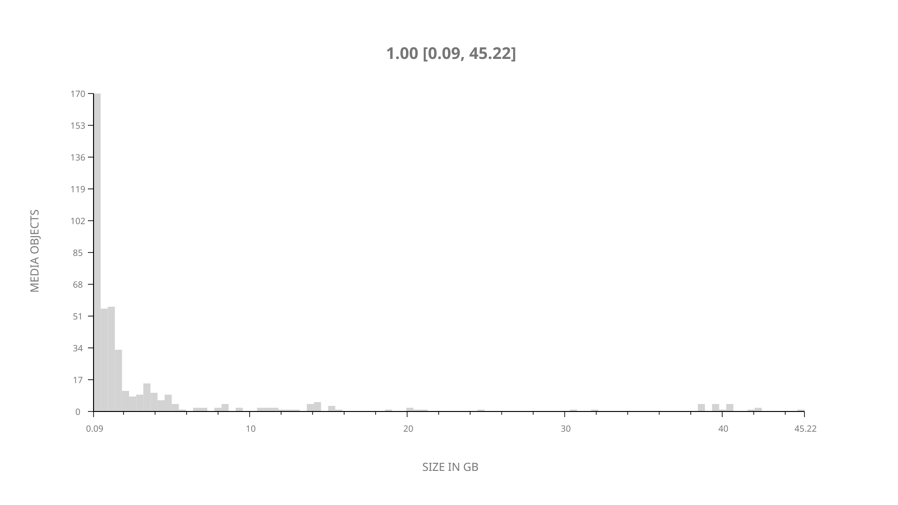
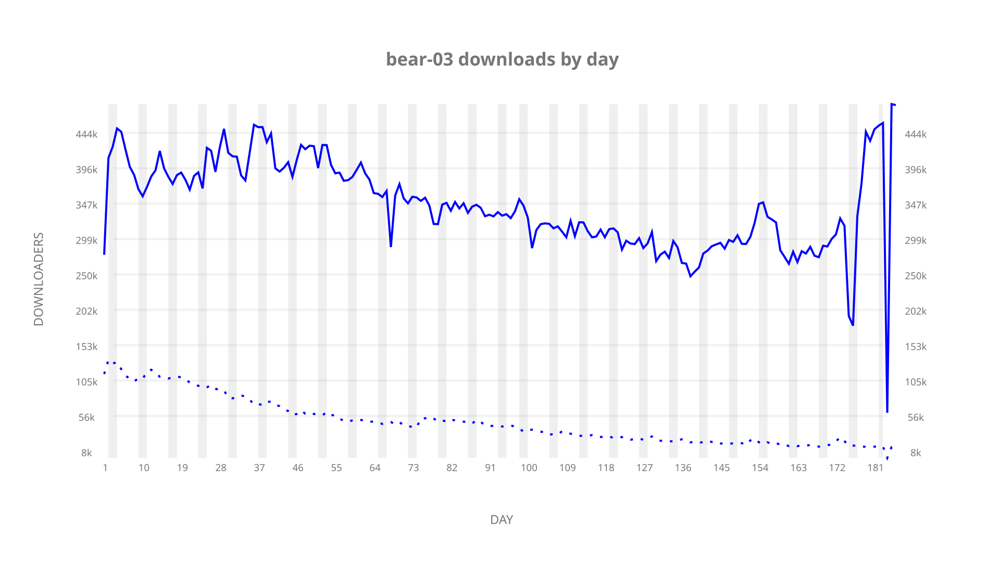
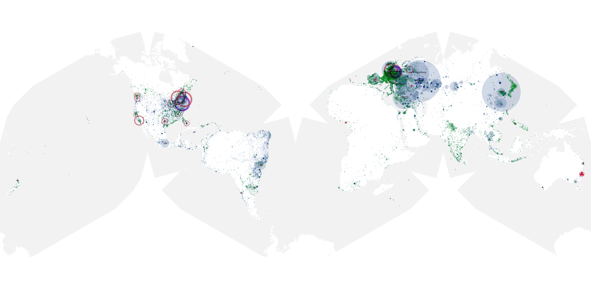
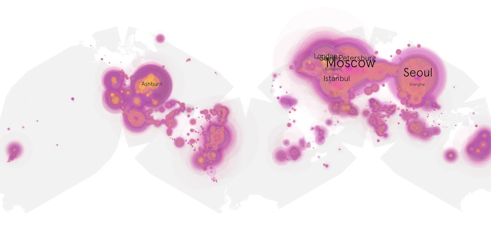
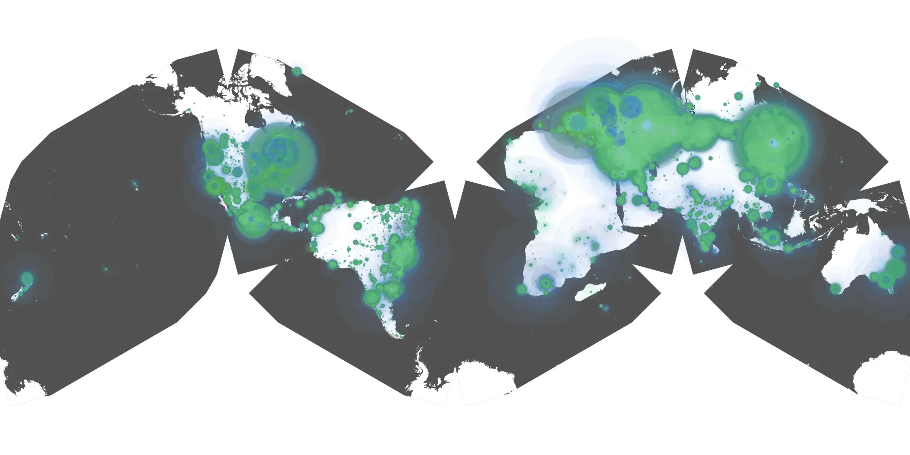

# bear-03 sample cache audit

## 1. Media object

| Field | Value |
| --- | --- |
| Media object | The Bear |
| Collection key | `bear-03` |
| imdb_id | [tt14452776](https://www.imdb.com/title/tt14452776/) |
| wikipedia_url | [The Bear (TV series)](https://en.wikipedia.org/wiki/The_Bear_(TV_series)) |
| Sample dates | 2024-06-27-to-2025-01-01 |
| Sample days | 189 |
| BTIH count | 490 |
| Unique BTIH count | 446 |
| Downloaders total | 46,702,449 |
| Uploaders total | 4,922,412 |
| Data version | `2026-08-05` |
| IP geolocation version | `6:1777968300` |

## 2. Coverage report

- Generated: 2026-08-25T22:08:21Z
- Sample archive directory: `/run/media/bkoz/gold/src/alpha60-samples-raw.gold/bear-03.xz`
- Hour directories: 4481
- Zero-length sample files: 0
- Other unparsable sample files: 0
- Hourly discontinuities: 2 (48 missing hours)
- Missing days: 1

### Sample archive discontinuities

- hourly gap: last `2024-12-12 22:00`, resumed `2024-12-13 00:00` — missing 1 hour(s)
- hourly gap: last `2024-12-28 22:00`, resumed `2024-12-30 22:00` — missing 47 hour(s)
- missing day: `2024-12-29`

## 3. File sizes histogram *median[lowest, highest]*

## 4. Graphs

### Downloads by week cumulative (normalized start)



### Downloads by day, Saturday and Sunday in gray

## 5. Cumulative Maps

<!-- https://raw.githubusercontent.com/alpha60-devops/alpha60-results-2024/refs/heads/main/data/ -->

### <a href="https://raw.githubusercontent.com/alpha60-devops/alpha60-results-2024/refs/heads/main/data/geojson.cumulative/bear-03-cumulative-aggregate.geojson.gz" data-map-title="The Bear — bear-03" onclick="leaflet_map_open_window(this.href, this.dataset.mapTitle); return false;" class="table-link" aria-label="Open The Bear (bear-03) cumulative data map in new window" title="Opens interactive map for The Bear (bear-03) data">Swarm Detail</a>

### Geographic Regions

| Africa | Americas | Asia | Europe | Oceania | Unknown |
| --- | --- | --- | --- | --- | --- |
| 1.20 | 18.33 | 24.62 | 51.65 | 1.21 | 0.60 |

### Network infrastructure

{:target="_blank" rel="noopener"}

### Resolution >= 1080p

{:target="_blank" rel="noopener"}

### Resolution < 1080p

{:target="_blank" rel="noopener"}
