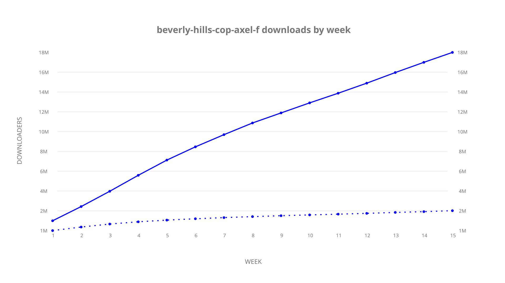
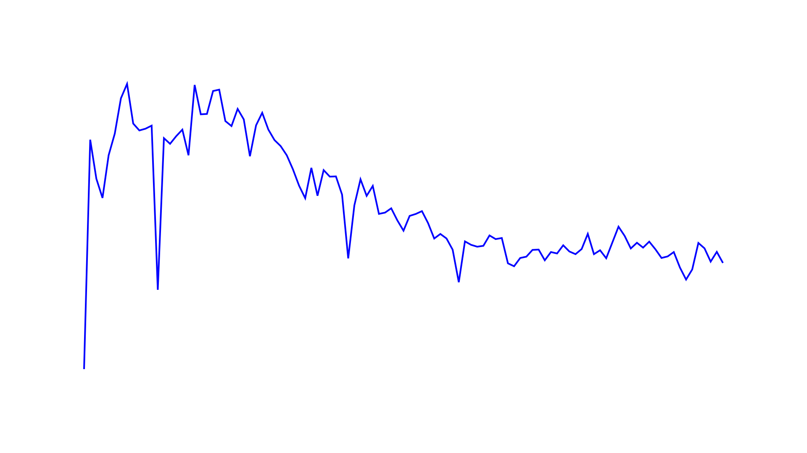
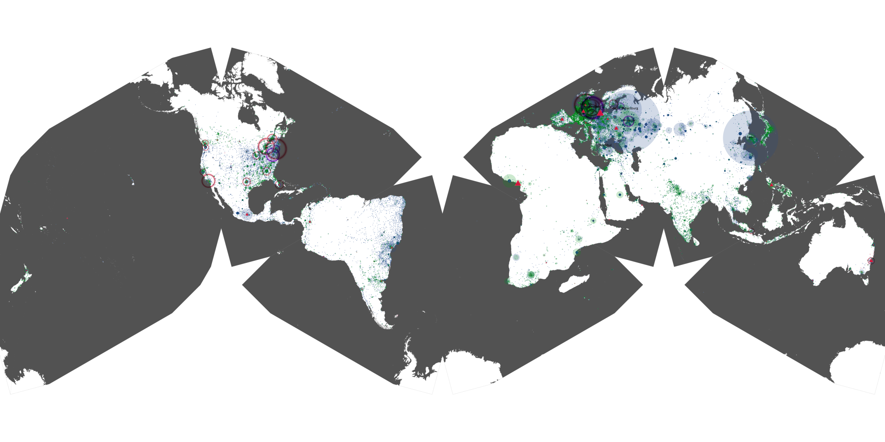

# beverly-hills-cop-axel-f sample cache audit

## 1. Media object

| Field | Value |
| --- | --- |
| Media object | Beverly Hills Cop: Axel F |
| Collection key | `beverly-hills-cop-axel-f` |
| imdb_id | [tt3083016](https://www.imdb.com/title/tt3083016/) |
| wikipedia_url | UNAVAILABLE |
| Sample dates | 2024-07-03-to-2024-10-15 |
| Sample days | 105 (2024–2024) |
| BTIH count | 234 |
| Unique BTIH count | 176 |
| Downloaders total | 21,006,765 |
| Uploaders total | 3,112,965 |
| Data version | `2026-08-05` |
| IP geolocation version | `6:1777968300` |

## 2. Cache coverage report

UNAVAILABLE: no sample archive on this host.

## 3. Collection size histogram

## 4. Visualization pass — graphs

### Downloads by week cumulative (normalized start)

### Downloads by day, Saturday and Sunday in gray

## 5. Visualization pass — maps

### Continental downloader slices

| Africa | Americas | Asia | Europe | Oceania | Unknown |
| --- | --- | --- | --- | --- | --- |
| 3.82 | 16.89 | 24.17 | 49.62 | 1.37 | 0.64 |

### Cumulative network infrastructure

{:target="_blank" rel="noopener"}

UNAVAILABLE — no cumulative data maps were rendered.
