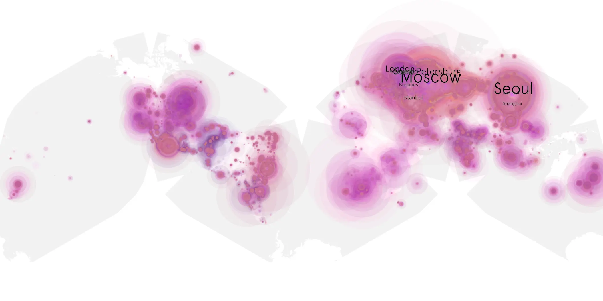
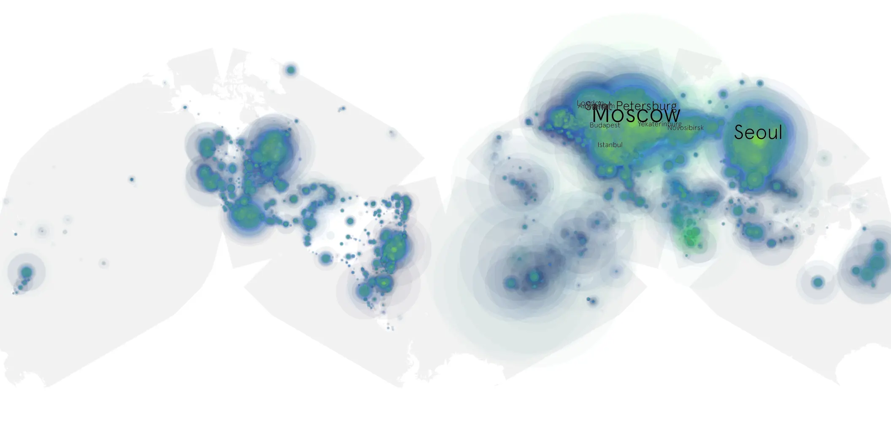

# beverly-hills-cop-axel-f sample cache audit

## 1. Media object

| Field | Value |
| --- | --- |
| Media object | Beverly Hills Cop: Axel F |
| Collection key | `beverly-hills-cop-axel-f` |
| imdb_id | [tt3083016](https://www.imdb.com/title/tt3083016/) |
| wikipedia_url | [Beverly Hills Cop: Axel F](https://en.wikipedia.org/wiki/Beverly_Hills_Cop:_Axel_F) |
| Sample dates | 2024-07-03-to-2024-10-15 |
| Sample days | 105 |
| BTIH count | 234 |
| Unique BTIH count | 176 |
| Downloaders total | 21,006,765 |
| Uploaders total | 3,112,965 |
| Data version | `2026-08-05` |
| IP geolocation version | `6:1777968300` |

## 2. Sample coverage report

- Generated: 2026-08-28T17:12:15Z
- Sample archive directory: `/run/media/bkoz/gold/src/alpha60-samples-raw.gold/beverly-hills-cop-axel-f.xz`
- Hour directories: 2491
- Zero-length sample files: 0
- Other unparsable sample files: 0
- Hourly discontinuities: 2 (18 missing hours)
- Missing days: 0

### Sample archive discontinuities

- hourly gap: last `2024-07-15 12:06`, resumed `2024-07-16 00:06` — missing 11 hour(s)
- hourly gap: last `2024-08-14 23:06`, resumed `2024-08-15 07:06` — missing 7 hour(s)

## 3. Media objects file size histogram

## 4. Visualization pass — graphs

### Downloads by week cumulative (normalized start)



### Downloads by day, Saturday and Sunday in gray

## 5. Visualization pass — maps

### Cumulative geographic slices

| Africa | Americas | Asia | Europe | Oceania | Unknown |
| --- | --- | --- | --- | --- | --- |
| 3.82 | 16.89 | 24.17 | 49.62 | 1.37 | 0.64 |

### Cumulative network infrastructure

{:target="_blank" rel="noopener"}

### Cumulative data maps

**Cumulative >= 1080p**

{:target="_blank" rel="noopener"}

**Cumulative < 1080p**

{:target="_blank" rel="noopener"}
