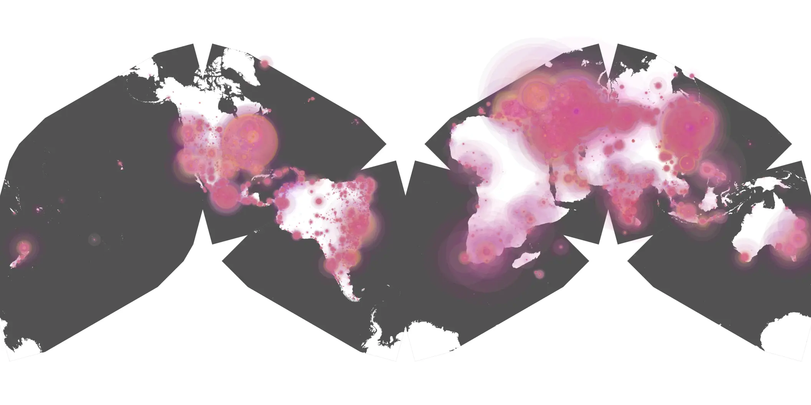
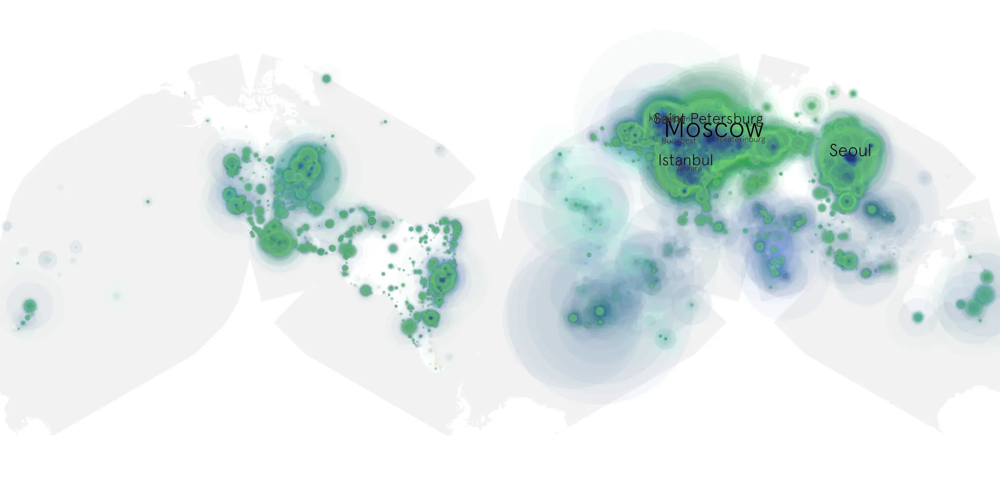

# blink-twice sample cache audit

## 1. Media object

| Field | Value |
| --- | --- |
| Media object | Blink Twice |
| Collection key | `blink-twice` |
| imdb_id | [tt14858658](https://www.imdb.com/title/tt14858658/) |
| wikipedia_url | [Blink Twice](https://en.wikipedia.org/wiki/Blink_Twice) |
| Sample dates | 2024-09-18-to-2025-01-08 |
| Sample days | 113 |
| BTIH count | 184 |
| Unique BTIH count | 168 |
| Downloaders total | 17,512,731 |
| Uploaders total | 2,600,784 |
| Data version | `2026-08-05` |
| IP geolocation version | `6:1777968300` |

## 2. Coverage report

- Generated: 2026-08-28T17:17:09Z
- Sample archive directory: `/run/media/bkoz/gold/src/alpha60-samples-raw.gold/blink-twice.xz`
- Hour directories: 2712
- Zero-length sample files: 0
- Other unparsable sample files: 0
- Hourly discontinuities: 0 (0 missing hours)
- Missing days: 0

### Sample archive discontinuities

None detected.

## 3. File sizes histogram *median[lowest, highest]*

## 4. Graphs

### Downloads by week cumulative (normalized start)



### Downloads by day, Saturday and Sunday in gray

## 5. Cumulative Maps

<!-- https://raw.githubusercontent.com/alpha60-devops/alpha60-results-2024/refs/heads/main/data/ -->

### <a href="https://raw.githubusercontent.com/alpha60-devops/alpha60-results-2024/refs/heads/main/data/geojson.cumulative/blink-twice-cumulative-aggregate.geojson.gz" data-map-title="Blink Twice — blink-twice" onclick="leaflet_map_open_window(this.href, this.dataset.mapTitle); return false;" class="table-link" aria-label="Open Blink Twice (blink-twice) cumulative data map in new window" title="Opens interactive map for Blink Twice (blink-twice) data">Swarm Detail</a>

### Geographic Regions

| Africa | Americas | Asia | Europe | Oceania | Unknown |
| --- | --- | --- | --- | --- | --- |
| 3.39 | 15.76 | 23.31 | 51.82 | 1.17 | 0.53 |

### Network infrastructure

{:target="_blank" rel="noopener"}

### Resolution >= 1080p

{:target="_blank" rel="noopener"}

### Resolution < 1080p

{:target="_blank" rel="noopener"}
