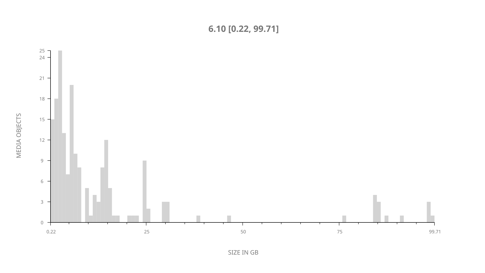
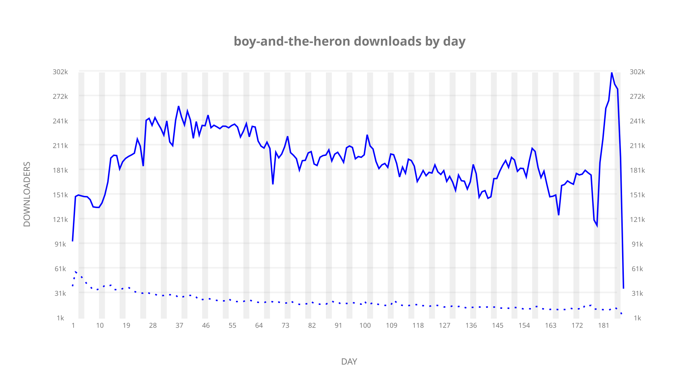
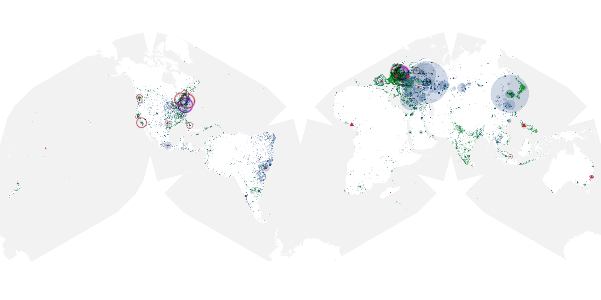
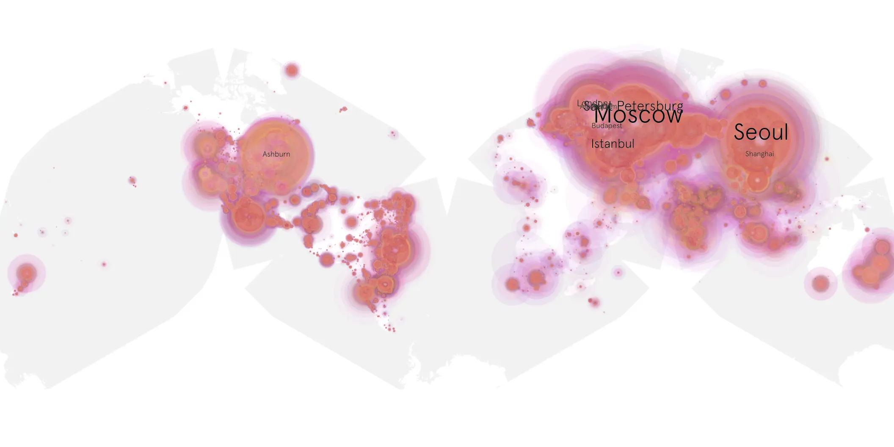
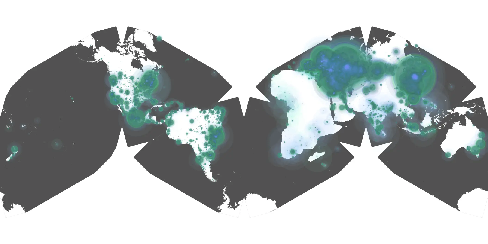

# boy-and-the-heron sample cache audit

## 1. Media object

| Field | Value |
| --- | --- |
| Media object | The Boy and the Heron |
| Collection key | `boy-and-the-heron` |
| imdb_id | [tt6587046](https://www.imdb.com/title/tt6587046/) |
| wikipedia_url | [The Boy and the Heron](https://en.wikipedia.org/wiki/The_Boy_and_the_Heron) |
| Sample dates | 2024-06-26-to-2025-01-08 |
| Sample days | 197 |
| BTIH count | 237 |
| Unique BTIH count | 192 |
| Downloaders total | 29,063,733 |
| Uploaders total | 2,113,998 |
| Data version | `2026-08-05` |
| IP geolocation version | `6:1777968300` |

## 2. Sample coverage report

- Generated: 2026-08-29T15:43:07Z
- Sample archive directory: `/run/media/bkoz/gold/src/alpha60-samples-raw.gold/boy-and-the-heron.xz`
- Hour directories: 4709
- Zero-length sample files: 0
- Other unparsable sample files: 0
- Hourly discontinuities: 1 (7 missing hours)
- Missing days: 0

### Sample archive discontinuities

- hourly gap: last `2024-12-07 22:06`, resumed `2024-12-08 06:06` — missing 7 hour(s)

## 3. Media objects file size histogram

## 4. Visualization pass — graphs

### Downloads by week cumulative (normalized start)



### Downloads by day, Saturday and Sunday in gray

## 5. Visualization pass — maps

### Cumulative geographic slices

| Africa | Americas | Asia | Europe | Oceania | Unknown |
| --- | --- | --- | --- | --- | --- |
| 1.38 | 16.74 | 26.81 | 51.02 | 0.94 | 0.67 |

### Cumulative network infrastructure

{:target="_blank" rel="noopener"}

### Cumulative data maps

**Cumulative >= 1080p**

{:target="_blank" rel="noopener"}

**Cumulative < 1080p**

{:target="_blank" rel="noopener"}
