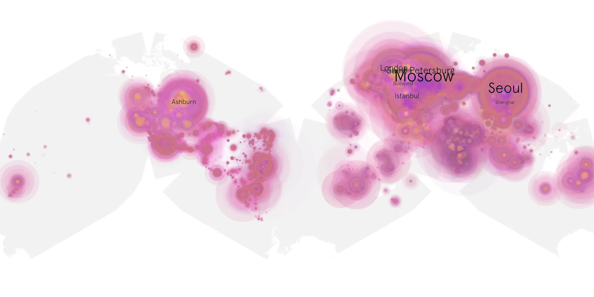
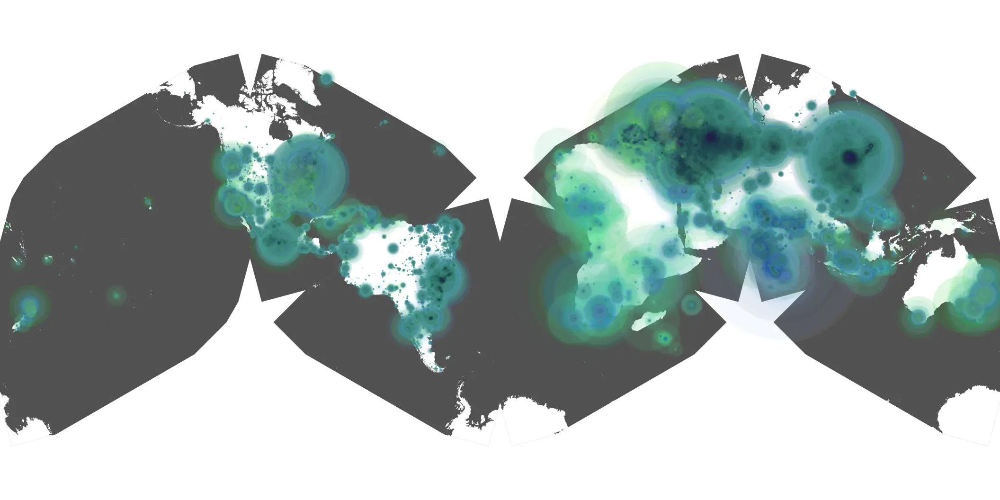

# boys-401 sample cache audit

## 1. Media object

| Field | Value |
| --- | --- |
| Media object | The Boys |
| Collection key | `boys-401` |
| imdb_id | [tt1190634](https://www.imdb.com/title/tt1190634/) |
| wikipedia_url | UNAVAILABLE |
| Sample dates | 2024-06-14-to-2024-12-12 |
| Sample days | 182 (2024–2024) |
| BTIH count | 316 |
| Unique BTIH count | 284 |
| Downloaders total | 41,998,372 |
| Uploaders total | 5,213,304 |
| Data version | `2026-08-05` |
| IP geolocation version | `6:1777968300` |

## 2. Cache coverage report

- Generated: 2026-08-28T17:21:19Z
- Sample archive directory: `/run/media/bkoz/gold/src/alpha60-samples-raw.gold/boys-401.xz`
- Hour directories: 4270
- Zero-length sample files: 0
- Other unparsable sample files: 0
- Hourly discontinuities: 6 (94 missing hours)
- Missing days: 1

### Sample archive discontinuities

- hourly gap: last `2024-07-21 22:06`, resumed `2024-07-22 19:06` — missing 20 hour(s)
- hourly gap: last `2024-08-11 22:06`, resumed `2024-08-12 15:06` — missing 16 hour(s)
- hourly gap: last `2024-08-12 22:06`, resumed `2024-08-13 00:06` — missing 1 hour(s)
- hourly gap: last `2024-08-14 22:06`, resumed `2024-08-16 21:22` — missing 46 hour(s)
- hourly gap: last `2024-08-17 22:06`, resumed `2024-08-18 09:06` — missing 10 hour(s)
- hourly gap: last `2024-08-18 22:06`, resumed `2024-08-19 00:06` — missing 1 hour(s)
- missing day: `2024-08-15`

## 3. Collection size histogram

## 4. Visualization pass — graphs

### Downloads by week cumulative (normalized start)

### Downloads by day, Saturday and Sunday in gray

## 5. Visualization pass — maps

### Continental downloader slices

| Africa | Americas | Asia | Europe | Oceania | Unknown |
| --- | --- | --- | --- | --- | --- |
| 3.13 | 17.67 | 26.63 | 48.35 | 1.45 | 0.60 |

### Cumulative network infrastructure

{:target="_blank" rel="noopener"}

### Cumulative data maps

**Cumulative >= 1080p**

**Cumulative < 1080p**

