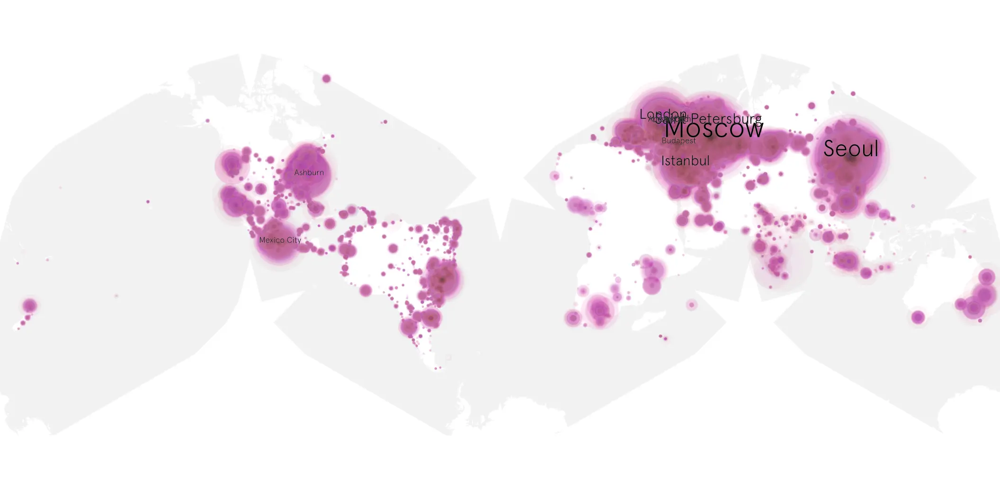
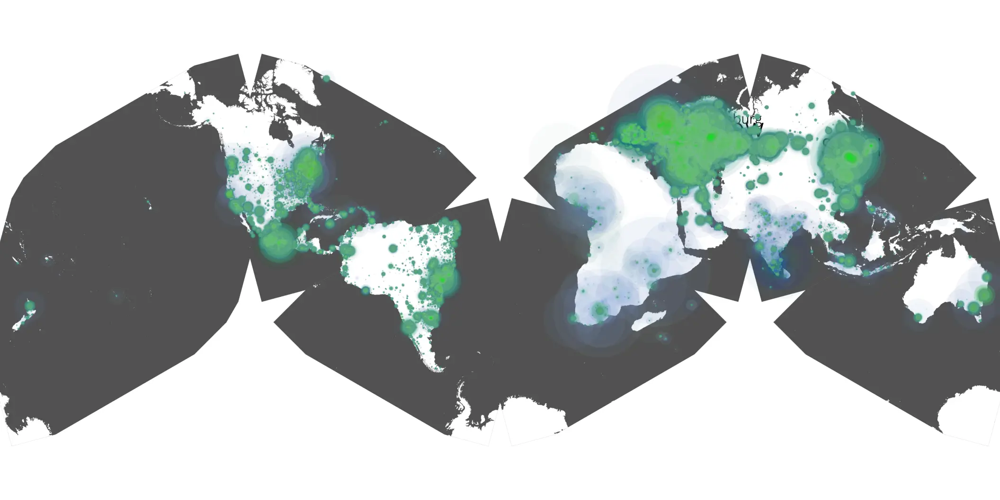

# brothers-sun-01 sample cache audit

## 1. Media object

| Field | Value |
| --- | --- |
| Media object | The Brothers Sun |
| Collection key | `brothers-sun-01` |
| imdb_id | [tt17632862](https://www.imdb.com/title/tt17632862/) |
| wikipedia_url | UNAVAILABLE |
| Sample dates | 2024-01-04-to-2024-04-24 |
| Sample days | 112 (2024–2024) |
| BTIH count | 201 |
| Unique BTIH count | 185 |
| Downloaders total | 11,311,948 |
| Uploaders total | 438,812 |
| Data version | `2026-08-05` |
| IP geolocation version | `6:1777968300` |

## 2. Cache coverage report

- Generated: 2026-08-28T17:22:55Z
- Sample archive directory: `/run/media/bkoz/gold/src/alpha60-samples-raw.gold/brothers-sun-01.xz`
- Hour directories: 2613
- Zero-length sample files: 0
- Other unparsable sample files: 0
- Hourly discontinuities: 14 (59 missing hours)
- Missing days: 1

### Sample archive discontinuities

- hourly gap: last `2024-03-31 01:03`, resumed `2024-03-31 03:03` — missing 1 hour(s)
- hourly gap: last `2024-04-04 14:03`, resumed `2024-04-04 16:03` — missing 1 hour(s)
- hourly gap: last `2024-04-05 06:03`, resumed `2024-04-05 08:03` — missing 1 hour(s)
- hourly gap: last `2024-04-05 12:03`, resumed `2024-04-05 14:03` — missing 1 hour(s)
- hourly gap: last `2024-04-05 21:03`, resumed `2024-04-05 23:03` — missing 1 hour(s)
- hourly gap: last `2024-04-07 23:03`, resumed `2024-04-08 01:03` — missing 1 hour(s)
- hourly gap: last `2024-04-09 17:03`, resumed `2024-04-09 19:03` — missing 1 hour(s)
- hourly gap: last `2024-04-09 21:03`, resumed `2024-04-09 23:03` — missing 1 hour(s)
- hourly gap: last `2024-04-10 01:03`, resumed `2024-04-10 03:03` — missing 1 hour(s)
- hourly gap: last `2024-04-15 21:03`, resumed `2024-04-15 23:03` — missing 1 hour(s)
- hourly gap: last `2024-04-17 00:03`, resumed `2024-04-17 02:03` — missing 1 hour(s)
- hourly gap: last `2024-04-18 02:03`, resumed `2024-04-18 04:03` — missing 1 hour(s)
- hourly gap: last `2024-04-19 23:03`, resumed `2024-04-21 00:03` — missing 24 hour(s)
- hourly gap: last `2024-04-21 00:03`, resumed `2024-04-22 00:03` — missing 23 hour(s)
- missing day: `2024-04-20`

## 3. Collection size histogram

## 4. Visualization pass — graphs

### Downloads by week cumulative (normalized start)

### Downloads by day, Saturday and Sunday in gray

## 5. Visualization pass — maps

### Continental downloader slices

| Africa | Americas | Asia | Europe | Oceania | Unknown |
| --- | --- | --- | --- | --- | --- |
| 2.14 | 19.18 | 23.00 | 51.46 | 0.87 | 0.55 |

### Cumulative network infrastructure

{:target="_blank" rel="noopener"}

### Cumulative data maps

**Cumulative >= 1080p**

**Cumulative < 1080p**

