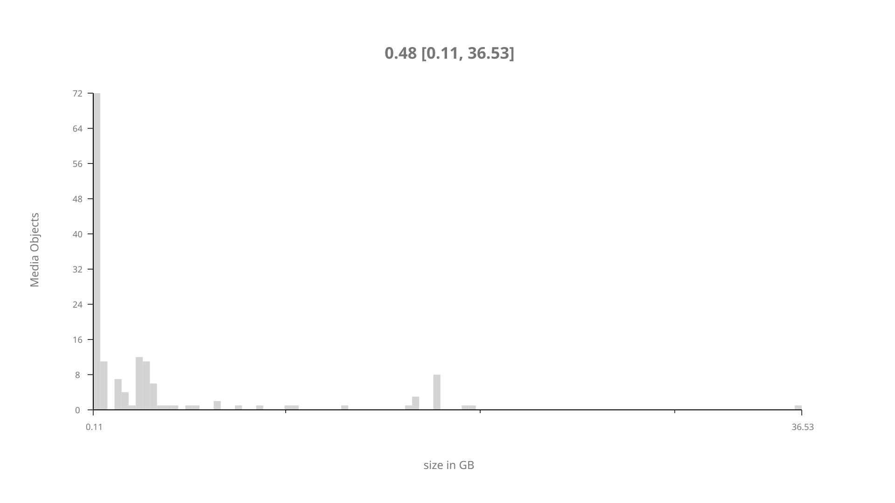
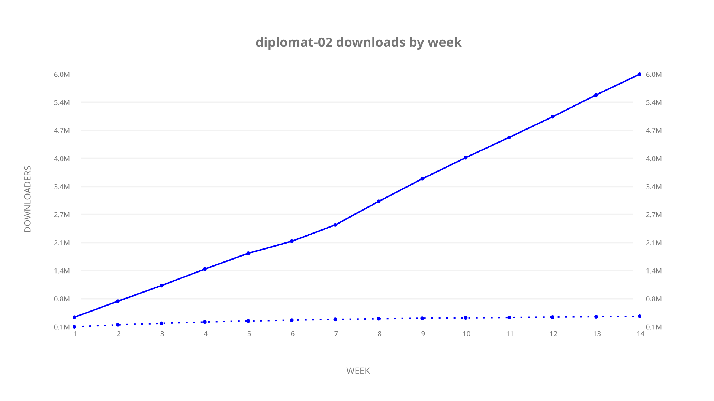
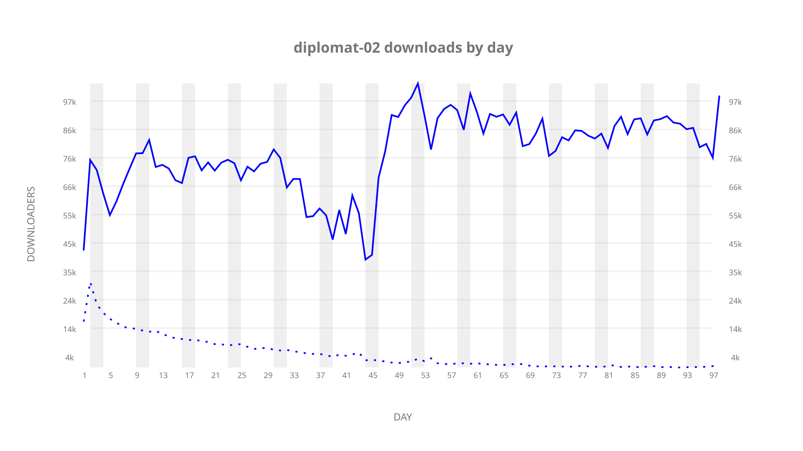
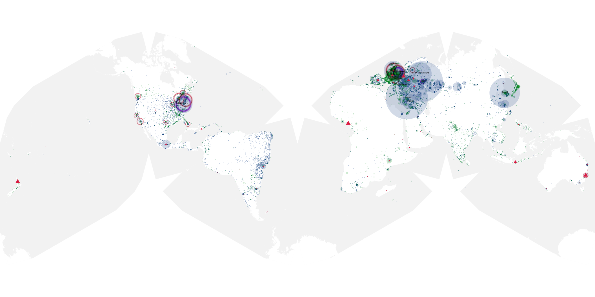
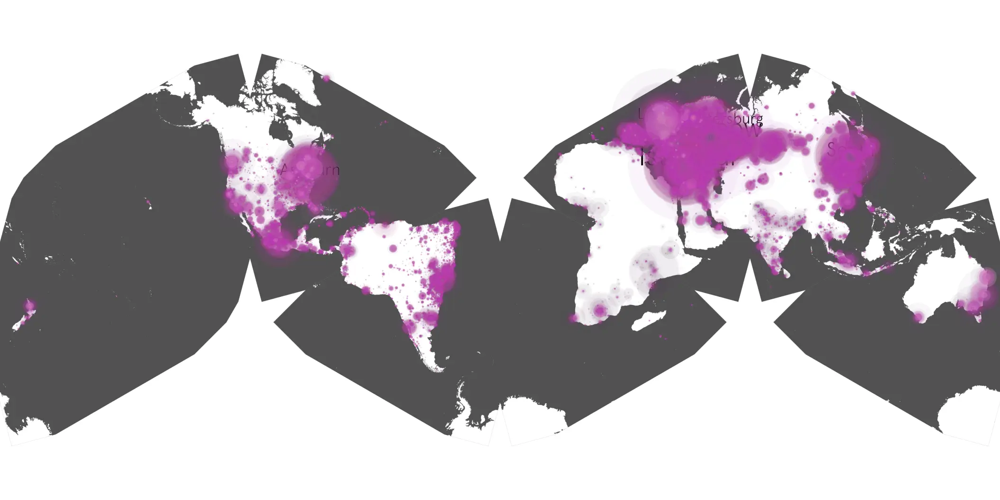
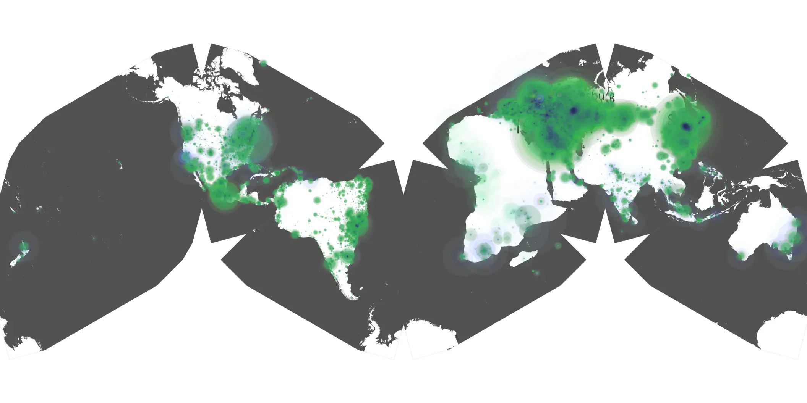

# diplomat-02 sample cache audit

## 1. Media object

| Field | Value |
| --- | --- |
| Media object | The Diplomat |
| Collection key | `diplomat-02` |
| imdb_id | [tt18687342](https://www.imdb.com/title/tt18687342/) |
| wikipedia_url | UNAVAILABLE |
| Sample dates | 2024-10-31-to-2025-02-12 |
| Sample days | 105 (2024–2025) |
| BTIH count | 161 |
| Unique BTIH count | 151 |
| Downloaders total | 6,432,247 |
| Uploaders total | 422,525 |
| Data version | `2026-08-05` |
| IP geolocation version | `6:1777968300` |

## 2. Cache coverage report

- Generated: 2026-08-28T17:26:10Z
- Sample archive directory: `/run/media/bkoz/gold/src/alpha60-samples-raw.gold/diplomat-02.xz`
- Hour directories: 2497
- Zero-length sample files: 0
- Other unparsable sample files: 0
- Hourly discontinuities: 1 (7 missing hours)
- Missing days: 0

### Sample archive discontinuities

- hourly gap: last `2024-12-07 22:03`, resumed `2024-12-08 06:03` — missing 7 hour(s)

## 3. Collection size histogram

## 4. Visualization pass — graphs

### Downloads by week cumulative (normalized start)

### Downloads by day, Saturday and Sunday in gray

## 5. Visualization pass — maps

### Continental downloader slices

| Africa | Americas | Asia | Europe | Oceania | Unknown |
| --- | --- | --- | --- | --- | --- |
| 1.71 | 15.77 | 24.81 | 51.26 | 0.98 | 0.47 |

### Cumulative network infrastructure

{:target="_blank" rel="noopener"}

### Cumulative data maps

**Cumulative >= 1080p**

**Cumulative < 1080p**

