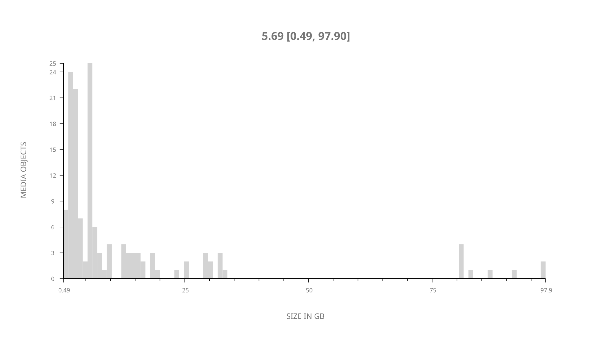
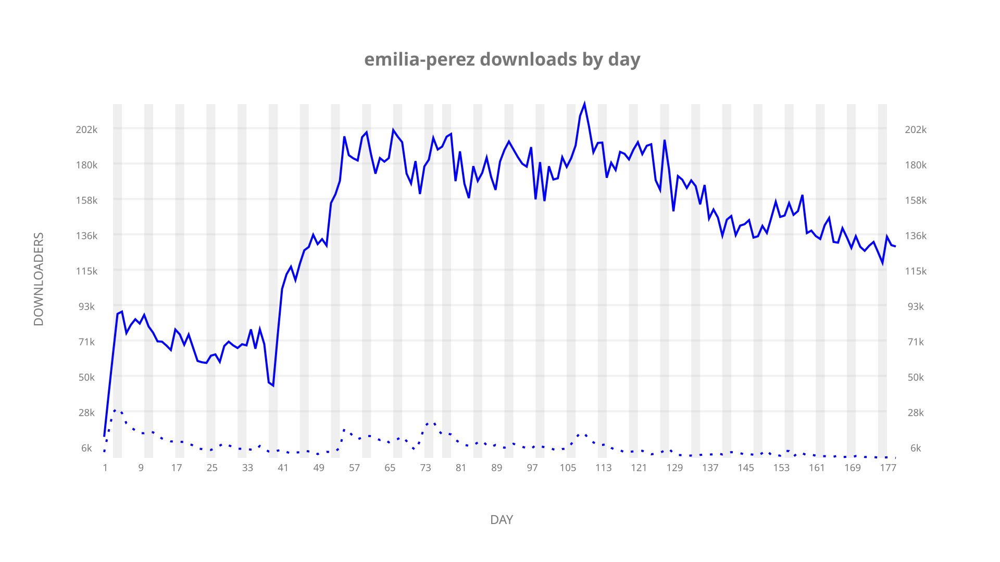
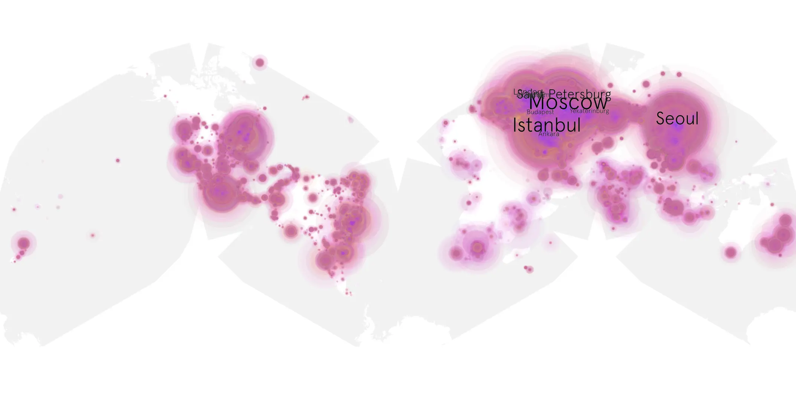
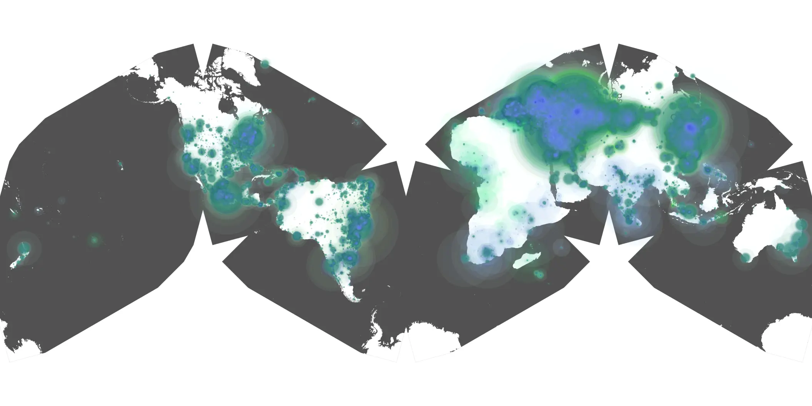

# emilia-perez sample cache audit

## 1. Media object

| Field | Value |
| --- | --- |
| Media object | Emilia Perez |
| Collection key | `emilia-perez` |
| imdb_id | [tt20221436](https://www.imdb.com/title/tt20221436/) |
| wikipedia_url | [Emilia Pérez](https://en.wikipedia.org/wiki/Emilia_P%C3%A9rez) |
| Sample dates | 2024-11-13-to-2025-05-13 |
| Sample days | 182 |
| BTIH count | 158 |
| Unique BTIH count | 142 |
| Downloaders total | 21,319,655 |
| Uploaders total | 1,269,848 |
| Data version | `2026-08-05` |
| IP geolocation version | `6:1777968300` |

## 2. Sample coverage report

- Generated: 2026-08-28T17:32:13Z
- Sample archive directory: `/run/media/bkoz/gold/src/alpha60-samples-raw.gold/emilia-perez.xz`
- Hour directories: 4278
- Zero-length sample files: 0
- Other unparsable sample files: 0
- Hourly discontinuities: 2 (73 missing hours)
- Missing days: 3

### Sample archive discontinuities

- hourly gap: last `2025-01-28 23:06`, resumed `2025-02-01 00:06` — missing 72 hour(s)
- hourly gap: last `2025-03-30 01:06`, resumed `2025-03-30 03:06` — missing 1 hour(s)
- missing day: `2025-01-29`
- missing day: `2025-01-30`
- missing day: `2025-01-31`

## 3. Media objects file size histogram

## 4. Visualization pass — graphs

### Downloads by week cumulative (normalized start)



### Downloads by day, Saturday and Sunday in gray

## 5. Visualization pass — maps

### Cumulative geographic slices

| Africa | Americas | Asia | Europe | Oceania | Unknown |
| --- | --- | --- | --- | --- | --- |
| 1.61 | 15.42 | 26.03 | 51.87 | 0.81 | 0.51 |

### Cumulative network infrastructure

{:target="_blank" rel="noopener"}

### Cumulative data maps

**Cumulative >= 1080p**

{:target="_blank" rel="noopener"}

**Cumulative < 1080p**

{:target="_blank" rel="noopener"}
