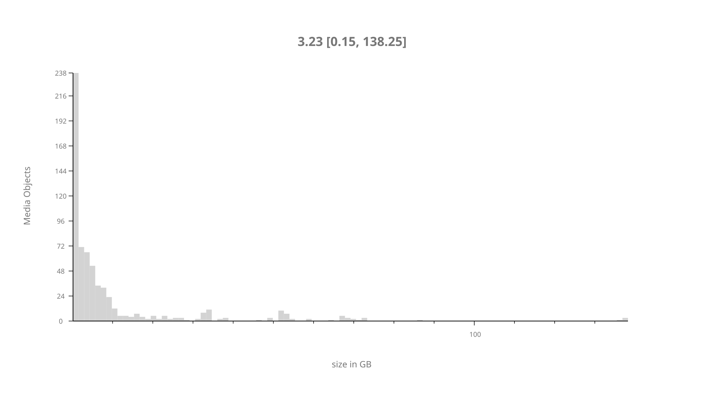
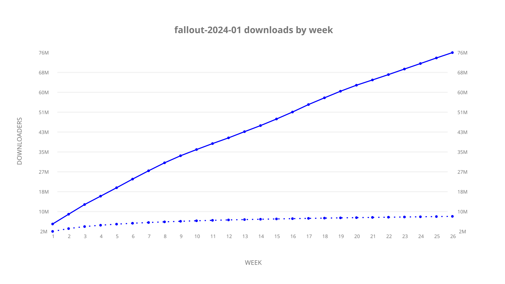
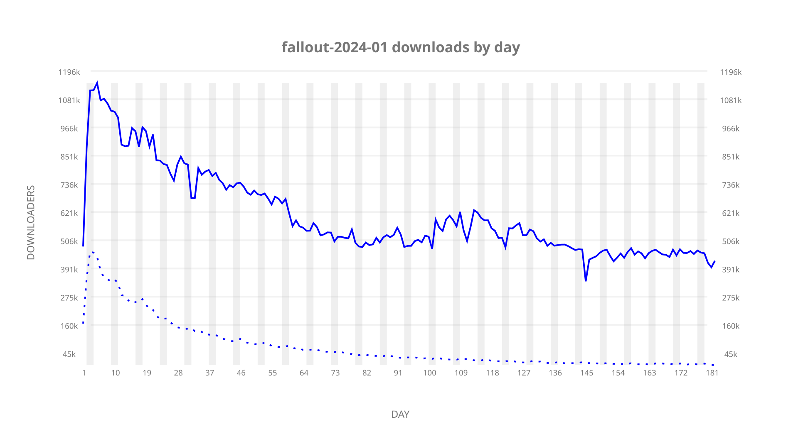
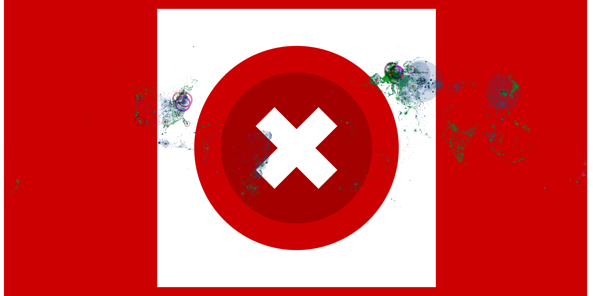

# fallout-2024-01 sample cache audit

## 1. Media object

| Field | Value |
| --- | --- |
| Media object | Fallout |
| Collection key | `fallout-2024-01` |
| imdb_id | [tt12637874](https://www.imdb.com/title/tt12637874/) |
| wikipedia_url | UNAVAILABLE |
| Sample dates | 2024-04-11-to-2024-10-09 |
| Sample days | 182 (2024–2024) |
| BTIH count | 720 |
| Unique BTIH count | 648 |
| Downloaders total | 81,673,824 |
| Uploaders total | 9,987,696 |
| Data version | `2026-08-05` |
| IP geolocation version | `6:1777968300` |

## 2. Cache coverage report

UNAVAILABLE: no sample archive on this host.

## 3. Collection size histogram

## 4. Visualization pass — graphs

### Downloads by week cumulative (normalized start)

### Downloads by day, Saturday and Sunday in gray

## 5. Visualization pass — maps

### Continental downloader slices

| Africa | Americas | Asia | Europe | Oceania | Unknown |
| --- | --- | --- | --- | --- | --- |
| 1.45 | 18.49 | 23.84 | 52.47 | 1.42 | 0.68 |

### Cumulative network infrastructure

{:target="_blank" rel="noopener"}

UNAVAILABLE — no cumulative data maps were rendered.
