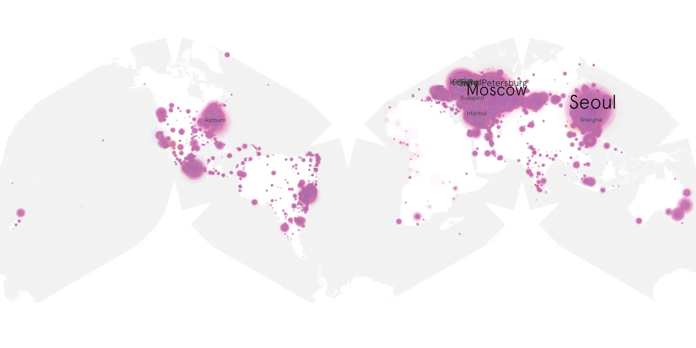
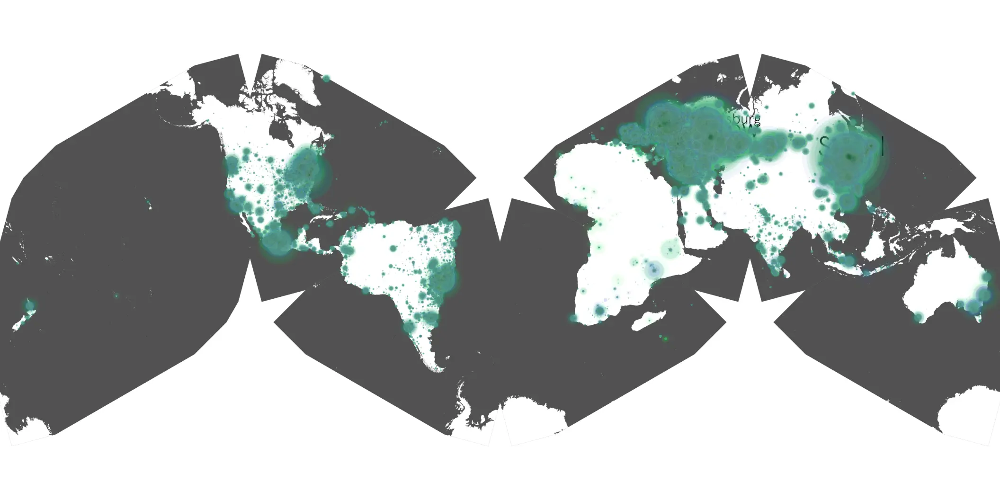

# fantasmas-01 sample cache audit

## 1. Media object

| Field | Value |
| --- | --- |
| Media object | Fantasmas |
| Collection key | `fantasmas-01` |
| imdb_id | [tt18182112](https://www.imdb.com/title/tt18182112/) |
| wikipedia_url | [Fantasmas (TV series)](https://en.wikipedia.org/wiki/Fantasmas_(TV_series)) |
| Sample dates | 2024-06-08-to-2024-07-26 |
| Sample days | 49 |
| BTIH count | 180 |
| Unique BTIH count | 152 |
| Downloaders total | 5,910,193 |
| Uploaders total | 49,724 |
| Data version | `2026-08-05` |
| IP geolocation version | `6:1777968300` |

## 2. Coverage report

- Generated: 2026-08-28T17:38:21Z
- Sample archive directory: `/run/media/bkoz/gold/src/alpha60-samples-raw.gold/fantasmas-01.xz`
- Hour directories: 1830
- Zero-length sample files: 0
- Other unparsable sample files: 0
- Hourly discontinuities: 1 (11 missing hours)
- Missing days: 0

### Sample archive discontinuities

- hourly gap: last `2024-07-15 12:06`, resumed `2024-07-16 00:06` — missing 11 hour(s)

## 3. File sizes histogram *median[lowest, highest]*

## 4. Graphs

### Downloads by week cumulative (normalized start)



### Downloads by day, Saturday and Sunday in gray

## 5. Cumulative Maps

<!-- https://raw.githubusercontent.com/alpha60-devops/alpha60-results-2024/refs/heads/main/data/ -->

### <a href="https://raw.githubusercontent.com/alpha60-devops/alpha60-results-2024/refs/heads/main/data/geojson.cumulative/fantasmas-01-cumulative-aggregate.geojson.gz" data-map-title="Fantasmas — fantasmas-01" onclick="leaflet_map_open_window(this.href, this.dataset.mapTitle); return false;" class="table-link" aria-label="Open Fantasmas (fantasmas-01) cumulative data map in new window" title="Opens interactive map for Fantasmas (fantasmas-01) data">Swarm Detail</a>

### Geographic Regions

| Africa | Americas | Asia | Europe | Oceania | Unknown |
| --- | --- | --- | --- | --- | --- |
| 1.00 | 18.86 | 26.07 | 50.04 | 1.05 | 0.68 |

### Network infrastructure

{:target="_blank" rel="noopener"}

### Resolution >= 1080p

{:target="_blank" rel="noopener"}

### Resolution < 1080p

{:target="_blank" rel="noopener"}
