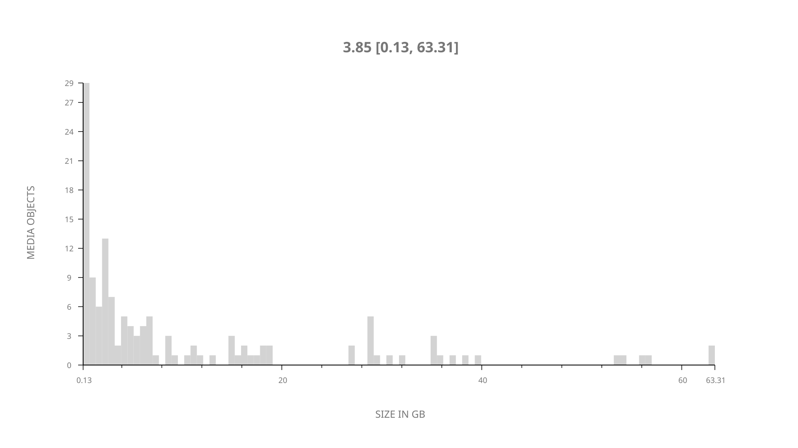
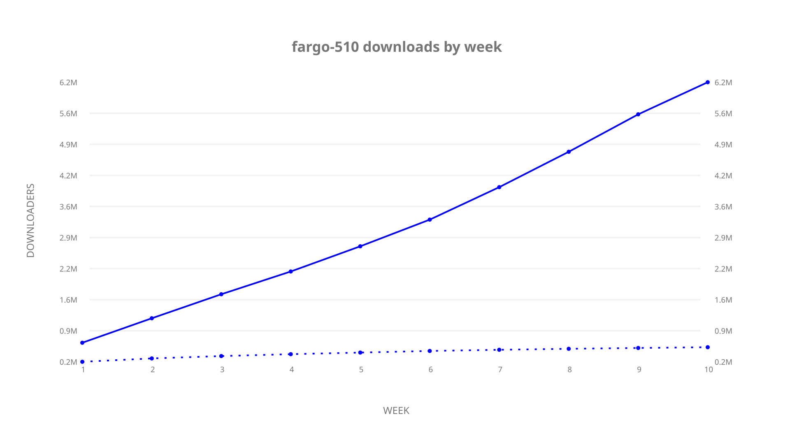
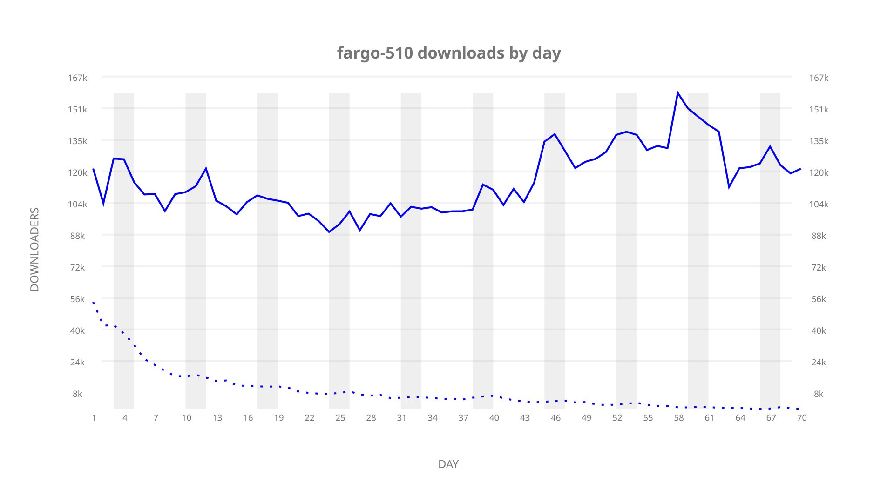
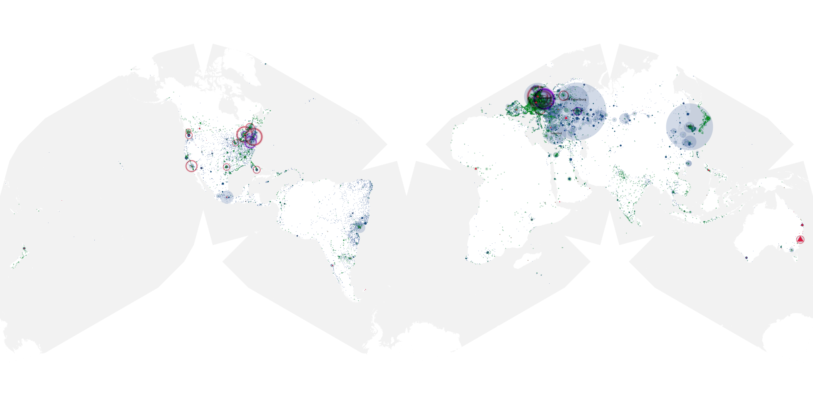
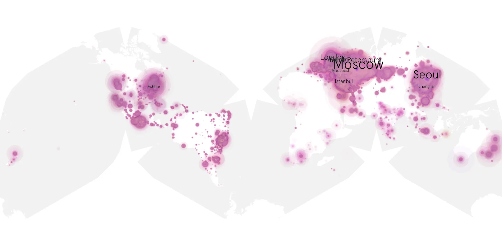
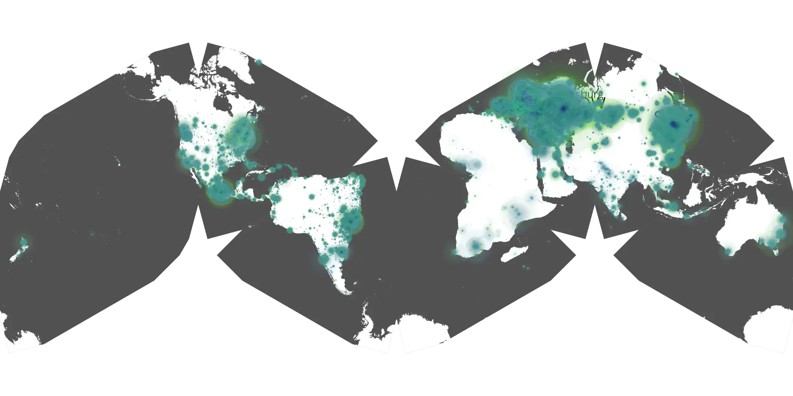

# fargo-510 sample cache audit

## 1. Media object

| Field | Value |
| --- | --- |
| Media object | Fargo |
| Collection key | `fargo-510` |
| imdb_id | [tt0116282](https://www.imdb.com/title/tt0116282/) |
| wikipedia_url | UNAVAILABLE |
| Sample dates | 2024-01-17-to-2024-03-26 |
| Sample days | 70 (2024–2024) |
| BTIH count | 146 |
| Unique BTIH count | 132 |
| Downloaders total | 6,645,670 |
| Uploaders total | 623,653 |
| Data version | `2026-08-05` |
| IP geolocation version | `6:1777968300` |

## 2. Cache coverage report

- Generated: 2026-08-28T17:40:47Z
- Sample archive directory: `/run/media/bkoz/gold/src/alpha60-samples-raw.gold/fargo-510.xz`
- Hour directories: 1673
- Zero-length sample files: 0
- Other unparsable sample files: 0
- Hourly discontinuities: 0 (0 missing hours)
- Missing days: 0

### Sample archive discontinuities

None detected.

## 3. Collection size histogram

## 4. Visualization pass — graphs

### Downloads by week cumulative (normalized start)

### Downloads by day, Saturday and Sunday in gray

## 5. Visualization pass — maps

### Continental downloader slices

| Africa | Americas | Asia | Europe | Oceania | Unknown |
| --- | --- | --- | --- | --- | --- |
| 1.42 | 18.65 | 22.04 | 53.07 | 1.22 | 0.59 |

### Cumulative network infrastructure

{:target="_blank" rel="noopener"}

### Cumulative data maps

**Cumulative >= 1080p**

**Cumulative < 1080p**

