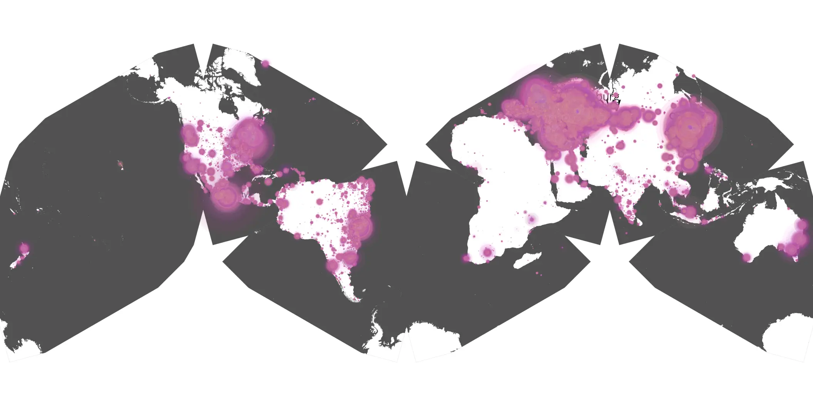
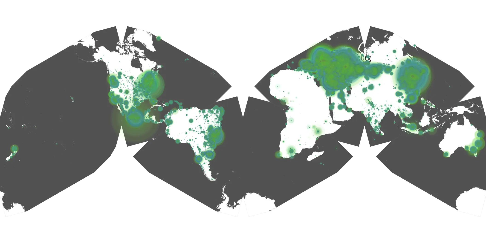

# feud-02 sample cache audit

## 1. Media object

| Field | Value |
| --- | --- |
| Media object | Feud |
| Collection key | `feud-02` |
| imdb_id | [tt1984119](https://www.imdb.com/title/tt1984119/) |
| wikipedia_url | [Feud (American TV series)](https://en.wikipedia.org/wiki/Feud_(American_TV_series)) |
| Sample dates | 2024-02-01-to-2024-05-22 |
| Sample days | 112 |
| BTIH count | 256 |
| Unique BTIH count | 246 |
| Downloaders total | 14,163,755 |
| Uploaders total | 361,860 |
| Data version | `2026-08-05` |
| IP geolocation version | `6:1777968300` |

## 2. Sample coverage report

- Generated: 2026-08-28T17:43:20Z
- Sample archive directory: `/run/media/bkoz/gold/src/alpha60-samples-raw.gold/feud-02.xz`
- Hour directories: 2631
- Zero-length sample files: 0
- Other unparsable sample files: 0
- Hourly discontinuities: 4 (40 missing hours)
- Missing days: 0

### Sample archive discontinuities

- hourly gap: last `2024-02-16 05:06`, resumed `2024-02-16 07:06` — missing 1 hour(s)
- hourly gap: last `2024-02-16 19:06`, resumed `2024-02-17 17:54` — missing 21 hour(s)
- hourly gap: last `2024-03-31 01:00`, resumed `2024-03-31 03:00` — missing 1 hour(s)
- hourly gap: last `2024-05-15 23:00`, resumed `2024-05-16 17:05` — missing 17 hour(s)

## 3. Media objects file size histogram

## 4. Visualization pass — graphs

### Downloads by week cumulative (normalized start)



### Downloads by day, Saturday and Sunday in gray

## 5. Visualization pass — maps

### Cumulative geographic slices

| Africa | Americas | Asia | Europe | Oceania | Unknown |
| --- | --- | --- | --- | --- | --- |
| 0.85 | 19.58 | 23.02 | 53.81 | 0.90 | 0.63 |

### Cumulative network infrastructure

{:target="_blank" rel="noopener"}

### Cumulative data maps

**Cumulative >= 1080p**

{:target="_blank" rel="noopener"}

**Cumulative < 1080p**

{:target="_blank" rel="noopener"}
