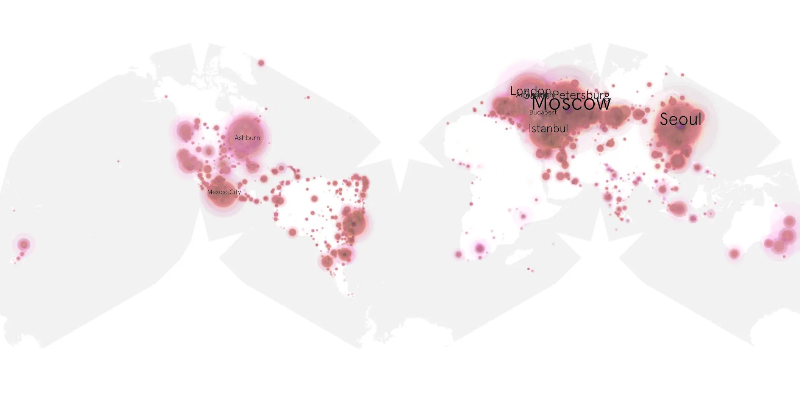
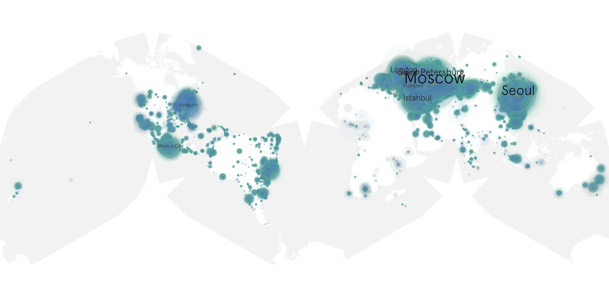

# for-all-mankind-410 sample cache audit

## 1. Media object

| Field | Value |
| --- | --- |
| Media object | For All Mankind |
| Collection key | `for-all-mankind-410` |
| imdb_id | [tt7772588](https://www.imdb.com/title/tt7772588/) |
| wikipedia_url | [For All Mankind (TV series)](https://en.wikipedia.org/wiki/For_All_Mankind_(TV_series)) |
| Sample dates | 2024-01-12-to-2024-04-25 |
| Sample days | 105 |
| BTIH count | 127 |
| Unique BTIH count | 117 |
| Downloaders total | 7,588,744 |
| Uploaders total | 284,052 |
| Data version | `2026-08-05` |
| IP geolocation version | `6:1777968300` |

## 2. Coverage report

- Generated: 2026-08-28T17:48:33Z
- Sample archive directory: `/run/media/bkoz/gold/src/alpha60-samples-raw.gold/for-all-mankind-410.xz`
- Hour directories: 2489
- Zero-length sample files: 0
- Other unparsable sample files: 0
- Hourly discontinuities: 2 (13 missing hours)
- Missing days: 0

### Sample archive discontinuities

- hourly gap: last `2024-02-16 19:03`, resumed `2024-02-17 09:00` — missing 12 hour(s)
- hourly gap: last `2024-03-31 01:00`, resumed `2024-03-31 03:00` — missing 1 hour(s)

## 3. File sizes histogram *median[lowest, highest]*

## 4. Graphs

### Downloads by week cumulative (normalized start)



### Downloads by day, Saturday and Sunday in gray

## 5. Cumulative Maps

<!-- https://raw.githubusercontent.com/alpha60-devops/alpha60-results-2024/refs/heads/main/data/ -->

### <a href="https://raw.githubusercontent.com/alpha60-devops/alpha60-results-2024/refs/heads/main/data/geojson.cumulative/for-all-mankind-410-cumulative-aggregate.geojson.gz" data-map-title="For All Mankind — for-all-mankind-410" onclick="leaflet_map_open_window(this.href, this.dataset.mapTitle); return false;" class="table-link" aria-label="Open For All Mankind (for-all-mankind-410) cumulative data map in new window" title="Opens interactive map for For All Mankind (for-all-mankind-410) data">Swarm Detail</a>

### Geographic Regions

| Africa | Americas | Asia | Europe | Oceania | Unknown |
| --- | --- | --- | --- | --- | --- |
| 0.95 | 20.24 | 21.97 | 52.36 | 1.01 | 0.54 |

### Network infrastructure

{:target="_blank" rel="noopener"}

### Resolution >= 1080p

{:target="_blank" rel="noopener"}

### Resolution < 1080p

{:target="_blank" rel="noopener"}
