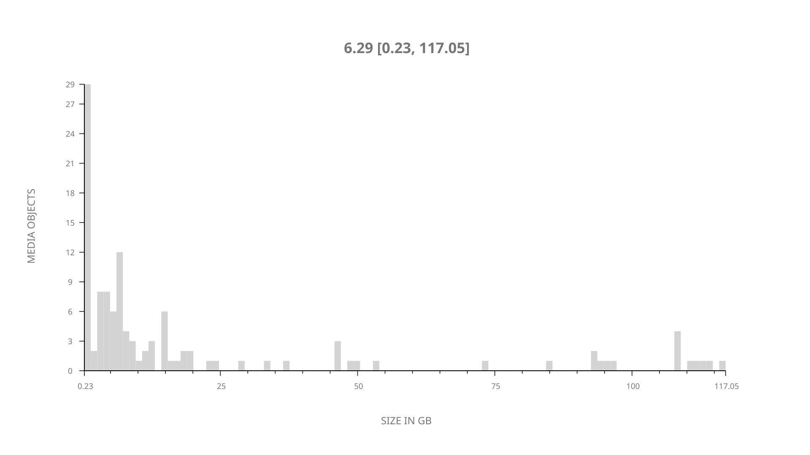
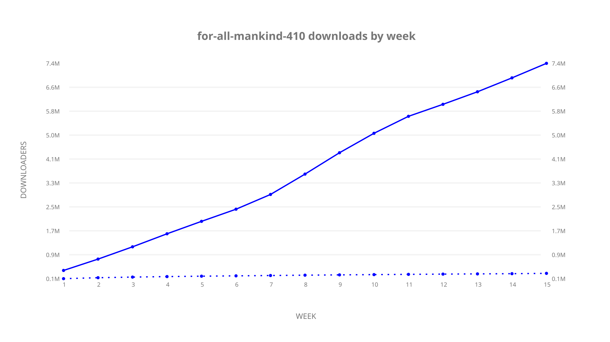
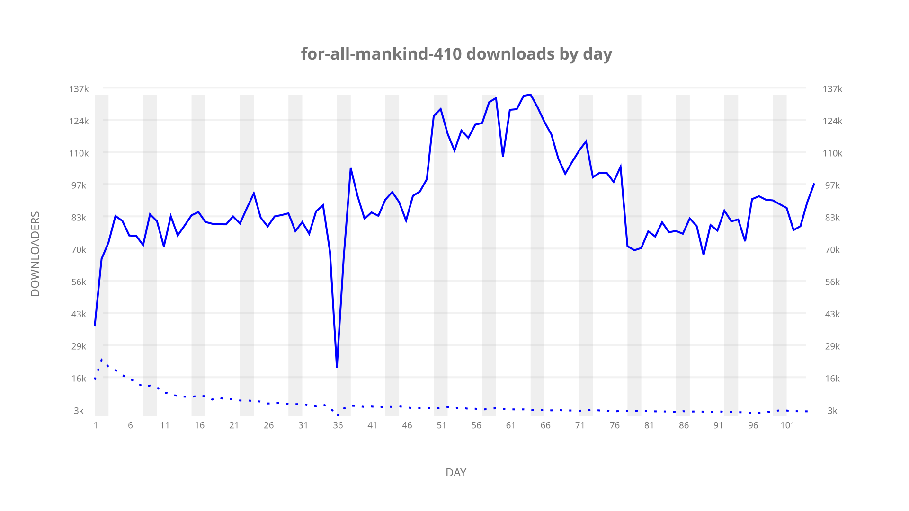
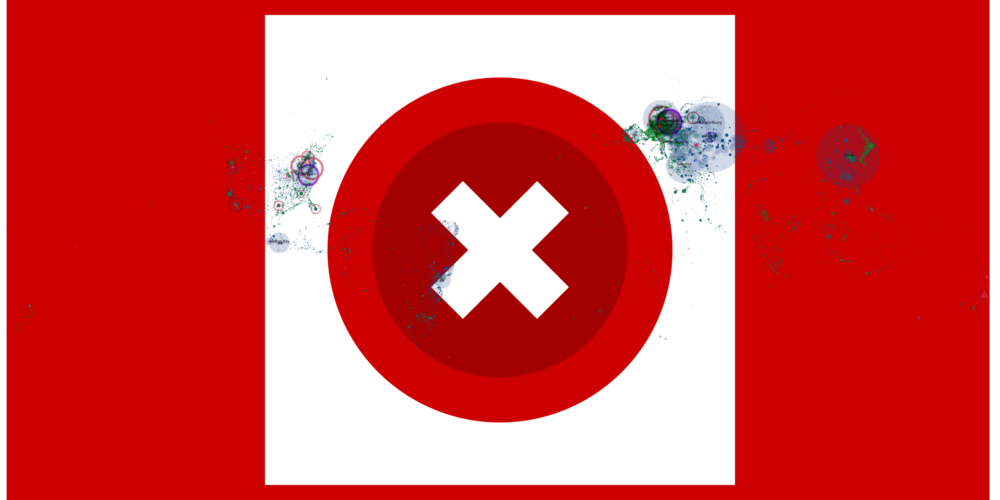

# for-all-mankind-410 sample cache audit

## 1. Media object

| Field | Value |
| --- | --- |
| Media object | For All Mankind |
| Collection key | `for-all-mankind-410` |
| imdb_id | [tt7772588](https://www.imdb.com/title/tt7772588/) |
| wikipedia_url | UNAVAILABLE |
| Sample dates | 2024-01-12-to-2024-04-25 |
| Sample days | 105 (2024–2024) |
| BTIH count | 127 |
| Unique BTIH count | 117 |
| Downloaders total | 7,588,744 |
| Uploaders total | 284,052 |
| Data version | `2026-08-05` |
| IP geolocation version | `6:1777968300` |

## 2. Cache coverage report

UNAVAILABLE: no sample archive on this host.

## 3. Collection size histogram

## 4. Visualization pass — graphs

### Downloads by week cumulative (normalized start)

### Downloads by day, Saturday and Sunday in gray

## 5. Visualization pass — maps

### Continental downloader slices

| Africa | Americas | Asia | Europe | Oceania | Unknown |
| --- | --- | --- | --- | --- | --- |
| 0.95 | 20.24 | 21.97 | 52.36 | 1.01 | 0.54 |

### Cumulative network infrastructure

{:target="_blank" rel="noopener"}

UNAVAILABLE — no cumulative data maps were rendered.
