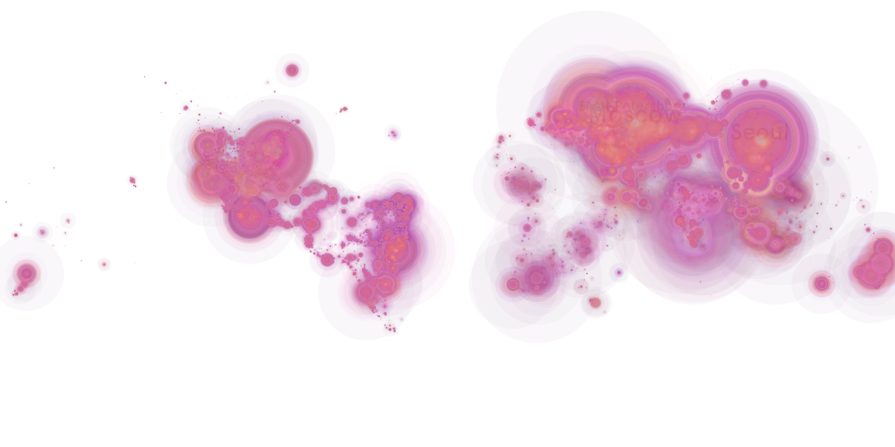
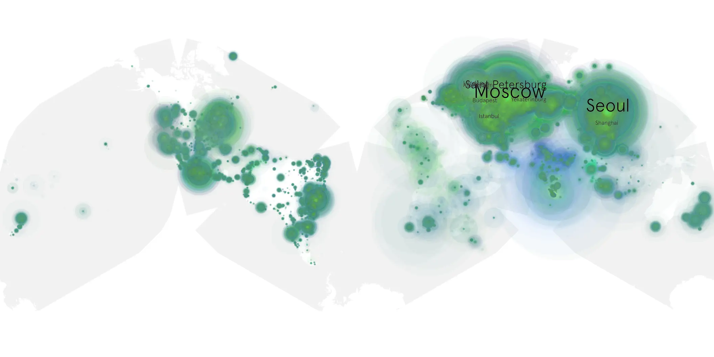

# godzilla-minus-one sample cache audit

## 1. Media object

| Field | Value |
| --- | --- |
| Media object | Gojira -1.0 |
| Collection key | `godzilla-minus-one` |
| imdb_id | [tt23289160](https://www.imdb.com/title/tt23289160/) |
| wikipedia_url | [Godzilla Minus One](https://en.wikipedia.org/wiki/Godzilla_Minus_One) |
| Sample dates | 2024-05-02-to-2024-10-30 |
| Sample days | 182 |
| BTIH count | 468 |
| Unique BTIH count | 405 |
| Downloaders total | 55,277,904 |
| Uploaders total | 4,385,765 |
| Data version | `2026-08-05` |
| IP geolocation version | `6:1777968300` |

## 2. Coverage report

- Generated: 2026-08-28T17:53:50Z
- Sample archive directory: `/run/media/bkoz/gold/src/alpha60-samples-raw.gold/godzilla-minus-one.xz`
- Hour directories: 4348
- Zero-length sample files: 0
- Other unparsable sample files: 0
- Hourly discontinuities: 1 (18 missing hours)
- Missing days: 0

### Sample archive discontinuities

- hourly gap: last `2024-07-10 05:03`, resumed `2024-07-11 00:03` — missing 18 hour(s)

## 3. File sizes histogram *median[lowest, highest]*

## 4. Graphs

### Downloads by week cumulative (normalized start)



### Downloads by day, Saturday and Sunday in gray

## 5. Cumulative Maps

<!-- https://raw.githubusercontent.com/alpha60-devops/alpha60-results-2024/refs/heads/main/data/ -->

### <a href="https://raw.githubusercontent.com/alpha60-devops/alpha60-results-2024/refs/heads/main/data/geojson.cumulative/godzilla-minus-one-cumulative-aggregate.geojson.gz" data-map-title="Gojira -1.0 — godzilla-minus-one" onclick="leaflet_map_open_window(this.href, this.dataset.mapTitle); return false;" class="table-link" aria-label="Open Gojira -1.0 (godzilla-minus-one) cumulative data map in new window" title="Opens interactive map for Gojira -1.0 (godzilla-minus-one) data">Swarm Detail</a>

### Geographic Regions

| Africa | Americas | Asia | Europe | Oceania | Unknown |
| --- | --- | --- | --- | --- | --- |
| 1.38 | 17.25 | 26.75 | 50.09 | 0.99 | 0.70 |

### Network infrastructure

{:target="_blank" rel="noopener"}

### Resolution >= 1080p

{:target="_blank" rel="noopener"}

### Resolution < 1080p

{:target="_blank" rel="noopener"}
