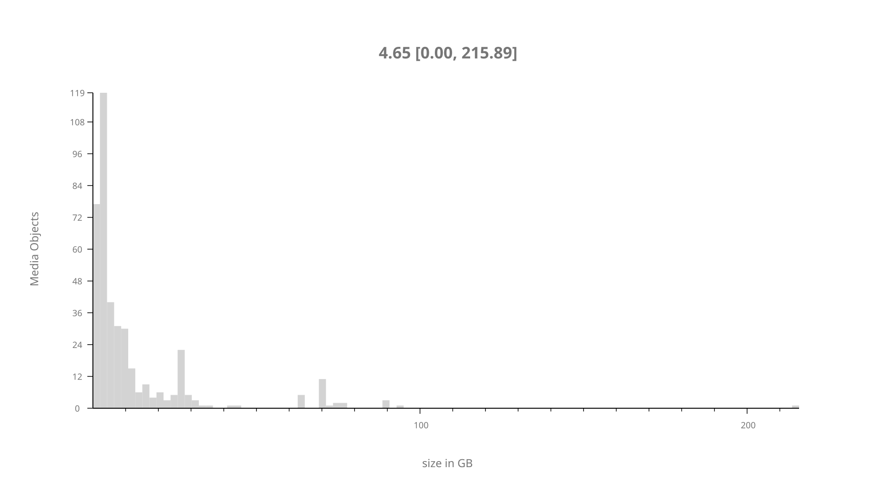
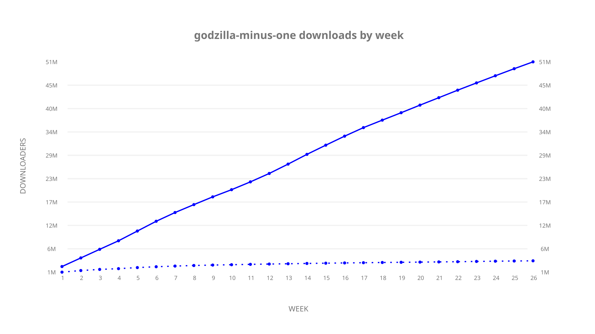
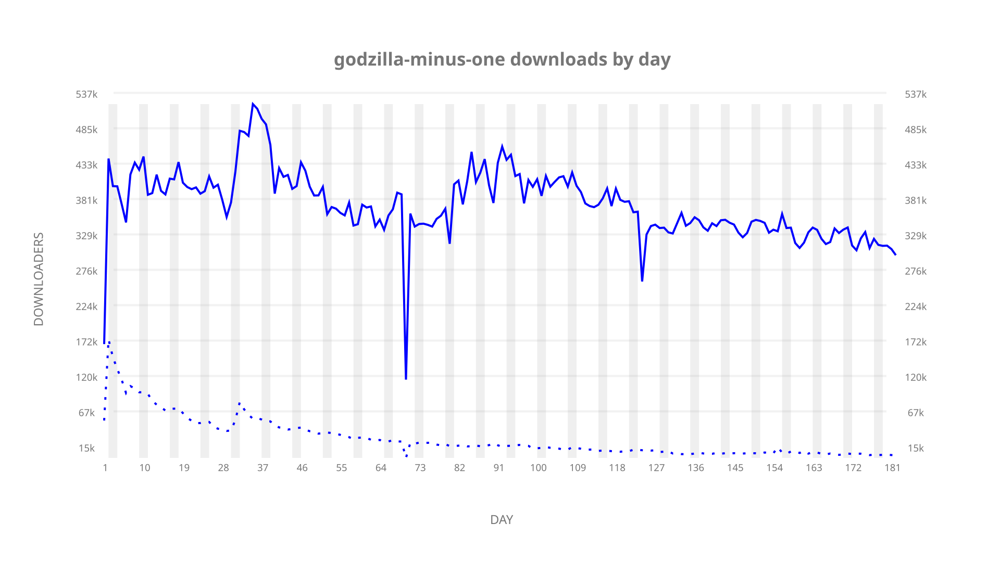
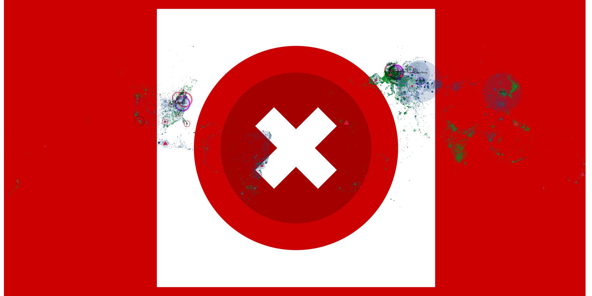

# godzilla-minus-one sample cache audit

## 1. Media object

| Field | Value |
| --- | --- |
| Media object | Gojira -1.0 |
| Collection key | `godzilla-minus-one` |
| imdb_id | [tt23289160](https://www.imdb.com/title/tt23289160/) |
| wikipedia_url | UNAVAILABLE |
| Sample dates | 2024-05-02-to-2024-10-30 |
| Sample days | 182 (2024–2024) |
| BTIH count | 468 |
| Unique BTIH count | 405 |
| Downloaders total | 55,277,904 |
| Uploaders total | 4,385,765 |
| Data version | `2026-08-05` |
| IP geolocation version | `6:1777968300` |

## 2. Cache coverage report

UNAVAILABLE: no sample archive on this host.

## 3. Collection size histogram

## 4. Visualization pass — graphs

### Downloads by week cumulative (normalized start)

### Downloads by day, Saturday and Sunday in gray

## 5. Visualization pass — maps

### Continental downloader slices

| Africa | Americas | Asia | Europe | Oceania | Unknown |
| --- | --- | --- | --- | --- | --- |
| 1.38 | 17.25 | 26.75 | 50.09 | 0.99 | 0.70 |

### Cumulative network infrastructure

{:target="_blank" rel="noopener"}

UNAVAILABLE — no cumulative data maps were rendered.
