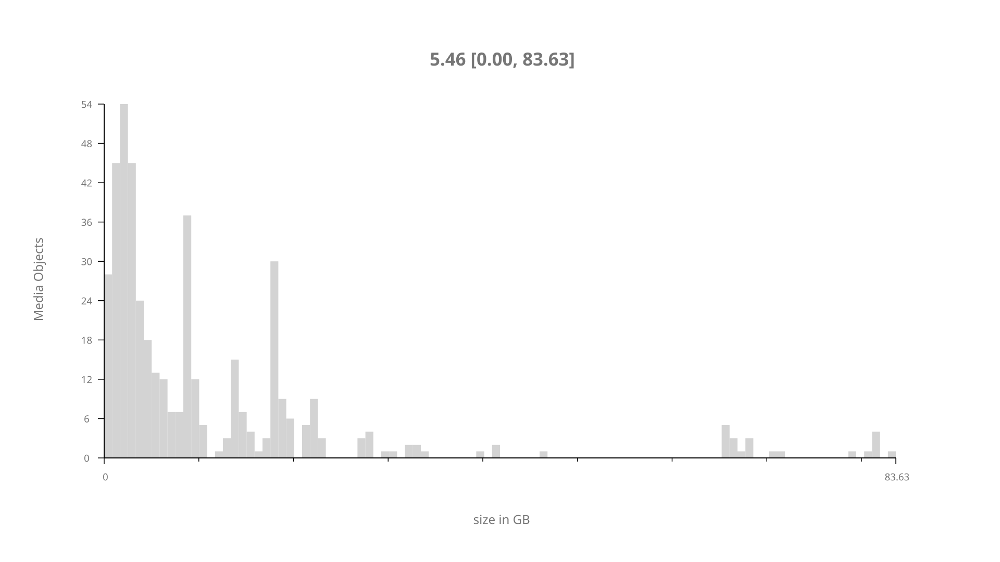
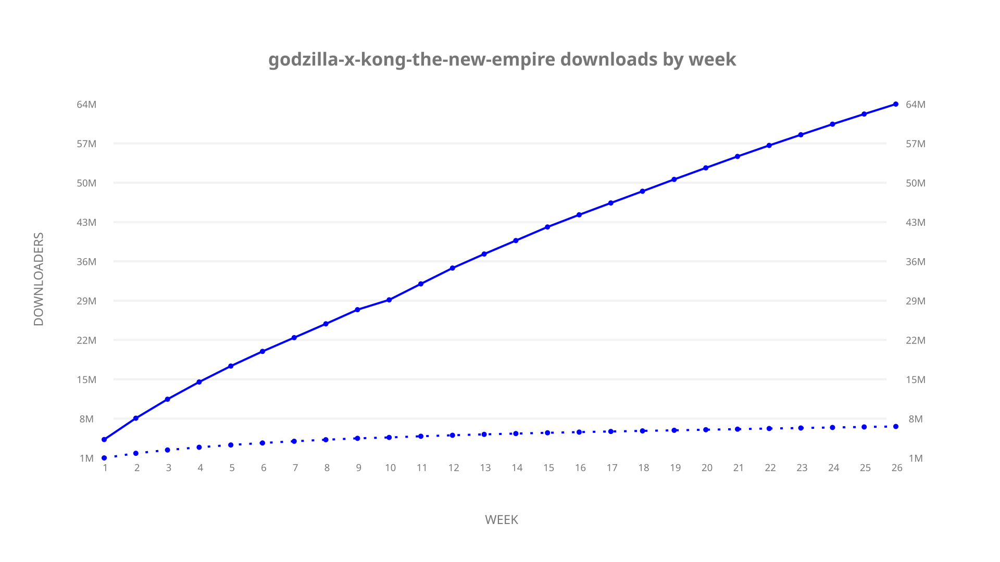
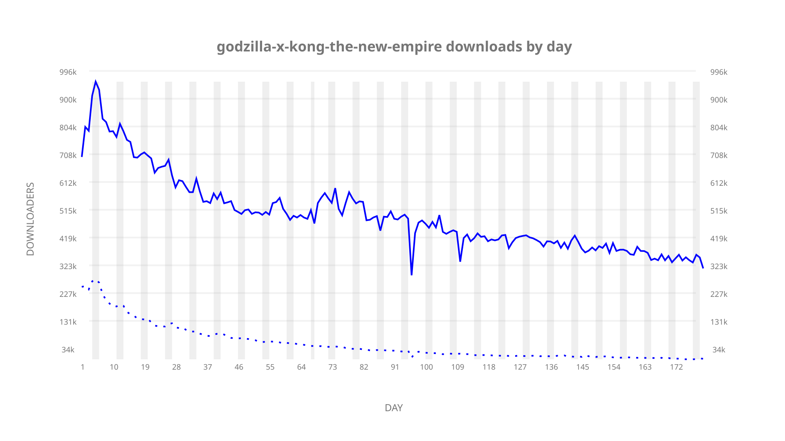
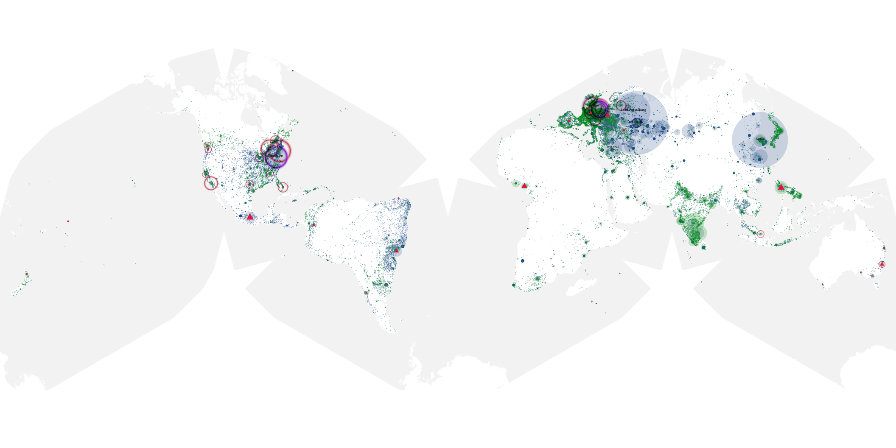
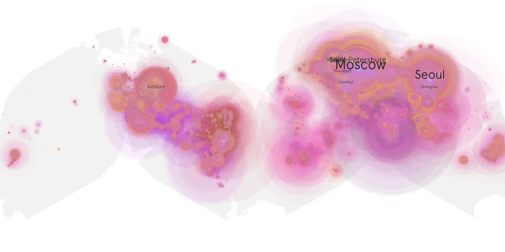
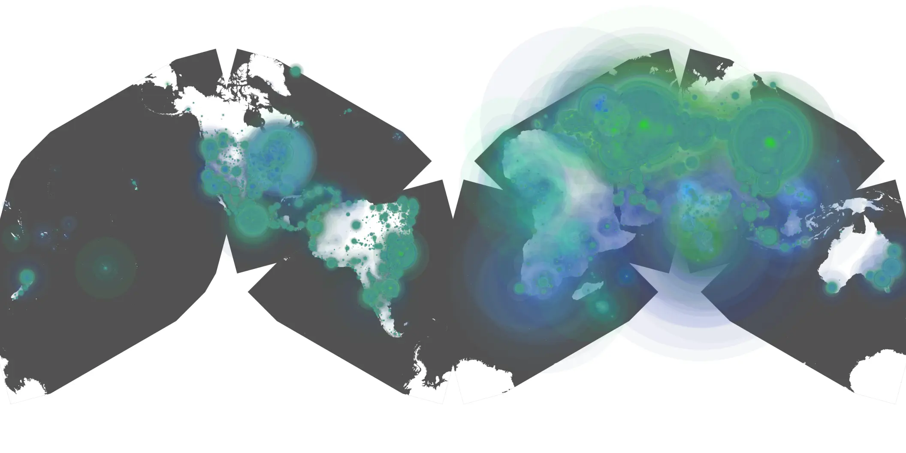

# godzilla-x-kong-the-new-empire sample cache audit

## 1. Media object

| Field | Value |
| --- | --- |
| Media object | Godzilla x Kong: The New Empire |
| Collection key | `godzilla-x-kong-the-new-empire` |
| imdb_id | [tt14539740](https://www.imdb.com/title/tt14539740/) |
| wikipedia_url | UNAVAILABLE |
| Sample dates | 2024-05-14-to-2024-11-11 |
| Sample days | 182 (2024–2024) |
| BTIH count | 505 |
| Unique BTIH count | 442 |
| Downloaders total | 69,823,259 |
| Uploaders total | 8,639,427 |
| Data version | `2026-08-05` |
| IP geolocation version | `6:1777968300` |

## 2. Cache coverage report

- Generated: 2026-08-28T18:34:49Z
- Sample archive directory: `/run/media/bkoz/gold/src/alpha60-samples-raw.gold/godzilla-x-kong-the-new-empire.xz`
- Hour directories: 4365
- Zero-length sample files: 0
- Other unparsable sample files: 0
- Hourly discontinuities: 0 (0 missing hours)
- Missing days: 0

### Sample archive discontinuities

None detected.

## 3. Collection size histogram

## 4. Visualization pass — graphs

### Downloads by week cumulative (normalized start)

### Downloads by day, Saturday and Sunday in gray

## 5. Visualization pass — maps

### Continental downloader slices

| Africa | Americas | Asia | Europe | Oceania | Unknown |
| --- | --- | --- | --- | --- | --- |
| 2.74 | 17.14 | 28.07 | 48.22 | 1.02 | 0.63 |

### Cumulative network infrastructure

{:target="_blank" rel="noopener"}

### Cumulative data maps

**Cumulative >= 1080p**

**Cumulative < 1080p**

