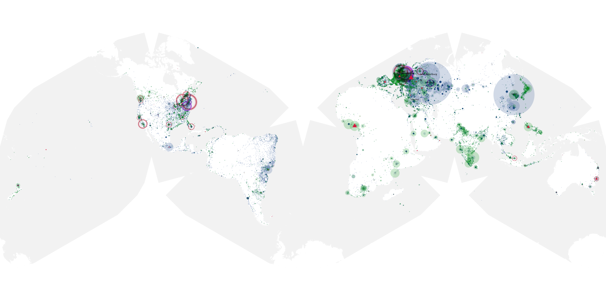
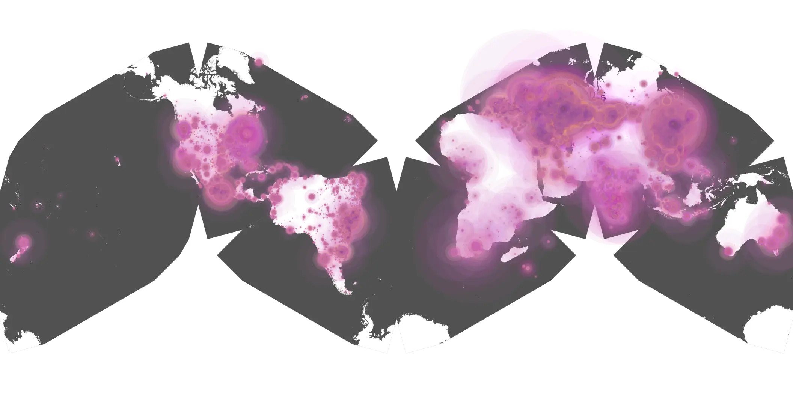
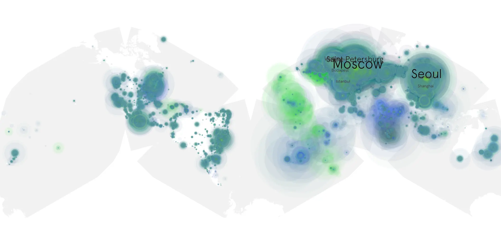

# hit-man sample cache audit

## 1. Media object

| Field | Value |
| --- | --- |
| Media object | Hit Man |
| Collection key | `hit-man` |
| imdb_id | [tt20215968](https://www.imdb.com/title/tt20215968/) |
| wikipedia_url | [Hit Man (2023 film)](https://en.wikipedia.org/wiki/Hit_Man_(2023_film)) |
| Sample dates | 2024-06-06-to-2024-09-19 |
| Sample days | 106 |
| BTIH count | 204 |
| Unique BTIH count | 174 |
| Downloaders total | 19,306,820 |
| Uploaders total | 2,921,956 |
| Data version | `2026-08-05` |
| IP geolocation version | `6:1777968300` |

## 2. Sample coverage report

- Generated: 2026-08-28T22:23:24Z
- Sample archive directory: `/run/media/bkoz/gold/src/alpha60-samples-raw.gold/hit-man.xz`
- Hour directories: 2536
- Zero-length sample files: 0
- Other unparsable sample files: 0
- Hourly discontinuities: 0 (0 missing hours)
- Missing days: 0

### Sample archive discontinuities

None detected.

## 3. Media objects file size histogram

## 4. Visualization pass — graphs

### Downloads by week cumulative (normalized start)



### Downloads by day, Saturday and Sunday in gray

## 5. Visualization pass — maps

### Cumulative geographic slices

| Africa | Americas | Asia | Europe | Oceania | Unknown |
| --- | --- | --- | --- | --- | --- |
| 3.89 | 16.29 | 25.86 | 47.19 | 1.13 | 0.62 |

### Cumulative network infrastructure

{:target="_blank" rel="noopener"}

### Cumulative data maps

**Cumulative >= 1080p**

{:target="_blank" rel="noopener"}

**Cumulative < 1080p**

{:target="_blank" rel="noopener"}
