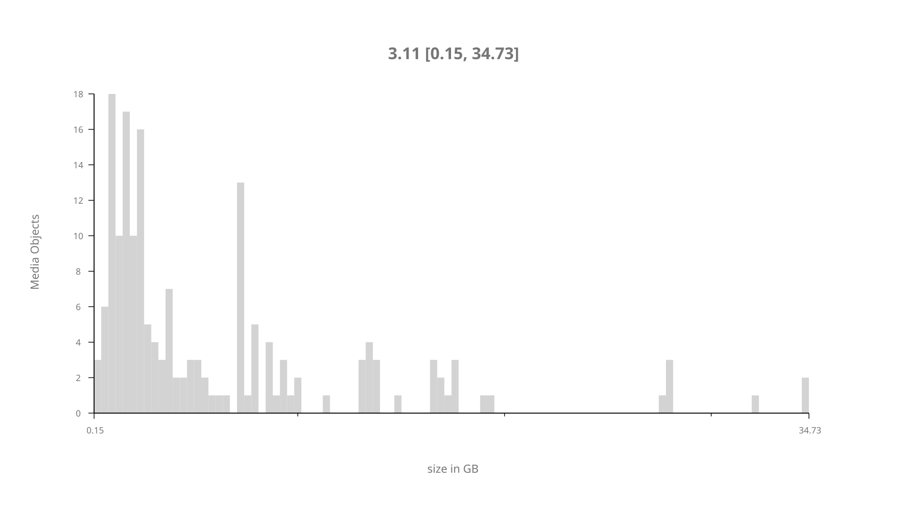
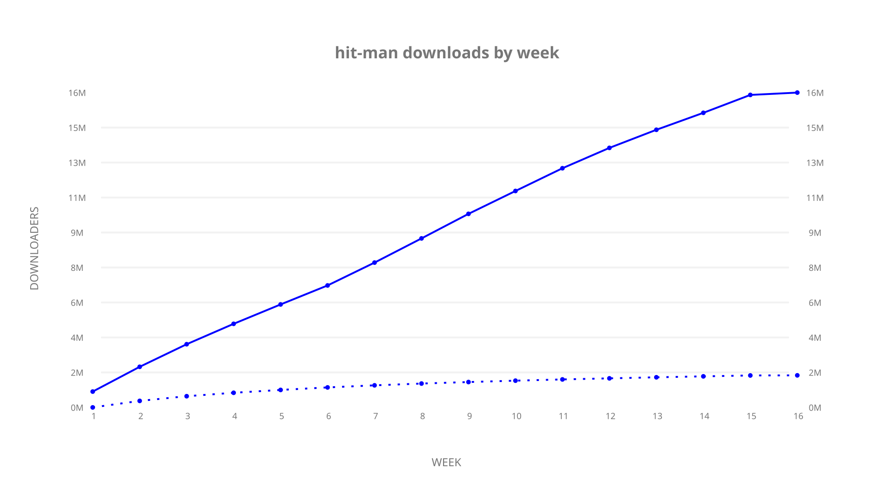
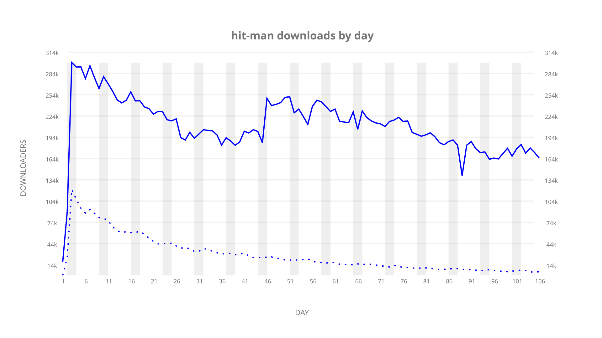

# hit-man sample cache audit

## 1. Media object

| Field | Value |
| --- | --- |
| Media object | Hit Man |
| Collection key | `hit-man` |
| imdb_id | [tt20215968](https://www.imdb.com/title/tt20215968/) |
| wikipedia_url | UNAVAILABLE |
| Sample dates | 2024-06-06-to-2024-09-19 |
| Sample days | 106 (2024–2024) |
| BTIH count | 204 |
| Unique BTIH count | 174 |
| Downloaders total | 19,306,820 |
| Uploaders total | 2,921,956 |
| Data version | `2026-08-05` |
| IP geolocation version | `6:1777968300` |

## 2. Cache coverage report

UNAVAILABLE: no sample archive on this host.

## 3. Collection size histogram

## 4. Visualization pass — graphs

### Downloads by week cumulative (normalized start)

### Downloads by day, Saturday and Sunday in gray

## 5. Visualization pass — maps

### Continental downloader slices

| Africa | Americas | Asia | Europe | Oceania | Unknown |
| --- | --- | --- | --- | --- | --- |
| 3.89 | 16.29 | 25.86 | 47.19 | 1.13 | 0.62 |

UNAVAILABLE — no cumulative data maps were rendered.
