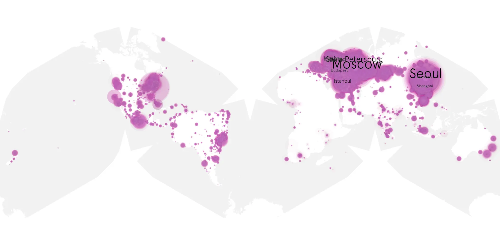
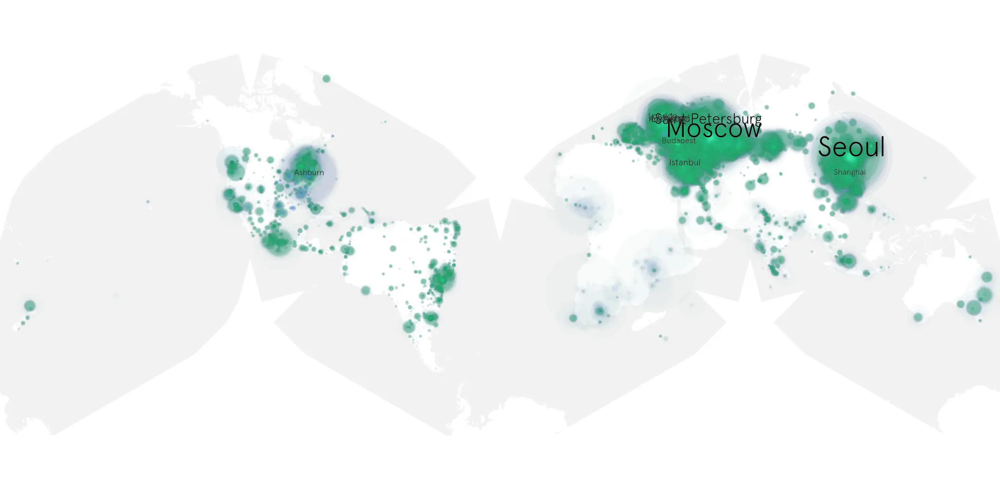

# hit-monkey-02 sample cache audit

## 1. Media object

| Field | Value |
| --- | --- |
| Media object | Hit Monkey |
| Collection key | `hit-monkey-02` |
| imdb_id | [tt9811316](https://www.imdb.com/title/tt9811316/) |
| wikipedia_url | [Hit-Monkey (TV series)](https://en.wikipedia.org/wiki/Hit-Monkey_(TV_series)) |
| Sample dates | 2024-07-16-to-2024-10-28 |
| Sample days | 105 |
| BTIH count | 107 |
| Unique BTIH count | 102 |
| Downloaders total | 4,292,050 |
| Uploaders total | 206,832 |
| Data version | `2026-08-05` |
| IP geolocation version | `6:1777968300` |

## 2. Sample coverage report

- Generated: 2026-08-28T18:42:09Z
- Sample archive directory: `/run/media/bkoz/gold/src/alpha60-samples-raw.gold/hit-monkey-02.xz`
- Hour directories: 2516
- Zero-length sample files: 0
- Other unparsable sample files: 0
- Hourly discontinuities: 0 (0 missing hours)
- Missing days: 0

### Sample archive discontinuities

None detected.

## 3. Media objects file size histogram

## 4. Visualization pass — graphs

### Downloads by week cumulative (normalized start)



### Downloads by day, Saturday and Sunday in gray

## 5. Visualization pass — maps

### Cumulative geographic slices

| Africa | Americas | Asia | Europe | Oceania | Unknown |
| --- | --- | --- | --- | --- | --- |
| 0.90 | 15.67 | 25.85 | 51.18 | 0.91 | 0.66 |

### Cumulative network infrastructure

{:target="_blank" rel="noopener"}

### Cumulative data maps

**Cumulative >= 1080p**

{:target="_blank" rel="noopener"}

**Cumulative < 1080p**

{:target="_blank" rel="noopener"}
