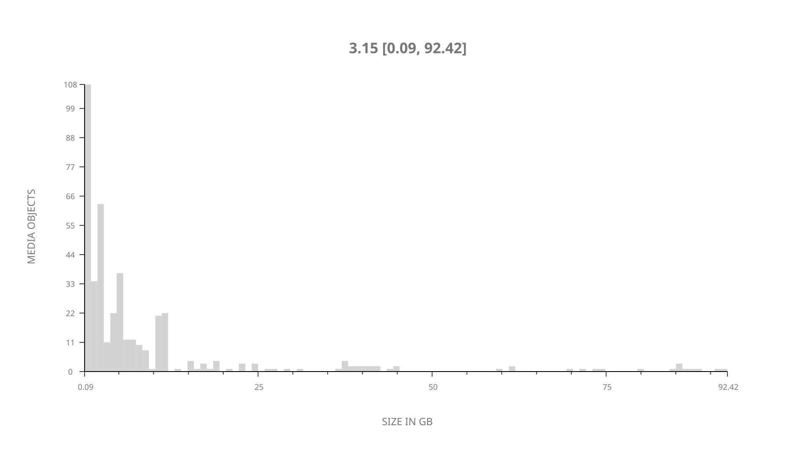
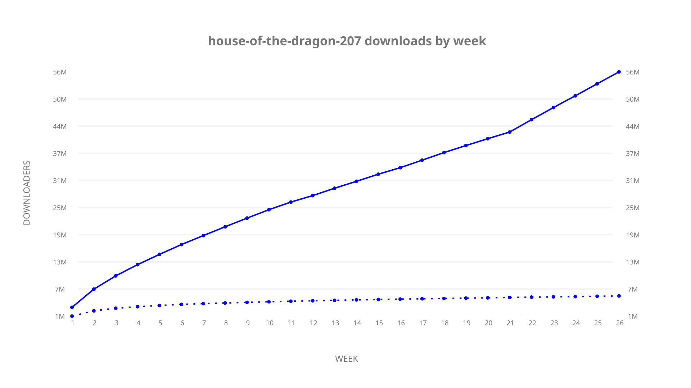
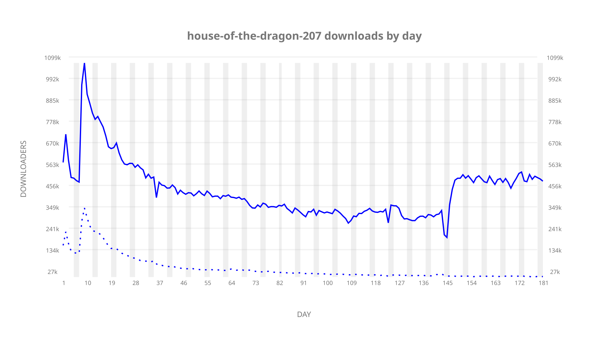
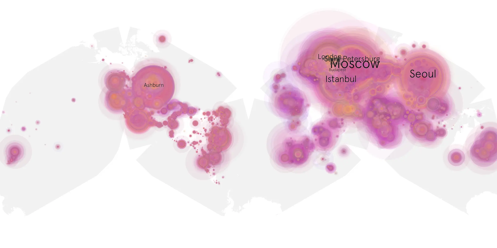
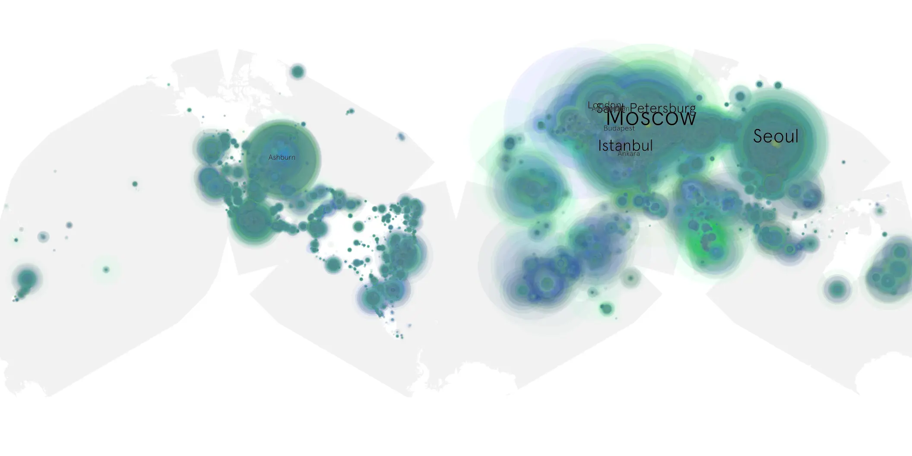

# house-of-the-dragon-207 sample cache audit

## 1. Media object

| Field | Value |
| --- | --- |
| Media object | House of the Dragon |
| Collection key | `house-of-the-dragon-207` |
| imdb_id | [tt11198330](https://www.imdb.com/title/tt11198330/) |
| wikipedia_url | UNAVAILABLE |
| Sample dates | 2024-07-29-to-2025-01-26 |
| Sample days | 182 (2024–2025) |
| BTIH count | 456 |
| Unique BTIH count | 421 |
| Downloaders total | 57,593,119 |
| Uploaders total | 5,714,209 |
| Data version | `2026-08-05` |
| IP geolocation version | `6:1777968300` |

## 2. Cache coverage report

- Generated: 2026-08-28T18:47:30Z
- Sample archive directory: `/run/media/bkoz/gold/src/alpha60-samples-raw.gold/house-of-the-dragon-207.xz`
- Hour directories: 4334
- Zero-length sample files: 0
- Other unparsable sample files: 0
- Hourly discontinuities: 2 (31 missing hours)
- Missing days: 1

### Sample archive discontinuities

- hourly gap: last `2024-10-19 23:03`, resumed `2024-10-21 00:03` — missing 24 hour(s)
- hourly gap: last `2024-11-29 10:03`, resumed `2024-11-29 18:03` — missing 7 hour(s)
- missing day: `2024-10-20`

## 3. Collection size histogram

## 4. Visualization pass — graphs

### Downloads by week cumulative (normalized start)

### Downloads by day, Saturday and Sunday in gray

## 5. Visualization pass — maps

### Continental downloader slices

| Africa | Americas | Asia | Europe | Oceania | Unknown |
| --- | --- | --- | --- | --- | --- |
| 2.84 | 15.52 | 26.08 | 52.19 | 1.19 | 0.55 |

### Cumulative network infrastructure

{:target="_blank" rel="noopener"}

### Cumulative data maps

**Cumulative >= 1080p**

**Cumulative < 1080p**

