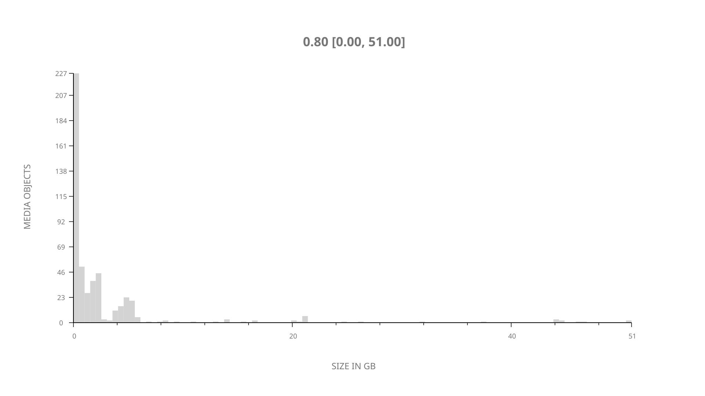
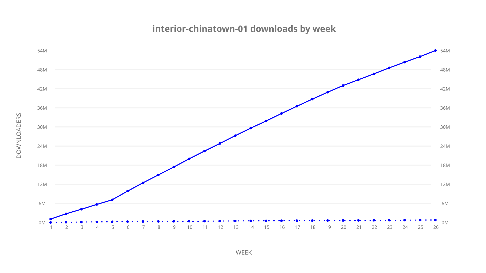
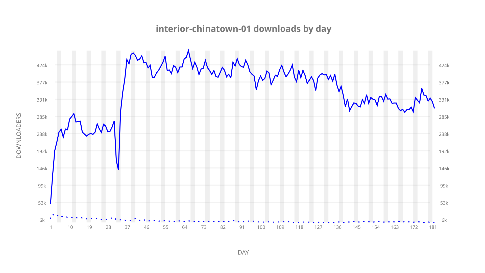

# interior-chinatown-01 sample cache audit

## 1. Media object

| Field | Value |
| --- | --- |
| Media object | Interior Chinatown |
| Collection key | `interior-chinatown-01` |
| imdb_id | [tt13354972](https://www.imdb.com/title/tt13354972/) |
| wikipedia_url | UNAVAILABLE |
| Sample dates | 2024-11-19-to-2025-05-19 |
| Sample days | 182 (2024–2025) |
| BTIH count | 510 |
| Unique BTIH count | 502 |
| Downloaders total | 53,991,475 |
| Uploaders total | 901,803 |
| Data version | `2026-08-05` |
| IP geolocation version | `6:1777968300` |

## 2. Cache coverage report

UNAVAILABLE: no sample archive on this host.

## 3. Collection size histogram

## 4. Visualization pass — graphs

### Downloads by week cumulative (normalized start)

### Downloads by day, Saturday and Sunday in gray

## 5. Visualization pass — maps

### Continental downloader slices

| Africa | Americas | Asia | Europe | Oceania | Unknown |
| --- | --- | --- | --- | --- | --- |
| 0.85 | 15.02 | 27.78 | 54.07 | 0.72 | 0.54 |

### Cumulative network infrastructure

{:target="_blank" rel="noopener"}

UNAVAILABLE — no cumulative data maps were rendered.
