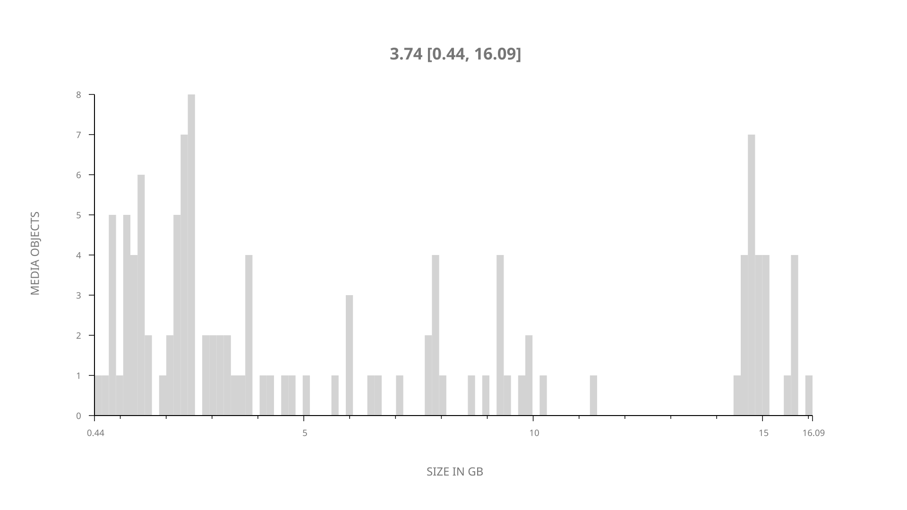
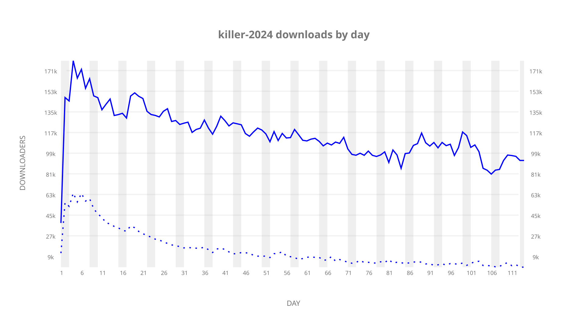
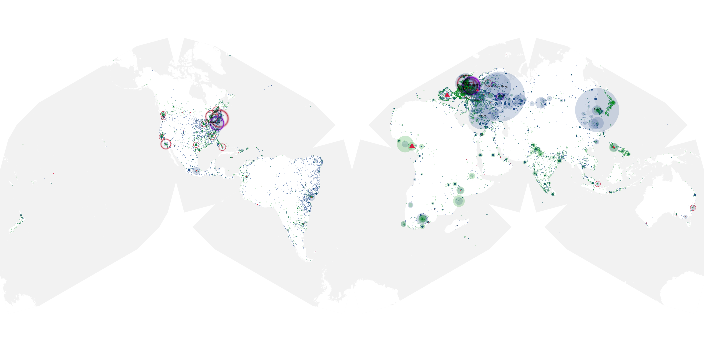
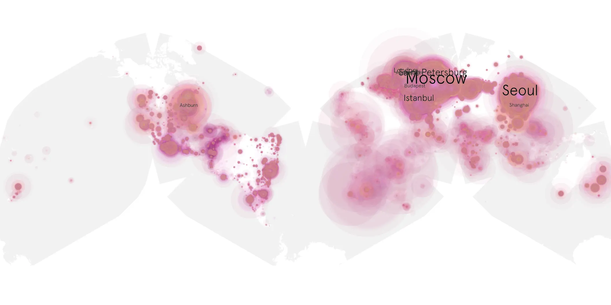
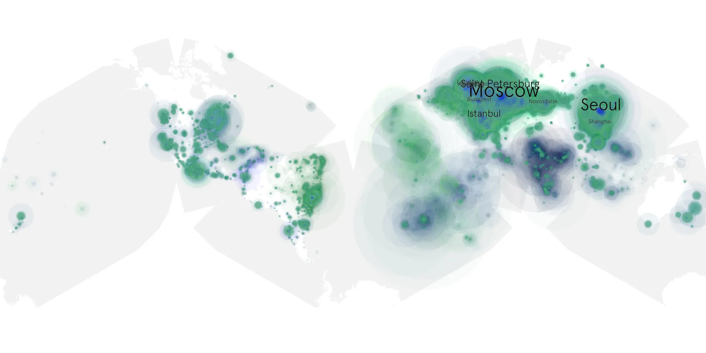

# killer-2024 sample cache audit

## 1. Media object

| Field | Value |
| --- | --- |
| Media object | The Killer 2024 |
| Collection key | `killer-2024` |
| imdb_id | [tt1121948](https://www.imdb.com/title/tt1121948/) |
| wikipedia_url | [The Killer (2024 film)](https://en.wikipedia.org/wiki/The_Killer_(2024_film)) |
| Sample dates | 2024-08-23-to-2024-12-14 |
| Sample days | 114 |
| BTIH count | 135 |
| Unique BTIH count | 119 |
| Downloaders total | 11,348,914 |
| Uploaders total | 1,773,365 |
| Data version | `2026-08-05` |
| IP geolocation version | `6:1777968300` |

## 2. Sample coverage report

- Generated: 2026-08-28T19:03:26Z
- Sample archive directory: `/run/media/bkoz/gold/src/alpha60-samples-raw.gold/killer-2024.xz`
- Hour directories: 2719
- Zero-length sample files: 0
- Other unparsable sample files: 0
- Hourly discontinuities: 0 (0 missing hours)
- Missing days: 0

### Sample archive discontinuities

None detected.

## 3. Media objects file size histogram

## 4. Visualization pass — graphs

### Downloads by week cumulative (normalized start)



### Downloads by day, Saturday and Sunday in gray

## 5. Visualization pass — maps

### Cumulative geographic slices

| Africa | Americas | Asia | Europe | Oceania | Unknown |
| --- | --- | --- | --- | --- | --- |
| 5.89 | 15.05 | 25.58 | 46.23 | 1.07 | 0.59 |

### Cumulative network infrastructure

{:target="_blank" rel="noopener"}

### Cumulative data maps

**Cumulative >= 1080p**

{:target="_blank" rel="noopener"}

**Cumulative < 1080p**

{:target="_blank" rel="noopener"}
