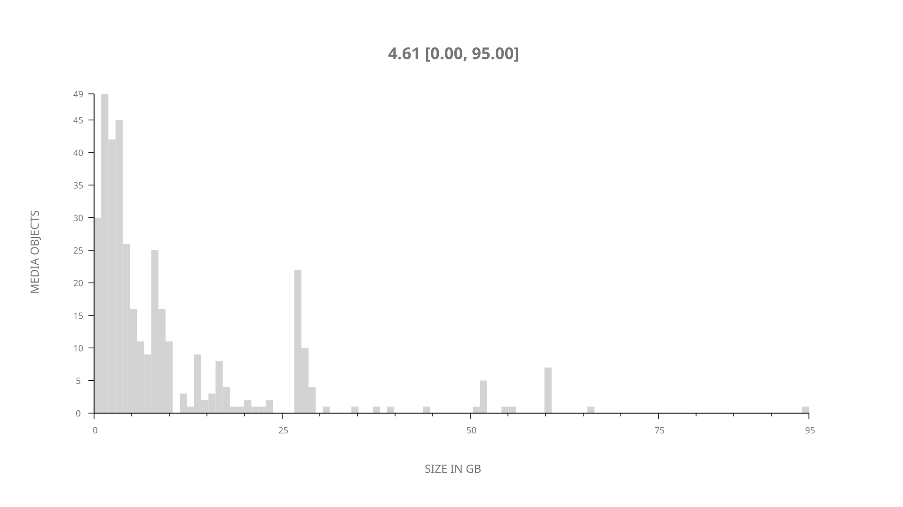
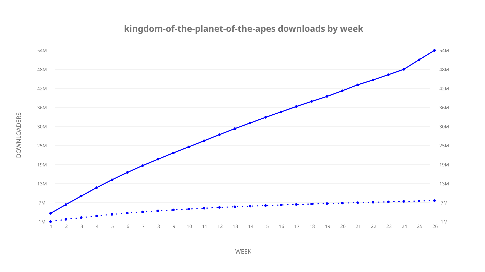
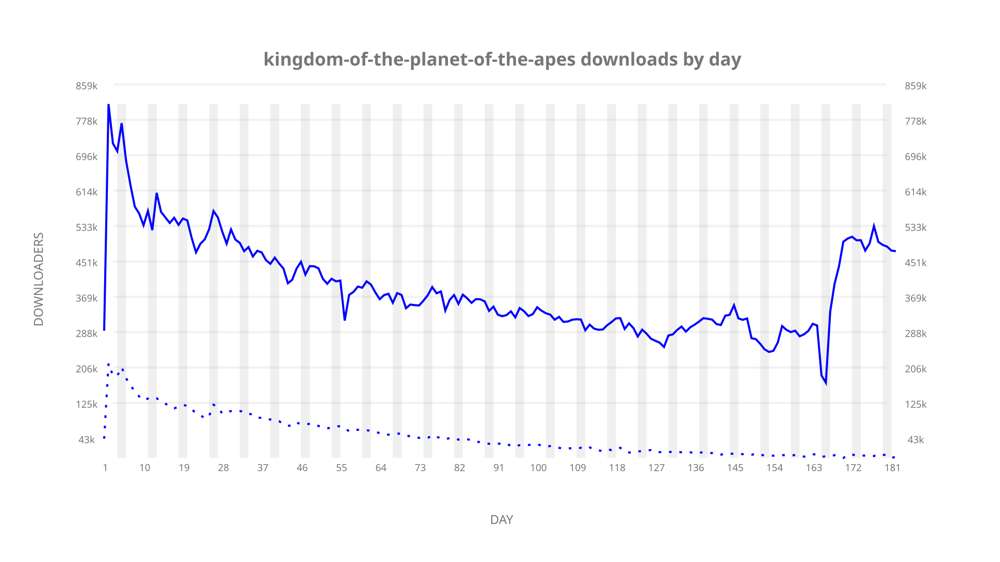
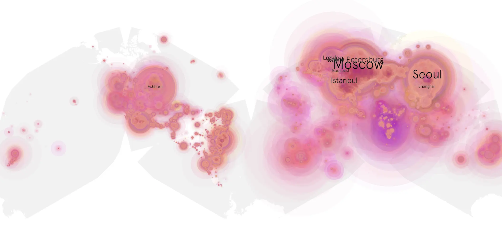
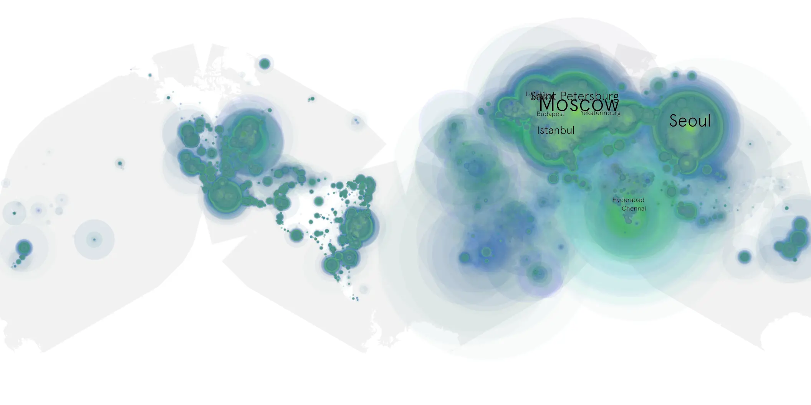

# kingdom-of-the-planet-of-the-apes sample cache audit

## 1. Media object

| Field | Value |
| --- | --- |
| Media object | The Kingdom of the Planet of the Apes |
| Collection key | `kingdom-of-the-planet-of-the-apes` |
| imdb_id | [tt11389872](https://www.imdb.com/title/tt11389872/) |
| wikipedia_url | UNAVAILABLE |
| Sample dates | 2024-07-09-to-2025-01-06 |
| Sample days | 182 (2024–2025) |
| BTIH count | 409 |
| Unique BTIH count | 376 |
| Downloaders total | 57,526,359 |
| Uploaders total | 8,765,637 |
| Data version | `2026-08-05` |
| IP geolocation version | `6:1777968300` |

## 2. Cache coverage report

- Generated: 2026-08-28T20:35:34Z
- Sample archive directory: `/run/media/bkoz/gold/src/alpha60-samples-raw.gold/kingdom-of-the-planet-of-the-apes.xz`
- Hour directories: 4363
- Zero-length sample files: 0
- Other unparsable sample files: 0
- Hourly discontinuities: 1 (1 missing hours)
- Missing days: 0

### Sample archive discontinuities

- hourly gap: last `2024-10-27 22:00`, resumed `2024-10-28 00:00` — missing 1 hour(s)

## 3. Collection size histogram

## 4. Visualization pass — graphs

### Downloads by week cumulative (normalized start)

### Downloads by day, Saturday and Sunday in gray

## 5. Visualization pass — maps

### Continental downloader slices

| Africa | Americas | Asia | Europe | Oceania | Unknown |
| --- | --- | --- | --- | --- | --- |
| 2.93 | 14.60 | 28.59 | 49.33 | 0.99 | 0.60 |

### Cumulative network infrastructure

{:target="_blank" rel="noopener"}

### Cumulative data maps

**Cumulative >= 1080p**

**Cumulative < 1080p**

