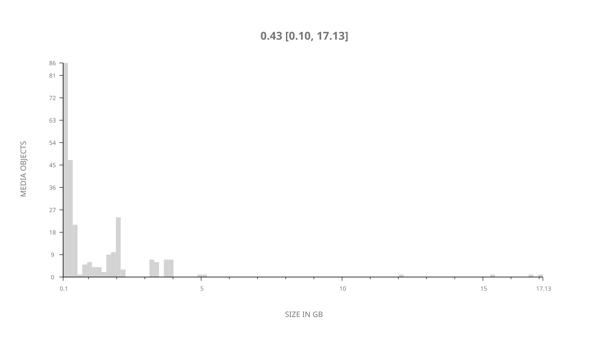
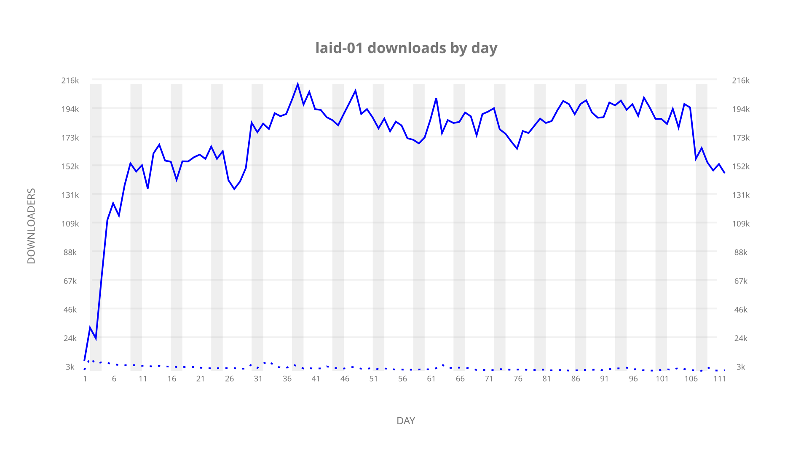
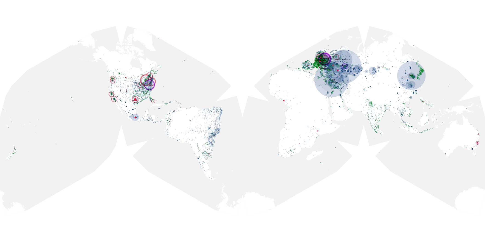
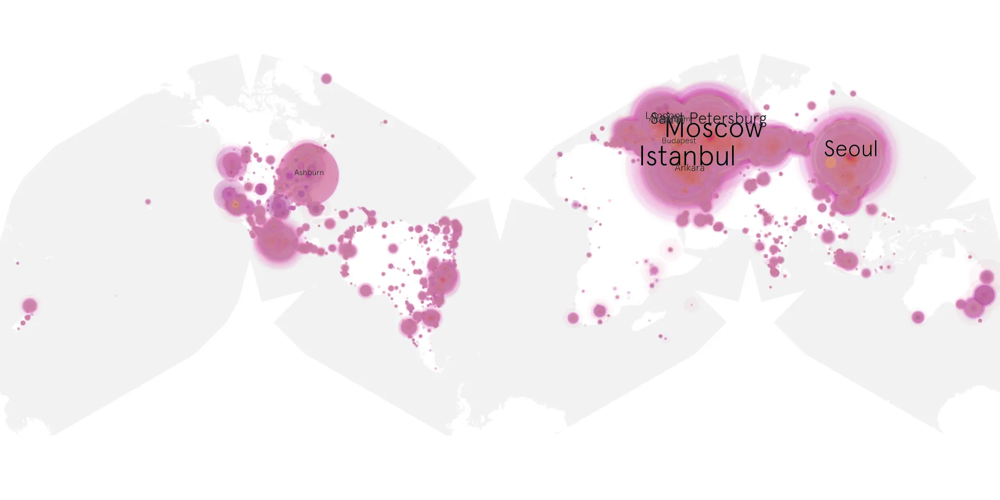
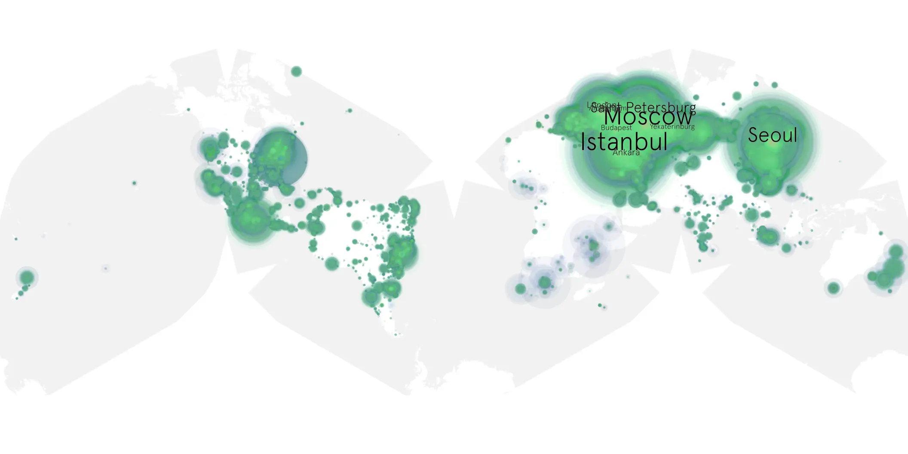

# laid-01 sample cache audit

## 1. Media object

| Field | Value |
| --- | --- |
| Media object | Laid |
| Collection key | `laid-01` |
| imdb_id | [tt21114548](https://www.imdb.com/title/tt21114548/) |
| wikipedia_url | [Laid (American TV series)](https://en.wikipedia.org/wiki/Laid_(American_TV_series)) |
| Sample dates | 2024-12-19-to-2025-04-09 |
| Sample days | 112 |
| BTIH count | 278 |
| Unique BTIH count | 255 |
| Downloaders total | 16,843,064 |
| Uploaders total | 289,940 |
| Data version | `2026-08-05` |
| IP geolocation version | `6:1777968300` |

## 2. Sample coverage report

- Generated: 2026-08-21T05:55:26Z
- Sample directory: `/home/bkoz/src/alpha60-samples/laid-01`
- Hour directories: 2666
- Zero-length sample files: 0
- Other unparsable sample files: 0
- Hourly discontinuities: 1 (1 missing hours)
- Missing days: 0

### Sample archive discontinuities

- hourly gap: last `2025-03-30 01:06`, resumed `2025-03-30 03:06` — missing 1 hour(s)

## 3. Media objects file size histogram

## 4. Visualization pass — graphs

### Downloads by week cumulative (normalized start)



### Downloads by day, Saturday and Sunday in gray

## 5. Visualization pass — maps

### Cumulative geographic slices

| Africa | Americas | Asia | Europe | Oceania | Unknown |
| --- | --- | --- | --- | --- | --- |
| 0.95 | 14.75 | 27.49 | 53.70 | 0.71 | 0.52 |

### Cumulative network infrastructure

{:target="_blank" rel="noopener"}

### Cumulative data maps

**Cumulative >= 1080p**

{:target="_blank" rel="noopener"}

**Cumulative < 1080p**

{:target="_blank" rel="noopener"}
