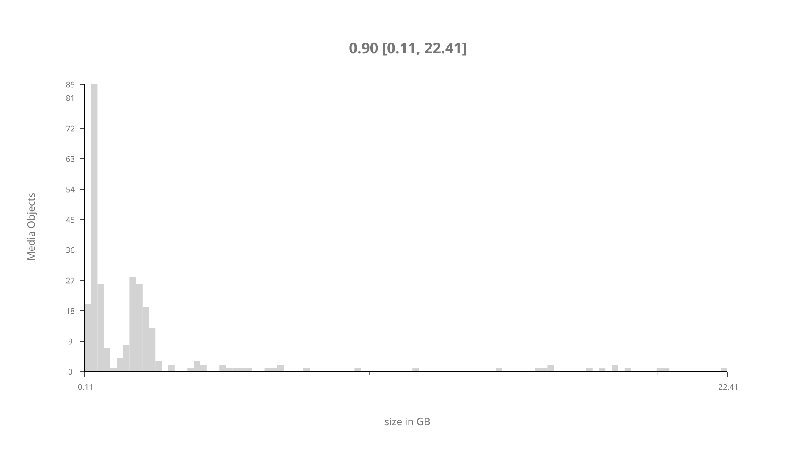
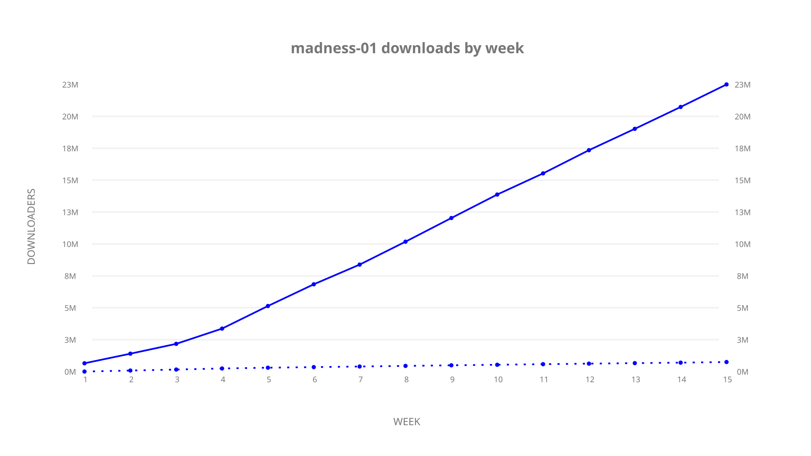
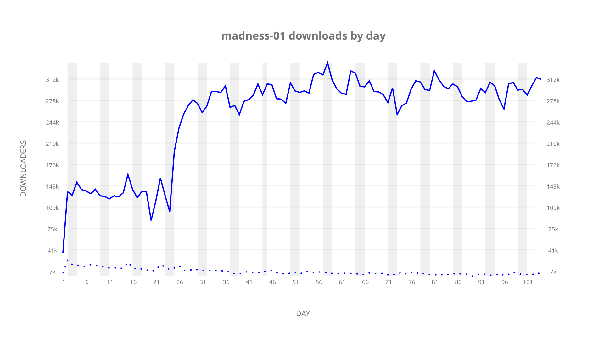
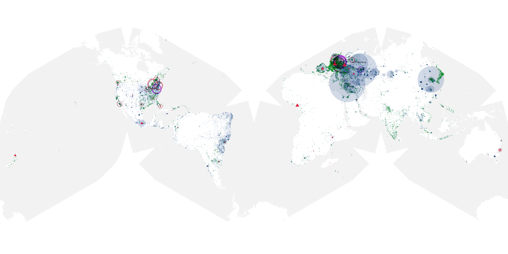
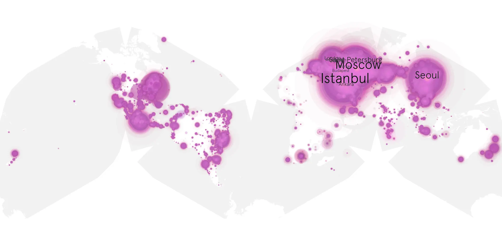
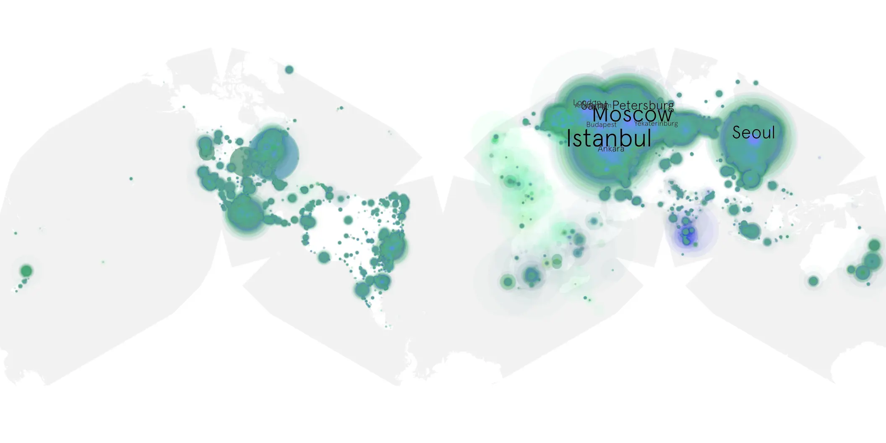

# madness-01 sample cache audit

## 1. Media object

| Field | Value |
| --- | --- |
| Media object | The Madness |
| Collection key | `madness-01` |
| imdb_id | [tt0412949](https://www.imdb.com/title/tt0412949/) |
| wikipedia_url | UNAVAILABLE |
| Sample dates | 2024-11-28-to-2025-03-12 |
| Sample days | 105 (2024–2025) |
| BTIH count | 300 |
| Unique BTIH count | 274 |
| Downloaders total | 23,653,019 |
| Uploaders total | 1,065,306 |
| Data version | `2026-08-05` |
| IP geolocation version | `6:1777968300` |

## 2. Cache coverage report

- Generated: 2026-08-28T20:51:29Z
- Sample archive directory: `/run/media/bkoz/gold/src/alpha60-samples-raw.gold/madness-01.xz`
- Hour directories: 2475
- Zero-length sample files: 0
- Other unparsable sample files: 0
- Hourly discontinuities: 1 (26 missing hours)
- Missing days: 1

### Sample archive discontinuities

- hourly gap: last `2025-01-10 22:00`, resumed `2025-01-12 01:00` — missing 26 hour(s)
- missing day: `2025-01-11`

## 3. Collection size histogram

## 4. Visualization pass — graphs

### Downloads by week cumulative (normalized start)

### Downloads by day, Saturday and Sunday in gray

## 5. Visualization pass — maps

### Continental downloader slices

| Africa | Americas | Asia | Europe | Oceania | Unknown |
| --- | --- | --- | --- | --- | --- |
| 1.43 | 14.78 | 26.92 | 52.66 | 0.71 | 0.50 |

### Cumulative network infrastructure

{:target="_blank" rel="noopener"}

### Cumulative data maps

**Cumulative >= 1080p**

**Cumulative < 1080p**

