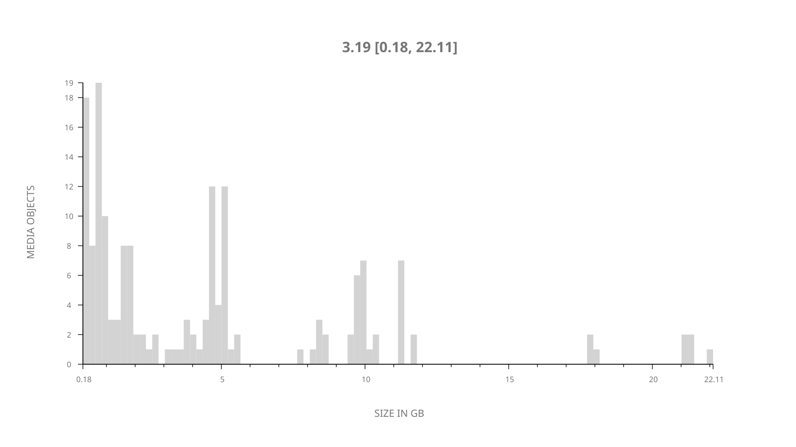
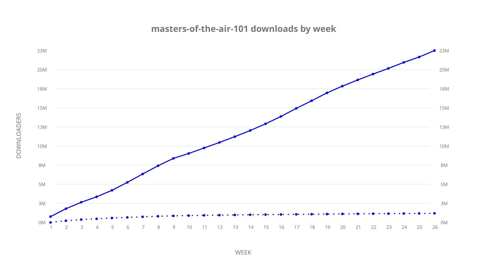
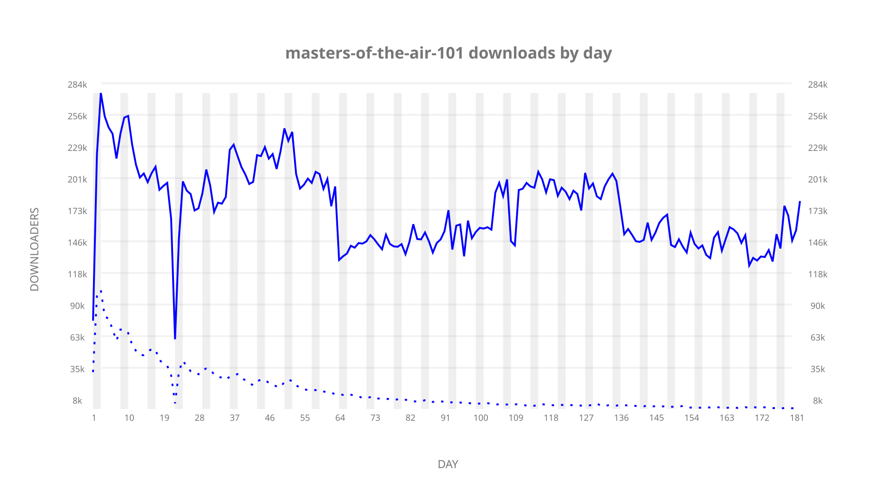
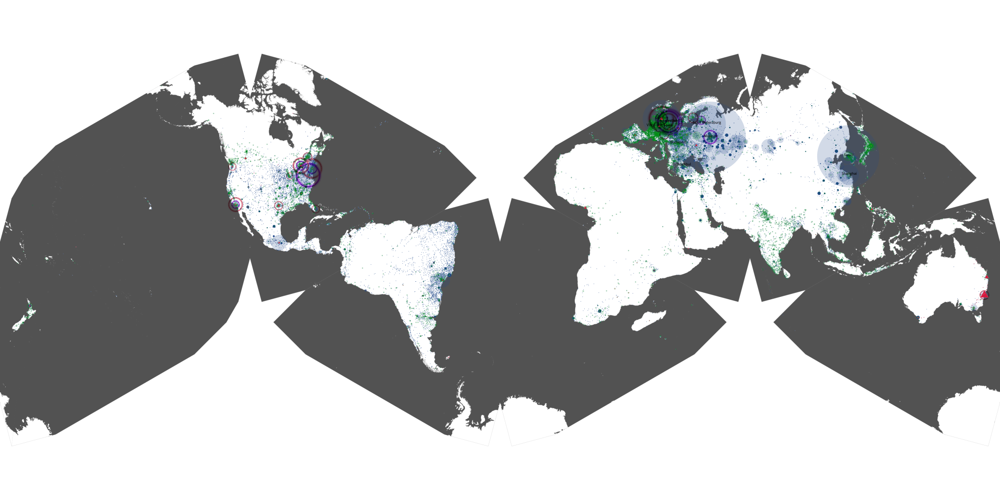

# masters-of-the-air-101 sample cache audit

## 1. Media object

| Field | Value |
| --- | --- |
| Media object | Masters of the Air |
| Collection key | `masters-of-the-air-101` |
| imdb_id | [tt2640044](https://www.imdb.com/title/tt2640044/) |
| wikipedia_url | UNAVAILABLE |
| Sample dates | 2024-01-26-to-2024-07-25 |
| Sample days | 182 (2024–2024) |
| BTIH count | 192 |
| Unique BTIH count | 169 |
| Downloaders total | 24,132,285 |
| Uploaders total | 1,823,013 |
| Data version | `2026-08-05` |
| IP geolocation version | `6:1777968300` |

## 2. Cache coverage report

UNAVAILABLE: no sample archive on this host.

## 3. Collection size histogram

## 4. Visualization pass — graphs

### Downloads by week cumulative (normalized start)

### Downloads by day, Saturday and Sunday in gray

## 5. Visualization pass — maps

### Continental downloader slices

| Africa | Americas | Asia | Europe | Oceania | Unknown |
| --- | --- | --- | --- | --- | --- |
| 1.59 | 19.49 | 23.39 | 50.55 | 1.57 | 0.64 |

### Cumulative network infrastructure

{:target="_blank" rel="noopener"}

UNAVAILABLE — no cumulative data maps were rendered.
