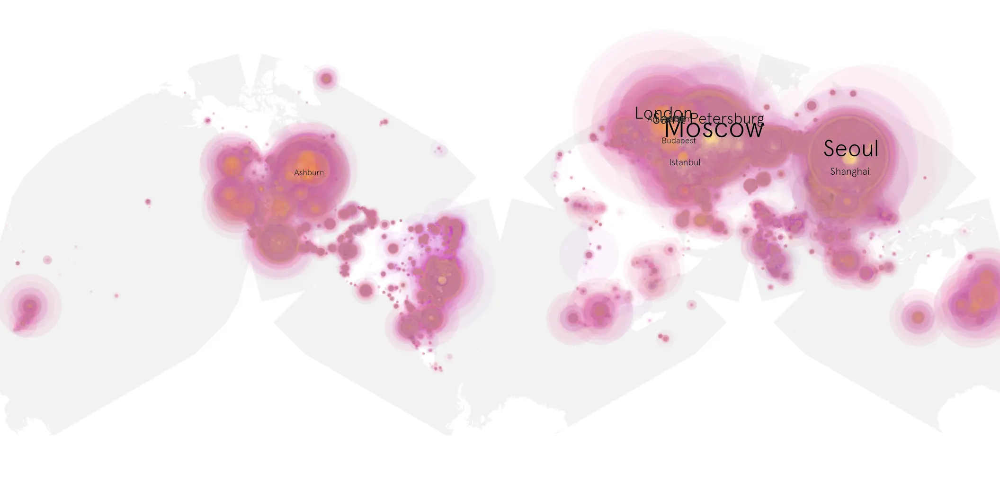
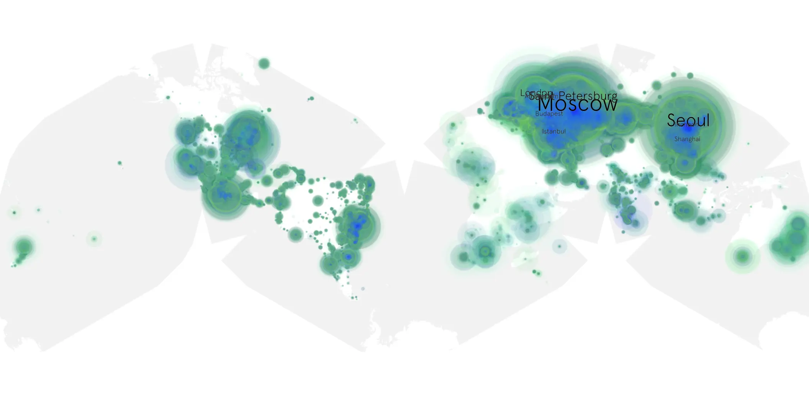

# masters-of-the-air-101 sample cache audit

## 1. Media object

| Field | Value |
| --- | --- |
| Media object | Masters of the Air |
| Collection key | `masters-of-the-air-101` |
| imdb_id | [tt2640044](https://www.imdb.com/title/tt2640044/) |
| wikipedia_url | UNAVAILABLE |
| Sample dates | 2024-01-26-to-2024-07-25 |
| Sample days | 182 (2024–2024) |
| BTIH count | 192 |
| Unique BTIH count | 169 |
| Downloaders total | 24,132,285 |
| Uploaders total | 1,823,013 |
| Data version | `2026-08-05` |
| IP geolocation version | `6:1777968300` |

## 2. Cache coverage report

- Generated: 2026-08-28T20:53:56Z
- Sample archive directory: `/run/media/bkoz/gold/src/alpha60-samples-raw.gold/masters-of-the-air-101.xz`
- Hour directories: 4336
- Zero-length sample files: 0
- Other unparsable sample files: 0
- Hourly discontinuities: 2 (13 missing hours)
- Missing days: 0

### Sample archive discontinuities

- hourly gap: last `2024-02-16 19:03`, resumed `2024-02-17 08:44` — missing 12 hour(s)
- hourly gap: last `2024-03-31 01:06`, resumed `2024-03-31 03:06` — missing 1 hour(s)

## 3. Collection size histogram

## 4. Visualization pass — graphs

### Downloads by week cumulative (normalized start)

### Downloads by day, Saturday and Sunday in gray

## 5. Visualization pass — maps

### Continental downloader slices

| Africa | Americas | Asia | Europe | Oceania | Unknown |
| --- | --- | --- | --- | --- | --- |
| 1.59 | 19.49 | 23.39 | 50.55 | 1.57 | 0.64 |

### Cumulative network infrastructure

{:target="_blank" rel="noopener"}

### Cumulative data maps

**Cumulative >= 1080p**

**Cumulative < 1080p**

