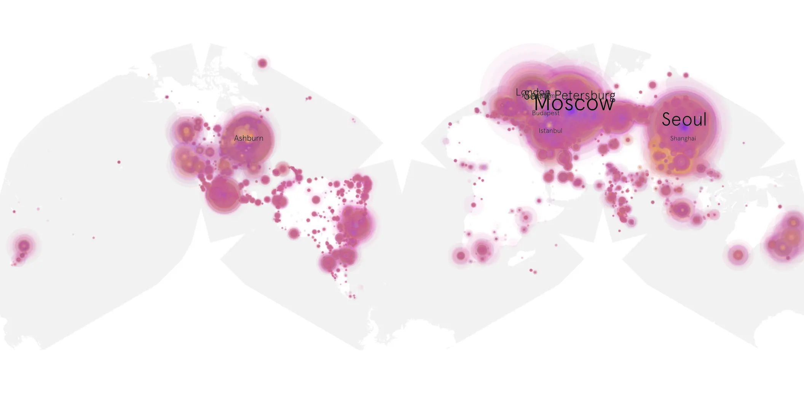
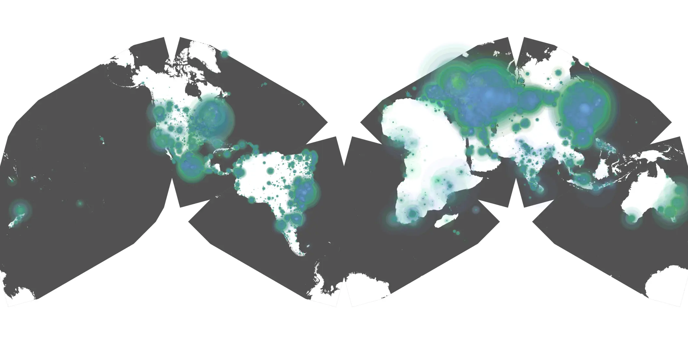

# masters-of-the-air-108 sample cache audit

## 1. Media object

| Field | Value |
| --- | --- |
| Media object | Masters of the Air |
| Collection key | `masters-of-the-air-108` |
| imdb_id | [tt2640044](https://www.imdb.com/title/tt2640044/) |
| wikipedia_url | [Masters of the Air](https://en.wikipedia.org/wiki/Masters_of_the_Air) |
| Sample dates | 2024-03-08-to-2024-07-04 |
| Sample days | 119 |
| BTIH count | 271 |
| Unique BTIH count | 233 |
| Downloaders total | 21,820,984 |
| Uploaders total | 1,746,421 |
| Data version | `2026-08-05` |
| IP geolocation version | `6:1777968300` |

## 2. Coverage report

- Generated: 2026-08-28T20:57:58Z
- Sample archive directory: `/run/media/bkoz/gold/src/alpha60-samples-raw.gold/masters-of-the-air-108.xz`
- Hour directories: 2850
- Zero-length sample files: 0
- Other unparsable sample files: 0
- Hourly discontinuities: 1 (1 missing hours)
- Missing days: 0

### Sample archive discontinuities

- hourly gap: last `2024-03-31 01:00`, resumed `2024-03-31 03:00` — missing 1 hour(s)

## 3. File sizes histogram *median[lowest, highest]*

## 4. Graphs

### Downloads by week cumulative (normalized start)



### Downloads by day, Saturday and Sunday in gray

## 5. Cumulative Maps

<!-- https://raw.githubusercontent.com/alpha60-devops/alpha60-results-2024/refs/heads/main/data/ -->

### <a href="https://raw.githubusercontent.com/alpha60-devops/alpha60-results-2024/refs/heads/main/data/geojson.cumulative/masters-of-the-air-108-cumulative-aggregate.geojson.gz" data-map-title="Masters of the Air — masters-of-the-air-108" onclick="leaflet_map_open_window(this.href, this.dataset.mapTitle); return false;" class="table-link" aria-label="Open Masters of the Air (masters-of-the-air-108) cumulative data map in new window" title="Opens interactive map for Masters of the Air (masters-of-the-air-108) data">Swarm Detail</a>

### Geographic Regions

| Africa | Americas | Asia | Europe | Oceania | Unknown |
| --- | --- | --- | --- | --- | --- |
| 1.23 | 19.15 | 23.37 | 52.85 | 1.32 | 0.68 |

### Network infrastructure

{:target="_blank" rel="noopener"}

### Resolution >= 1080p

{:target="_blank" rel="noopener"}

### Resolution < 1080p

{:target="_blank" rel="noopener"}
