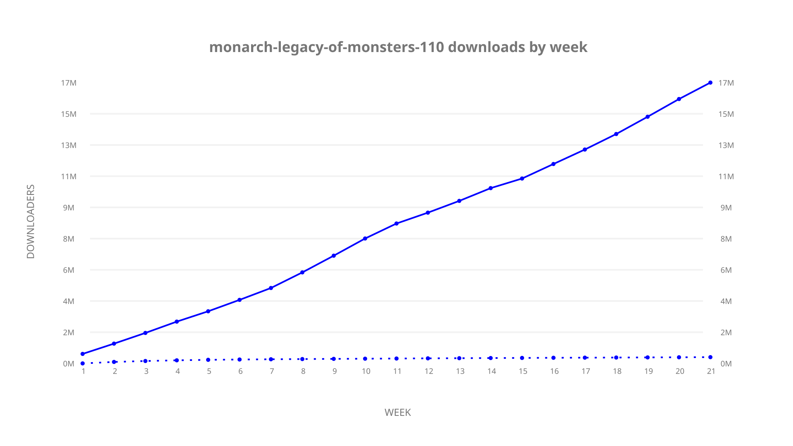

# monarch-legacy-of-monsters-110 sample cache audit

## 1. Media object

| Field | Value |
| --- | --- |
| Media object | Monarch: Legacy of Monsters |
| Collection key | `monarch-legacy-of-monsters-110` |
| imdb_id | [tt17220216](https://www.imdb.com/title/tt17220216/) |
| wikipedia_url | UNAVAILABLE |
| Sample dates | 2024-01-12-to-2024-06-06 |
| Sample days | 147 (2024–2024) |
| BTIH count | 204 |
| Unique BTIH count | 186 |
| Downloaders total | 17,401,369 |
| Uploaders total | 767,563 |
| Data version | `2026-08-05` |
| IP geolocation version | `6:1777968300` |

## 2. Cache coverage report

UNAVAILABLE: no sample archive on this host.

## 3. Collection size histogram

## 4. Visualization pass — graphs

### Downloads by week cumulative (normalized start)

### Downloads by day, Saturday and Sunday in gray

## 5. Visualization pass — maps

### Continental downloader slices

| Africa | Americas | Asia | Europe | Oceania | Unknown |
| --- | --- | --- | --- | --- | --- |
| 1.50 | 19.07 | 23.73 | 51.94 | 0.96 | 0.65 |

### Cumulative network infrastructure

{:target="_blank" rel="noopener"}

UNAVAILABLE — no cumulative data maps were rendered.
