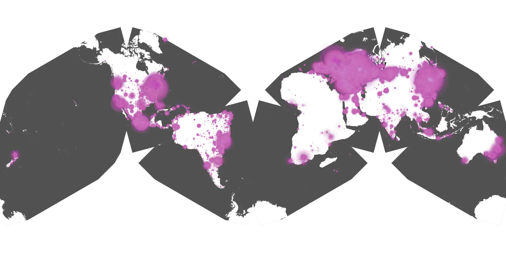
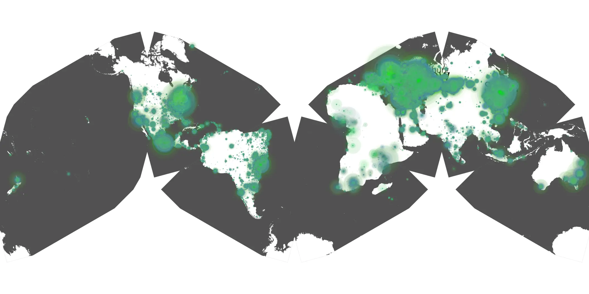

# monsieur-spade-01 sample cache audit

## 1. Media object

| Field | Value |
| --- | --- |
| Media object | Monsieur Spade |
| Collection key | `monsieur-spade-01` |
| imdb_id | [tt14203572](https://www.imdb.com/title/tt14203572/) |
| wikipedia_url | [Monsieur Spade](https://en.wikipedia.org/wiki/Monsieur_Spade) |
| Sample dates | 2024-01-15-to-2024-04-28 |
| Sample days | 105 |
| BTIH count | 194 |
| Unique BTIH count | 183 |
| Downloaders total | 10,585,644 |
| Uploaders total | 466,592 |
| Data version | `2026-08-05` |
| IP geolocation version | `6:1777968300` |

## 2. Coverage report

- Generated: 2026-08-28T21:00:58Z
- Sample archive directory: `/run/media/bkoz/gold/src/alpha60-samples-raw.gold/monsieur-spade-01.xz`
- Hour directories: 2509
- Zero-length sample files: 0
- Other unparsable sample files: 0
- Hourly discontinuities: 2 (11 missing hours)
- Missing days: 0

### Sample archive discontinuities

- hourly gap: last `2024-02-16 19:03`, resumed `2024-02-17 06:03` — missing 10 hour(s)
- hourly gap: last `2024-03-31 01:03`, resumed `2024-03-31 03:03` — missing 1 hour(s)

## 3. File sizes histogram *median[lowest, highest]*

## 4. Graphs

### Downloads by week cumulative (normalized start)



### Downloads by day, Saturday and Sunday in gray

## 5. Cumulative Maps

<!-- https://raw.githubusercontent.com/alpha60-devops/alpha60-results-2024/refs/heads/main/data/ -->

### <a href="https://raw.githubusercontent.com/alpha60-devops/alpha60-results-2024/refs/heads/main/data/geojson.cumulative/monsieur-spade-01-cumulative-aggregate.geojson.gz" data-map-title="Monsieur Spade — monsieur-spade-01" onclick="leaflet_map_open_window(this.href, this.dataset.mapTitle); return false;" class="table-link" aria-label="Open Monsieur Spade (monsieur-spade-01) cumulative data map in new window" title="Opens interactive map for Monsieur Spade (monsieur-spade-01) data">Swarm Detail</a>

### Geographic Regions

| Africa | Americas | Asia | Europe | Oceania | Unknown |
| --- | --- | --- | --- | --- | --- |
| 1.68 | 20.22 | 21.75 | 52.21 | 1.29 | 0.56 |

### Network infrastructure

{:target="_blank" rel="noopener"}

### Resolution >= 1080p

{:target="_blank" rel="noopener"}

### Resolution < 1080p

{:target="_blank" rel="noopener"}
