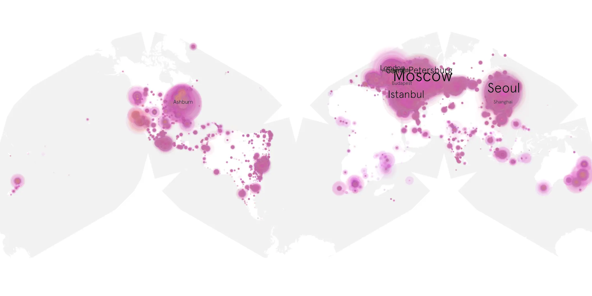
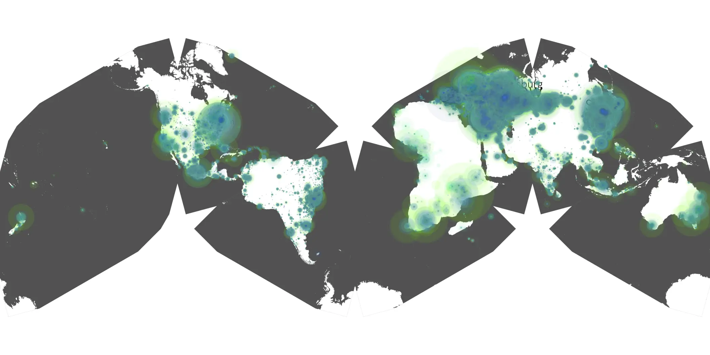

# old-man-201 sample cache audit

## 1. Media object

| Field | Value |
| --- | --- |
| Media object | The Old Man |
| Collection key | `old-man-201` |
| imdb_id | [tt13456976](https://www.imdb.com/title/tt13456976/) |
| wikipedia_url | UNAVAILABLE |
| Sample dates | 2024-09-14-to-2024-12-27 |
| Sample days | 105 (2024–2024) |
| BTIH count | 172 |
| Unique BTIH count | 164 |
| Downloaders total | 8,555,891 |
| Uploaders total | 618,528 |
| Data version | `2026-08-05` |
| IP geolocation version | `6:1777968300` |

## 2. Cache coverage report

- Generated: 2026-08-28T21:04:57Z
- Sample archive directory: `/run/media/bkoz/gold/src/alpha60-samples-raw.gold/old-man-201.xz`
- Hour directories: 2511
- Zero-length sample files: 0
- Other unparsable sample files: 0
- Hourly discontinuities: 1 (7 missing hours)
- Missing days: 0

### Sample archive discontinuities

- hourly gap: last `2024-12-07 22:00`, resumed `2024-12-08 06:00` — missing 7 hour(s)

## 3. Collection size histogram

## 4. Visualization pass — graphs

### Downloads by week cumulative (normalized start)

### Downloads by day, Saturday and Sunday in gray

## 5. Visualization pass — maps

### Continental downloader slices

| Africa | Americas | Asia | Europe | Oceania | Unknown |
| --- | --- | --- | --- | --- | --- |
| 1.89 | 16.28 | 24.47 | 52.74 | 1.42 | 0.56 |

### Cumulative network infrastructure

{:target="_blank" rel="noopener"}

### Cumulative data maps

**Cumulative >= 1080p**

**Cumulative < 1080p**

