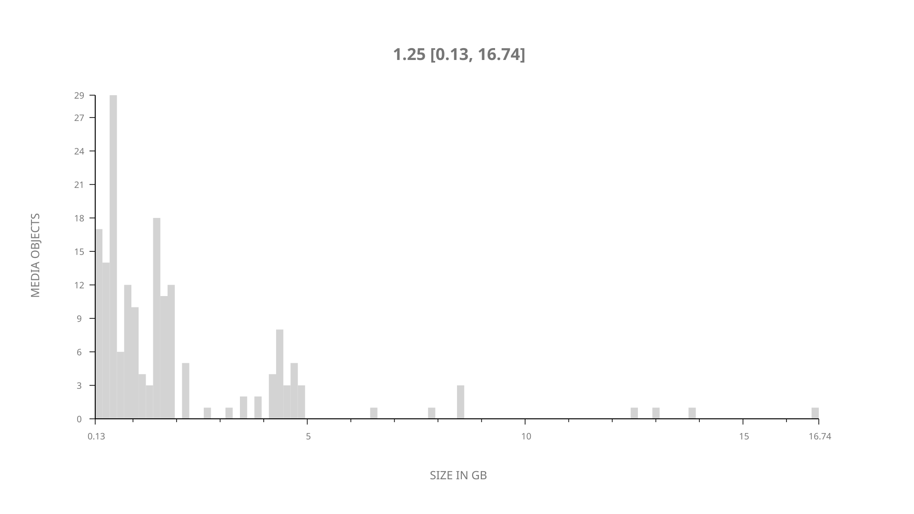
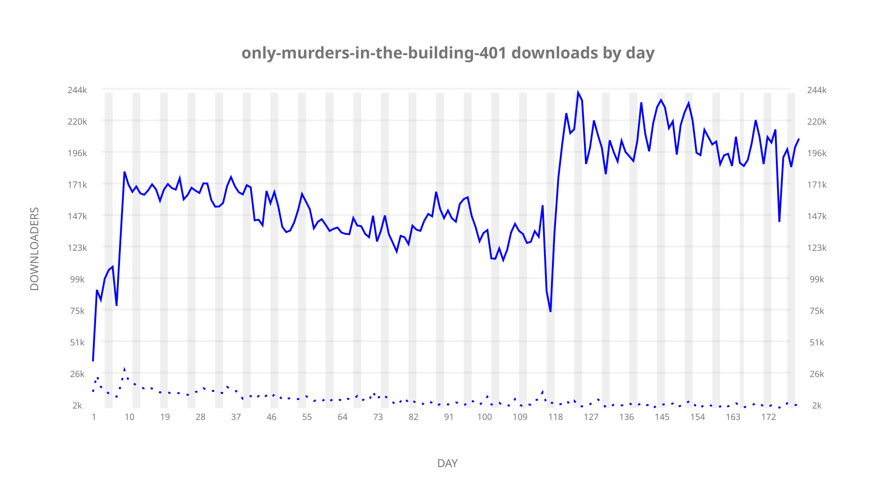
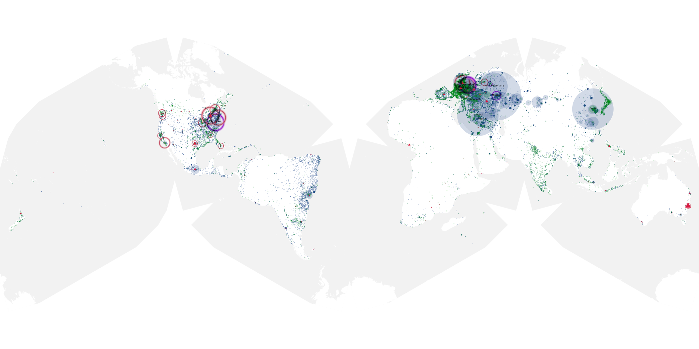
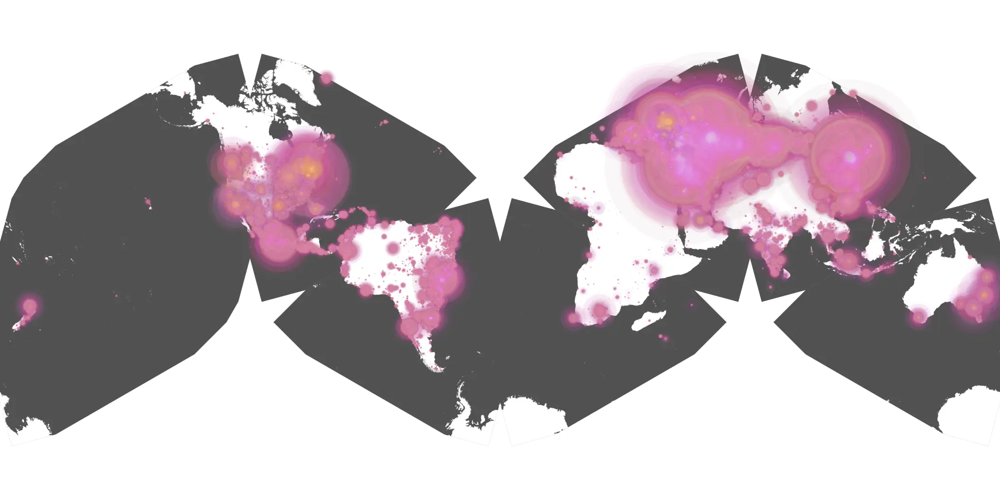
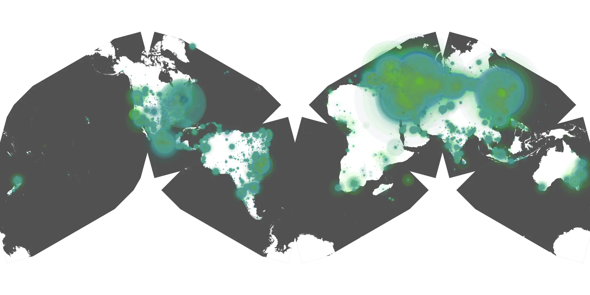

# only-murders-in-the-building-401 sample cache audit

## 1. Media object

| Field | Value |
| --- | --- |
| Media object | Only Murders In the Building |
| Collection key | `only-murders-in-the-building-401` |
| imdb_id | [tt11691774](https://www.imdb.com/title/tt11691774/) |
| wikipedia_url | [Only Murders in the Building](https://en.wikipedia.org/wiki/Only_Murders_in_the_Building) |
| Sample dates | 2024-08-27-to-2025-02-24 |
| Sample days | 182 |
| BTIH count | 208 |
| Unique BTIH count | 179 |
| Downloaders total | 24,399,610 |
| Uploaders total | 1,003,783 |
| Data version | `2026-08-05` |
| IP geolocation version | `6:1777968300` |

## 2. Sample coverage report

- Generated: 2026-08-28T21:05:49Z
- Sample archive directory: `/run/media/bkoz/gold/src/alpha60-samples-raw.gold/only-murders-in-the-building-401.xz`
- Hour directories: 4290
- Zero-length sample files: 0
- Other unparsable sample files: 0
- Hourly discontinuities: 5 (61 missing hours)
- Missing days: 2

### Sample archive discontinuities

- hourly gap: last `2024-12-30 20:06`, resumed `2024-12-30 22:06` — missing 1 hour(s)
- hourly gap: last `2025-01-11 22:06`, resumed `2025-01-12 01:06` — missing 2 hour(s)
- hourly gap: last `2025-02-08 22:06`, resumed `2025-02-10 00:06` — missing 25 hour(s)
- hourly gap: last `2025-02-18 17:06`, resumed `2025-02-19 00:06` — missing 6 hour(s)
- hourly gap: last `2025-02-20 22:06`, resumed `2025-02-22 02:06` — missing 27 hour(s)
- missing day: `2025-02-09`
- missing day: `2025-02-21`

## 3. Media objects file size histogram

## 4. Visualization pass — graphs

### Downloads by week cumulative (normalized start)



### Downloads by day, Saturday and Sunday in gray

## 5. Visualization pass — maps

### Cumulative geographic slices

| Africa | Americas | Asia | Europe | Oceania | Unknown |
| --- | --- | --- | --- | --- | --- |
| 0.93 | 15.70 | 26.51 | 53.16 | 0.89 | 0.57 |

### Cumulative network infrastructure

{:target="_blank" rel="noopener"}

### Cumulative data maps

**Cumulative >= 1080p**

{:target="_blank" rel="noopener"}

**Cumulative < 1080p**

{:target="_blank" rel="noopener"}
