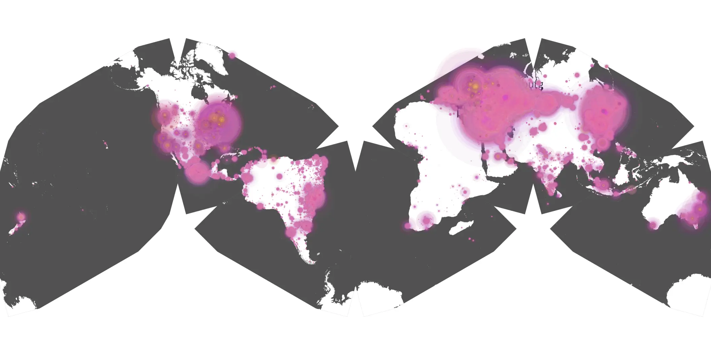
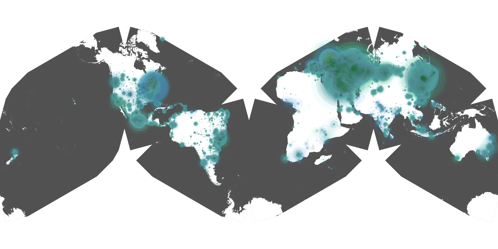

# only-murders-in-the-building-409 sample cache audit

## 1. Media object

| Field | Value |
| --- | --- |
| Media object | Only Murders In the Building |
| Collection key | `only-murders-in-the-building-409` |
| imdb_id | [tt11691774](https://www.imdb.com/title/tt11691774/) |
| wikipedia_url | [Only Murders in the Building](https://en.wikipedia.org/wiki/Only_Murders_in_the_Building) |
| Sample dates | 2024-10-23-to-2025-02-04 |
| Sample days | 105 |
| BTIH count | 215 |
| Unique BTIH count | 194 |
| Downloaders total | 14,248,147 |
| Uploaders total | 649,144 |
| Data version | `2026-08-05` |
| IP geolocation version | `6:1777968300` |

## 2. Coverage report

- Generated: 2026-08-28T21:07:58Z
- Sample archive directory: `/run/media/bkoz/gold/src/alpha60-samples-raw.gold/only-murders-in-the-building-409.xz`
- Hour directories: 2517
- Zero-length sample files: 0
- Other unparsable sample files: 0
- Hourly discontinuities: 2 (3 missing hours)
- Missing days: 0

### Sample archive discontinuities

- hourly gap: last `2024-12-30 20:03`, resumed `2024-12-30 22:03` — missing 1 hour(s)
- hourly gap: last `2025-01-11 22:03`, resumed `2025-01-12 01:03` — missing 2 hour(s)

## 3. File sizes histogram *median[lowest, highest]*

## 4. Graphs

### Downloads by week cumulative (normalized start)



### Downloads by day, Saturday and Sunday in gray

## 5. Cumulative Maps

<!-- https://raw.githubusercontent.com/alpha60-devops/alpha60-results-2024/refs/heads/main/data/ -->

### <a href="https://raw.githubusercontent.com/alpha60-devops/alpha60-results-2024/refs/heads/main/data/geojson.cumulative/only-murders-in-the-building-409-cumulative-aggregate.geojson.gz" data-map-title="Only Murders In the Building — only-murders-in-the-building-409" onclick="leaflet_map_open_window(this.href, this.dataset.mapTitle); return false;" class="table-link" aria-label="Open Only Murders In the Building (only-murders-in-the-building-409) cumulative data map in new window" title="Opens interactive map for Only Murders In the Building (only-murders-in-the-building-409) data">Swarm Detail</a>

### Geographic Regions

| Africa | Americas | Asia | Europe | Oceania | Unknown |
| --- | --- | --- | --- | --- | --- |
| 0.91 | 16.47 | 25.73 | 52.80 | 0.90 | 0.51 |

### Network infrastructure

{:target="_blank" rel="noopener"}

### Resolution >= 1080p

{:target="_blank" rel="noopener"}

### Resolution < 1080p

{:target="_blank" rel="noopener"}
