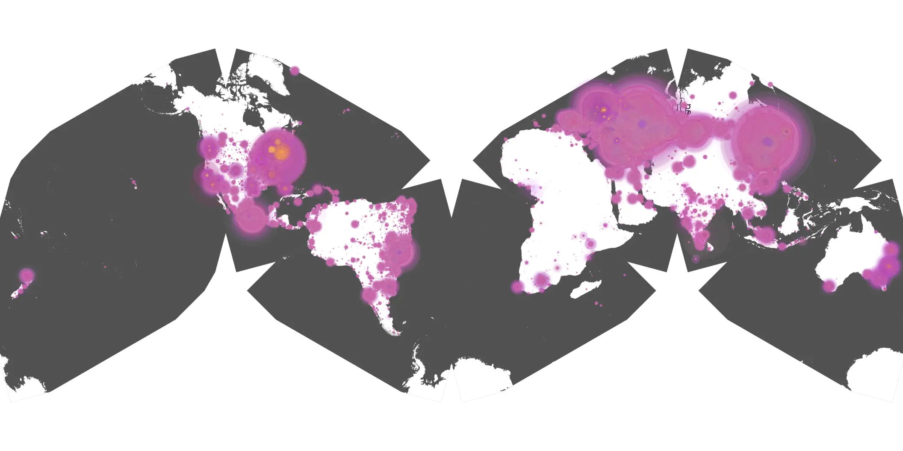
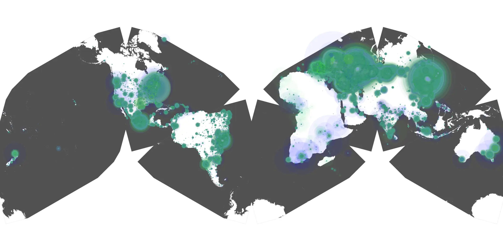

# outer-range-02 sample cache audit

## 1. Media object

| Field | Value |
| --- | --- |
| Media object | Outer Range |
| Collection key | `outer-range-02` |
| imdb_id | [tt11685912](https://www.imdb.com/title/tt11685912/) |
| wikipedia_url | [Outer Range](https://en.wikipedia.org/wiki/Outer_Range) |
| Sample dates | 2024-05-16-to-2024-08-28 |
| Sample days | 105 |
| BTIH count | 353 |
| Unique BTIH count | 326 |
| Downloaders total | 20,918,406 |
| Uploaders total | 396,011 |
| Data version | `2026-08-05` |
| IP geolocation version | `6:1777968300` |

## 2. Coverage report

- Generated: 2026-08-28T21:11:05Z
- Sample archive directory: `/run/media/bkoz/gold/src/alpha60-samples-raw.gold/outer-range-02.xz`
- Hour directories: 2488
- Zero-length sample files: 0
- Other unparsable sample files: 0
- Hourly discontinuities: 1 (11 missing hours)
- Missing days: 0

### Sample archive discontinuities

- hourly gap: last `2024-07-15 12:00`, resumed `2024-07-16 00:00` — missing 11 hour(s)

## 3. File sizes histogram *median[lowest, highest]*

## 4. Graphs

### Downloads by week cumulative (normalized start)



### Downloads by day, Saturday and Sunday in gray

## 5. Cumulative Maps

<!-- https://raw.githubusercontent.com/alpha60-devops/alpha60-results-2024/refs/heads/main/data/ -->

### <a href="https://raw.githubusercontent.com/alpha60-devops/alpha60-results-2024/refs/heads/main/data/geojson.cumulative/outer-range-02-cumulative-aggregate.geojson.gz" data-map-title="Outer Range — outer-range-02" onclick="leaflet_map_open_window(this.href, this.dataset.mapTitle); return false;" class="table-link" aria-label="Open Outer Range (outer-range-02) cumulative data map in new window" title="Opens interactive map for Outer Range (outer-range-02) data">Swarm Detail</a>

### Geographic Regions

| Africa | Americas | Asia | Europe | Oceania | Unknown |
| --- | --- | --- | --- | --- | --- |
| 0.91 | 18.91 | 25.05 | 51.97 | 1.04 | 0.70 |

### Network infrastructure

{:target="_blank" rel="noopener"}

### Resolution >= 1080p

{:target="_blank" rel="noopener"}

### Resolution < 1080p

{:target="_blank" rel="noopener"}
