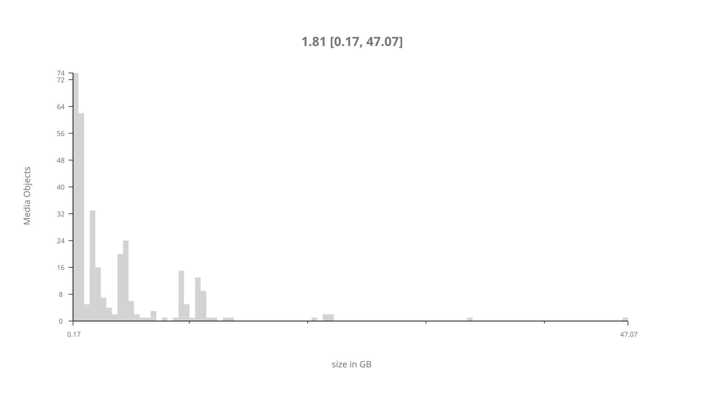
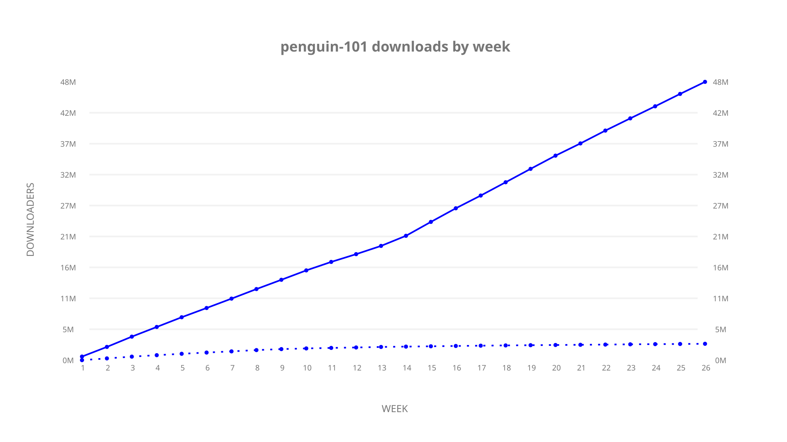
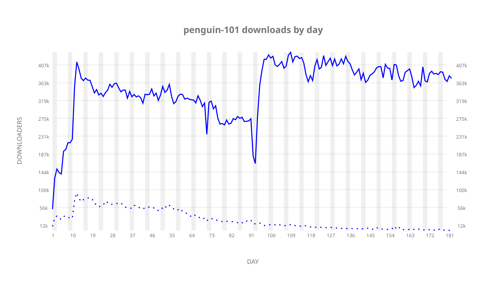
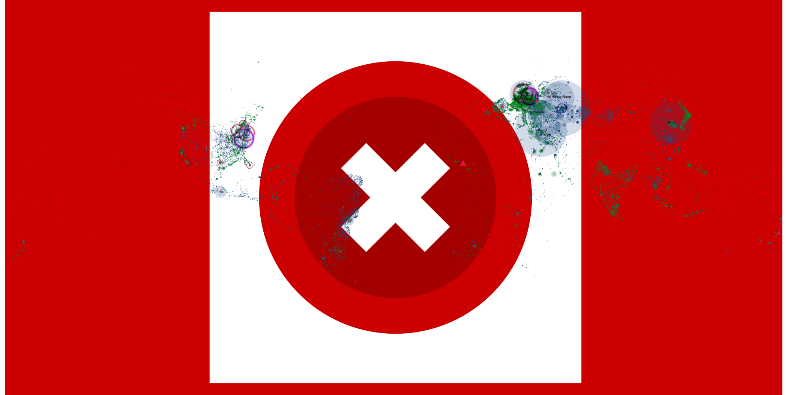

# penguin-101 sample cache audit

## 1. Media object

| Field | Value |
| --- | --- |
| Media object | The Penguin |
| Collection key | `penguin-101` |
| imdb_id | [tt11323316](https://www.imdb.com/title/tt11323316/) |
| wikipedia_url | UNAVAILABLE |
| Sample dates | 2024-09-20-to-2025-03-20 |
| Sample days | 182 (2024–2025) |
| BTIH count | 344 |
| Unique BTIH count | 316 |
| Downloaders total | 50,019,922 |
| Uploaders total | 3,400,610 |
| Data version | `2026-08-05` |
| IP geolocation version | `6:1777968300` |

## 2. Cache coverage report

UNAVAILABLE: no sample archive on this host.

## 3. Collection size histogram

## 4. Visualization pass — graphs

### Downloads by week cumulative (normalized start)

### Downloads by day, Saturday and Sunday in gray

## 5. Visualization pass — maps

### Continental downloader slices

| Africa | Americas | Asia | Europe | Oceania | Unknown |
| --- | --- | --- | --- | --- | --- |
| 2.09 | 15.30 | 26.58 | 52.98 | 1.01 | 0.52 |

### Cumulative network infrastructure

{:target="_blank" rel="noopener"}

UNAVAILABLE — no cumulative data maps were rendered.
